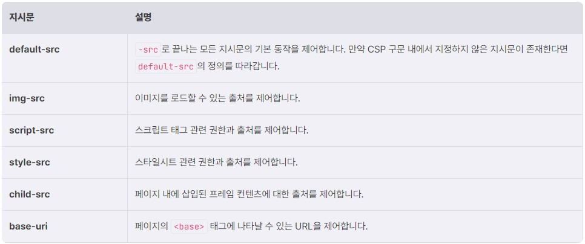
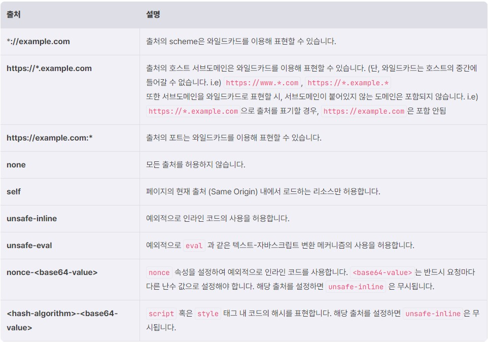
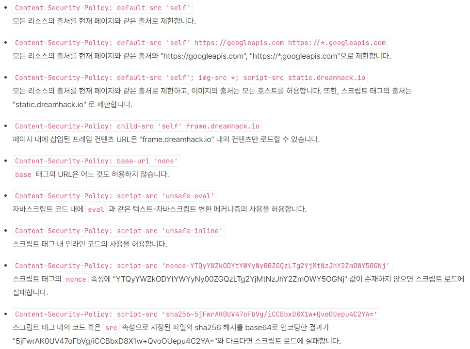

# Content Security Policy  
**Content Security Policy (CSP, 컨텐츠 보안 정책)** 는 **XSS나 데이터를 삽입하는 공격**이 발생하였을 때 **피해를 줄이고** 웹 관리자가 **공격 시도를 보고** 받을 수 있도록 새롭게 추가된 **보안 계층**  
## Content Security Policy  
**XSS 공격** -> 자바스크립트 구문을 통해 동일 출처 정책(Same-Origin Policy)을 우회함  
**Content Security Policy** : 페이지의 컨텐츠에서 사용하는 자원들이 모두 웹 서버에서 의도한 자원이 맞는지 확인하는 방식  
  
**XSS 공격**은 브라우저가 서버로부터 **전달받은 컨텐츠를 신뢰한다는 점을 이용**  
**CSP**는 이를 방지하기 위해 웹 페이지에 **사용될 수 있는 자원의 위치, 출처** 등에 **제약**을 건다.  
  
**CSP 헤더**는 **1개 이상의 정책 지시문**이 세미콜론(;)으로 분리돼있다.  
  
**정책 지시문**은 **지시문** (e.g. default-src, script-src 등)과 **1개 이상의 출처** (e.g. 'self', https:, *.dreamhack.io 등)가 공백으로 분리돼있다.  

```
{{default-src 'self' https://example.dreamhack.io }}
```
위의 구문은 **같은 오리진** 혹은 
```
https://example.dreamhack.io 
```
**에서만 로드**되어야 함을 나타냄  
```
Content-Security-Policy: <policy-directive>; <policy-directive>
```
위처럼 보통 CSP 구문은 **HTTP 헤더에 추가**하여 적용할 수 있다.  
```
Content-Security-Policy: default-src 'self' https://example.dreamhack.io
```
위에 있는 것은 이전의 2가지를 종합해서, **같은 오리진** 혹은
```
https://example.dreamhack.io 
```
**에서만 로드** 되는 걸 나타내는 CSP 헤더입니다.  
```
<meta http-equiv="Content-Security-Policy" content="default-src 'self' https://example.dreamhack.io">
```
HTTP 헤더 외에 **meta** 태그의 요소로 정의할 수 있다.  

## Content Security Policy 기본 정책 - Inline Code  
CSP는 **인라인 코드** (Inline Code)를 **유해하다**고 간주함  
-> 인라인 코드를 **사용할 수 없음.**  

```html
<script>alert(1);</script>
```
예를 들어, 다음과 같이 script 태그 안에 **src** 없이 바로 코드를 넣은 것을 **인라인 코드** 라고 한다.  
```html
<script src="alert.js"></script>
```
위처럼 CSP는 **src**를 사용해서 **코드 경로를 정의하는 방식**을 권장한다.  
**script, on 핸들러, javascript:** 모두 인라인 코드라고 간주한다.  
또한 **CSS 스타일시트** 도 인라인 코드로 간주해서, **stype** 속성을 사용하는 걸 권장함  

## Content Security Policy 기본 정책 - Eval  
CSP는 기본적으로 **문자열 텍스트**를 **실행 가능한 자바스크립트 코드 형태로 변환**하는 메커니즘 또한 **유해하다고 간주함**  
예를 들면 **eval** 과 같은 함수이다.  
**eval, new Function(), setTimeout(), setInterval()** 처럼 문자열 형태로 입력 받는 함수는 모두 차단함  
-> 단, **인라인 함수** 형태로 **파라미터**가 전달 될 때에는 **차단되지 않습니다.**  
```javascript
setTimeout("alert(1)", ...) 
```
위의 코드는 **문자열을 코드로 변환**하는 것이므로 **차단함**  
```javascript
setTimeout(function(){alert(1)}, ...)
```
반면에, 위의 코드는 **인라인 함수**로 파라미터를 받았기 때문에 **차단되지 않음**
## Policy Directive  
**Policy-directive**는 **directive, value 형태**로 구성  
directive는 **지시문**, value는 **directive에서 정의한 리소스의 출처**를 정의함  
  

자주 사용되는 지시문은 다음과 같다.  
  

value 에 올 수 있는 출처의 종류(와일드카드를 사용하는 경우가 종종 있음)  

## CSP Examples  
  


# 퀴즈  
1. 페이지 내에 삽입된 프레임 컨텐츠에 대한 출처를 제어하는 지시문은 무엇인가?  
**답** : child-src  
2. 다음 CSP 지시어를 보고 틀린 설명을 한 사람을 모두 고르시오.  
```http
default-src: none;
script-src: https://*.dreamhack.io;
img-src: https://static.dreamhack.io;
```
**답** : 준오 : default-src가 none 인걸 보니 아무 스크립트나 load 할 수 있겠군!, 태양 : default-src가 none 인걸 보니 https://static.dreamhack.io 에 있는 이미지도 불러오지 못하겠군!  