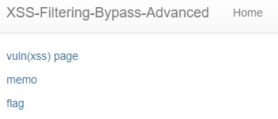
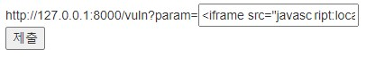
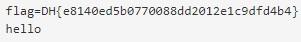

Exercise: XSS Filtering Bypass의 패치된 문제입니다.  
```python
#!/usr/bin/python3
from flask import Flask, request, render_template
from selenium import webdriver
from selenium.webdriver.chrome.service import Service
import urllib
import os

app = Flask(__name__)
app.secret_key = os.urandom(32)

try:
    FLAG = open("./flag.txt", "r").read()
except:
    FLAG = "[**FLAG**]"


def read_url(url, cookie={"name": "name", "value": "value"}):
    cookie.update({"domain": "127.0.0.1"})
    try:
        service = Service(executable_path="/chromedriver")
        options = webdriver.ChromeOptions()
        for _ in [
            "headless",
            "window-size=1920x1080",
            "disable-gpu",
            "no-sandbox",
            "disable-dev-shm-usage",
        ]:
            options.add_argument(_)
        driver = webdriver.Chrome(service=service, options=options)
        driver.implicitly_wait(3)
        driver.set_page_load_timeout(3)
        driver.get("http://127.0.0.1:8000/")
        driver.add_cookie(cookie)
        driver.get(url)
    except Exception as e:
        driver.quit()
        # return str(e)
        return False
    driver.quit()
    return True


def check_xss(param, cookie={"name": "name", "value": "value"}):
    url = f"http://127.0.0.1:8000/vuln?param={urllib.parse.quote(param)}"
    return read_url(url, cookie)

def xss_filter(text):
    _filter = ["script", "on", "javascript"]
    for f in _filter:
        if f in text.lower():
            return "filtered!!!"

    advanced_filter = ["window", "self", "this", "document", "location", "(", ")", "&#"]
    for f in advanced_filter:
        if f in text.lower():
            return "filtered!!!"

    return text

@app.route("/")
def index():
    return render_template("index.html")


@app.route("/vuln")
def vuln():
    param = request.args.get("param", "")
    param = xss_filter(param)
    return param


@app.route("/flag", methods=["GET", "POST"])
def flag():
    if request.method == "GET":
        return render_template("flag.html")
    elif request.method == "POST":
        param = request.form.get("param")
        if not check_xss(param, {"name": "flag", "value": FLAG.strip()}):
            return '<script>alert("wrong??");history.go(-1);</script>'

        return '<script>alert("good");history.go(-1);</script>'


memo_text = ""


@app.route("/memo")
def memo():
    global memo_text
    text = request.args.get("memo", "")
    memo_text += text + "\n"
    return render_template("memo.html", memo=memo_text)


app.run(host="0.0.0.0", port=8000)
```
## 엔드포인트 분석  
1. '/'  
-> 메인페이지 html 파일 render
2. '/vuln'  
-> param에서 특정 값을 얻어서 **xss_filter** 의 결과값을 return 한다.  
3. '/flag'  
-> param에서 특정 값을 얻어서 **check_xss** 에 넣어서 **xss를 필터링** 한다.
4. '/memo'  
-> memo에서 특정 값을 작성한다.  
## 주요 함수 분석  
1. xss_filter  
-> **script, on, javascript:, window, self, this, document, location, (, ), &#** 를 대소문자 구분하지 않고 필터링한다.
2. check_xss  
-> 입력받은 param을 이용해 URL을 만들어서 접근함  
## 문제 모습  
이전 문제인 **XSS Filtering Bypass** 와 동일함  
  

## 문제 해결  
이전 문제와 차이점이 있다.  
1. **window, self, this, document, location, (, ), &#** 를 추가적으로 필터링한다.  
2. 필터링 방식이 replace 가 아니라, **filtering을 return** 한다.   

즉, 이전 문제에서 사용했던 방식인 **oonn** 이런 방식을 사용할 수 없다.  
그래서 생각했던 방식이 있다.  
바로 **유니코드와 iframe** 을 사용하는 것이다.  
```html

```
이전 문제에서 사용한 예시 코드이다.  
여기서 **location, document** 는 유니코드로 우회할 수 있다.  
예를 들면, **location.href='/memo?memo='+document.cookie** 를 **locati\u006f\u006e.href='/memo?memo='+d\u006fcument.cookie** 로 바꿀 수 있다.  
그렇다면, **on** 은 어떻게 할 수 있을까?  
참고로 on은 바꿀 수 없다.  
-> **&#** 를 필터링해서, HTML Entity Encoding를 사용할 수 없기 때문이다.  
여기에서 사용할 수 있는 태그는 바로 **iframe** 이다.  
작동시킬 새로운 코드를 작성하면 다음과 같다.  
```html
<iframe src="javascript:location.href='/memo?memo='+document.cookie">
```
여기서 중요한 점은 **javascript:** 를 우회해야한다.  
이 부분을 잘 모르겠어서 구글링을 한 결과, **탭(tab)** 으로 우회할 수 있다고 한다.  
그래서 메모장에 **javascript:** 중간에 탭으로 나눈 것과 location.href 를 우회한 것을 합쳐서 다음과 같은 결과가 나왔다.  
```html
<iframe src="javasc	ript:locati\u006f\u006e.href='/memo?memo='+d\u006fcument.cookie">
```
  
  

따라서 정답은 **DH{e8140ed5b0770088dd2012e1c9dfd4b4}** 이다.