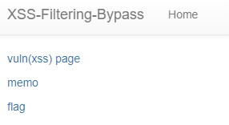
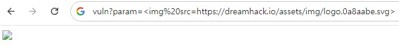
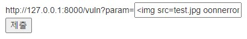
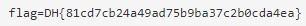

Exercise: XSS Filtering Bypass에서 실습하는 문제입니다.  
```python
#!/usr/bin/python3
from flask import Flask, request, render_template
from selenium import webdriver
from selenium.webdriver.chrome.service import Service
import urllib
import os

app = Flask(__name__)
app.secret_key = os.urandom(32)

try:
    FLAG = open("./flag.txt", "r").read()
except:
    FLAG = "[**FLAG**]"


def read_url(url, cookie={"name": "name", "value": "value"}):
    cookie.update({"domain": "127.0.0.1"})
    try:
        service = Service(executable_path="/chromedriver")
        options = webdriver.ChromeOptions()
        for _ in [
            "headless",
            "window-size=1920x1080",
            "disable-gpu",
            "no-sandbox",
            "disable-dev-shm-usage",
        ]:
            options.add_argument(_)
        driver = webdriver.Chrome(service=service, options=options)
        driver.implicitly_wait(3)
        driver.set_page_load_timeout(3)
        driver.get("http://127.0.0.1:8000/")
        driver.add_cookie(cookie)
        driver.get(url)
    except Exception as e:
        driver.quit()
        # return str(e)
        return False
    driver.quit()
    return True


def check_xss(param, cookie={"name": "name", "value": "value"}):
    url = f"http://127.0.0.1:8000/vuln?param={urllib.parse.quote(param)}"
    return read_url(url, cookie)

def xss_filter(text):
    _filter = ["script", "on", "javascript:"]
    for f in _filter:
        if f in text.lower():
            text = text.replace(f, "")
    return text

@app.route("/")
def index():
    return render_template("index.html")


@app.route("/vuln")
def vuln():
    param = request.args.get("param", "")
    param = xss_filter(param)
    return param


@app.route("/flag", methods=["GET", "POST"])
def flag():
    if request.method == "GET":
        return render_template("flag.html")
    elif request.method == "POST":
        param = request.form.get("param")
        if not check_xss(param, {"name": "flag", "value": FLAG.strip()}):
            return '<script>alert("wrong??");history.go(-1);</script>'

        return '<script>alert("good");history.go(-1);</script>'


memo_text = ""


@app.route("/memo")
def memo():
    global memo_text
    text = request.args.get("memo", "")
    memo_text += text + "\n"
    return render_template("memo.html", memo=memo_text)


app.run(host="0.0.0.0", port=8000)

```
## 엔드포인트 분석  
1. '/'  
-> 메인페이지 html 파일 render
2. '/vuln'  
-> param에서 특정 값을 얻어서 **xss_filter** 의 결과값을 return 한다.  
3. '/flag'  
-> param에서 특정 값을 얻어서 **check_xss** 에 넣어서 **xss를 필터링** 한다.
4. '/memo'  
-> memo에서 특정 값을 작성한다.  
## 주요 함수 분석  
1. xss_filter  
-> **script, on, javascript:** 를 대소문자 구분하지 않고 필터링한다.
2. check_xss  
-> 입력받은 param을 이용해 URL을 만들어서 접근함  

## 문제 모습  
  

여기가 메인페이지 '/' 이다.  
  

여기는 '/vuln' 인데, 여기서 주의깊게 봐야할 점은 param에 다음과 같은 코드가 들어가있다.  

```html

```
다음과 같이 **script, on, javascript:** 가 없으므로 필터링이 되지 않는 모습을 볼 수 있다.  

## 문제 해결  
여기서 이전에 XSS 문제들을 풀었다면, **/memo?memo=document.cookie** 등을 통해 cookie를 memo에 적을 수 있다.  
즉, /vuln 에 있었던 예시인 **img** 태그를 활용할 수 있다.  
```html

```
이 코드를 그대로 사용한다면, **on** 이 필터링 되기 때문에 사용할 수 없다.  
여기서 사용할 수 있는 방법은, **oonn** 이런 식으로 2번 겹쳐서 쓰면 해결할 수 있다.  
**xss_filter** 함수를 보면, for문을 이용해서 필터링 된 문자를 공백문자로 바꾸기 때문에 **oonn -> on** 으로 바뀌는 것이다.  



```html

```

  

따라서 정답은 **DH{81cd7cb24a49ad75b9ba37c2b0cda4ea}** 이다.