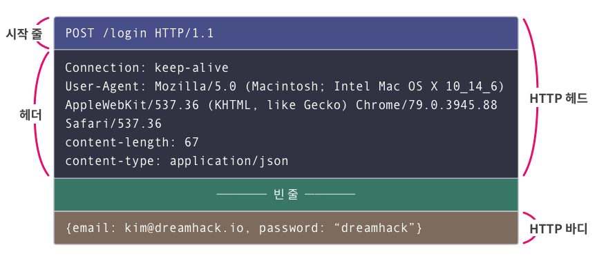
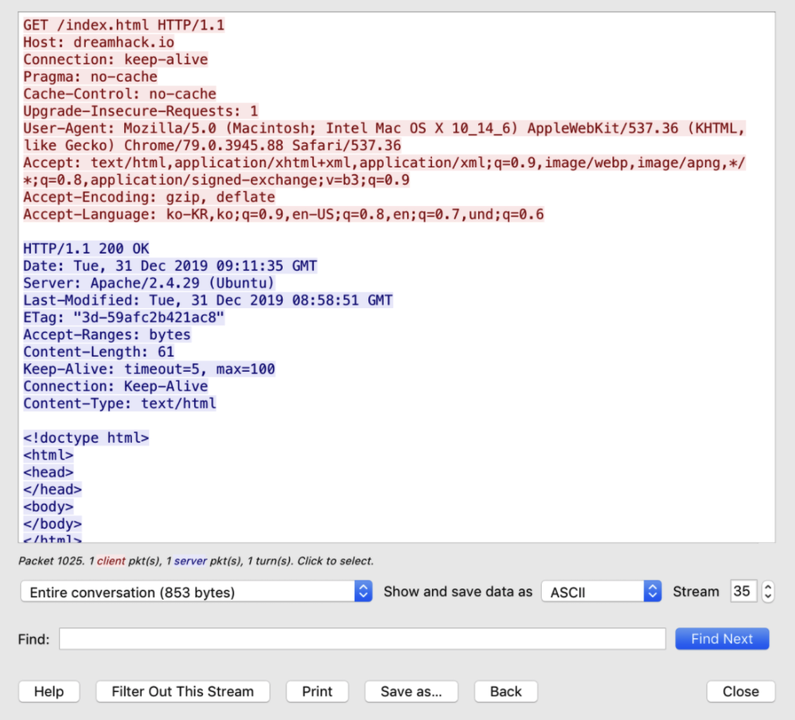
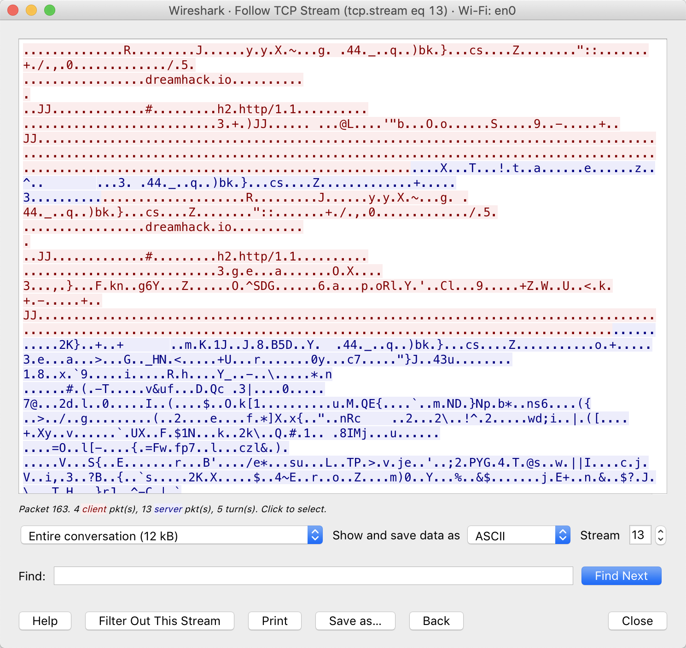

# 서론  
## 인코딩  
**인코딩(encoding)** : 0과 1로 우리의 문자를 표현하는 약속들(예 : **아스키, 유니코드**)  

## 통신 프로토콜  
**프로토콜(Protocol)** : **요청(request), 응답(Response)** 등과 같은 **규격화된** 상호작용에 적용되는 약속  
**통신 프로토콜(communication protocol)** : **컴퓨터나 원거리 통신 장비 사이** 에서 메시지를 주고 받는 양식과 규칙의 체계(예 : **TCP/IPO, HTTP** 등)  

  

# HTTP  
## HTTP  
**HTTP(Hyper Text Transfer Protocol)** : 서버와 클라이언트의 데이터 교환을 **요청(Request)** 과 **응답(Response)** 형식으로 정의한 프로토콜  

참고로 HTTP 서비스 포트는 **TCP/80** 혹은 **TCP/8080** 이다.  

### 참고(네트워크 포트와 서비스 포트)
**네트워크 포트(Network Port)** : 네트워크에서 서버와 클라이언트가 **정보를 교환하는 추상화된 장소**를 의미  
**서비스 포트(Service Port)** : 네트워크 포트 중에서 **특정 서비스가 점유하고 있는 포트**  

**포트로 데이터를 교환하는 방식**은 **전송 계층(Transport Layer)** 의 프로토콜을 따른다. 대표적으로는 **TCP**와 **UDP**가 있다.  

현대 운영체제에는 **포트의 개수는 65536개**(0 ~ 65535) 이다.  

**잘 알려진 포트(Well-known port)** 또는 **특권 포트(Privileged port)** : 0 ~ 1023번 포트(예 : **22번(SSH), 80번(HTTP), 443번(HTTPS)**)  

## HTTP 메시지  
### HTTP 헤더  
첫 줄은 **시작 줄(Start-line)**, 나머지 줄은 **헤더(Header)** 라고 부름.  
(각 줄은 **CRLF**로 구분된다.)  

**시작 줄** : 요청과 응답에 따라 다르지만, **메소드, 요청한 URI, HTTP 버전** 등이 들어간다.  
**헤더** : **필드**와 **값**으로 구성되며 **HTTP 메시지** 또는 **바디의 속성**을 나타냄  

### HTTP 바디  
**HTTP 바디** : 클라이언트나 서버에게 전송하려는 데이터  

### 참고(CRLF란?)  
**CRLF** : **Carriage Return (CR)** 와 **Line Feed (LF)** 의 조합  

**Carriage Return (CR)** : **커서**를 현재 줄의 **맨 앞으로** 이동시키는 문자  
**Line Feed (LF)** : **커서**를 **다음 줄로** 이동시키는 문자  

  

## HTTP 요청  
**HTTP 요청** : 서버에게 **특정 동작을 요구**하는 메시지  

### 시작 줄  
시작 줄은 **메소드(Method)**, **요청 URI(Request-URI)**, 그리고 **HTTP 버전**으로 구성된다.  

**메소드** : 서버가 수행하길 바라는 동작  
**요청 URI** : 메소드의 대상  
**HTTP 버전** : HTTP 프로토콜의 버전  

참고로, 메소드는 8가지가 있지만 대표적으로 **GET, POST**만 설명함  

**GET** : 리소스를 가져오라는 요청하는 메소드    
**POST** : 요청 대상에게 데이터를 보내는 메소드  

## HTTP 응답  
**HTTP 응답** : HTTP 요청에 대한 **결과를 반환**하는 메시지  

### 시작 줄  
시작 줄은 **HTTP 버전**, **상태 코드(Status Code)**, 그리고 **처리 사유(Reason Phrase)** 로 구성  

HTTP 버전은 HTTP 요청의 시작 줄에 있는 것과 동일  

**상태 코드** : **요청에 대한 처리 결과**를 세 자릿수로 표현한 것  
**처리 사유** : **상태 코드가 발생한 이유**를 짧게 기술한 것  

|상태코드|설명|대표예시|
|---|---|---|
|1xx|요청을 제대로 받았고, **처리가 진행 중**임||
|2xx|요청이 제대로 **처리됨**|<ul> <li> **200(OK)**: 성공 </li> </ul>|
|3xx|요청을 처리하려면, 클라이언트가 **추가 동작**을 취해야 함.|<ul> <li> **302(Found)**: 다른 URL로 갈 것 </li> </ul>|
|4xx|**클라이언트가 잘못된 요청**을 보내어 처리에 실패했습니다.|<ul> <li> **400(Bad Request)**: 요청이 문법에 맞지 않음 </li> <li> **401(Unauthorized)**: 클라이언트가 요청한 리소스에 대한 인증이 실패함 </li> <li> **403(Forbidden)**: 클라이언트가 리소스에 요청할 권한이 없음 </li> <li> **404(Not Found)**: 리소스가 없음 </li> </ul>|
|5xx|클라이언트의 요청은 유효하지만, **서버에 에러가 발생**하여 처리에 실패했습니다.|<ul> <li> **500(Internal Server Error)**: 서버가 요청을 처리하다가 에러가 발생함 </li> <li> **503(Service Unavailable)**: 서버가 과부하로 인해 요청을 처리할 수 없음 </li> </ul>|

### Lab - HTTP Request & Response  
추후에 작성  

# HTTPS  
## HTTPS  
**HTTP**의 응답과 요청은 **평문으로 전달**된다.  
-> 즉, 중간에 누가 가로채서 **정보가 유출**될 수 있다.  

**HTTPS(HTTP over Secure socket layer)** 는 **TLS(Transport Layer Security)** 프로토콜을 도입하고 **HTTP 메세지를 암호화**해서 해결  

  

**HTTP 통신**  

  

**HTTPS 통신**  

# 마치며  
## 마치며  

- **HTTP(HyperText Transfer Protocol)**: 웹 서버와 클라이언트가 리소스를 교환하기 위해 사용하는 프로토콜. 클라이언트가 요청하면, 서버가 응답하는 방식.

- **HTTP 메시지**: HTTP 서버와 클라이언트가 교환하는 데이터. 헤드와 바디로 구성되며, 각 줄은 CRLF로 구분됨.

    - 헤드: 메시지에 대한 정보. 헤드의 끝에는 CRLF가 한 줄 있음.

    - 바디: 클라이언트가 서버에게, 또는 서버가 클라이언트에게 전달할 데이터

- **HTTP 요청(Request)**: 클라이언트가 서버에게 특정 동작을 요청하는 메시지

    - 메소드(Method): 요청 URI가 가리키는 리소스에 대해, 서버가 수행했으면 하는 동작을 지정

    - 요청 URI(Request-URI): 메소드의 대상이 되는 리소스를 지정

- **HTTP 응답(Response)**: 요청을 처리한 결과 및 이유, 그리고 클라이언트에 전송할 웹 리소스를 포함하는 메시지

    - 상태 코드(Status code): 요청을 처리한 결과

    - 처리 사유(Reason phrase): 상태 코드가 발생한 이유

- **HTTPS(HTTP on Secure socket layer)**: TLS를 이용하여 HTTP의 약점을 보완한 프로토콜

# 퀴즈  
1. 다음 중 기본 HTTPS 포트 번호는?  
``답 : 443``  
2. 다음 중 기본 HTTP 포트 번호는?  
``답 : 80``  
3. 다음 중 서버에 추가 정보를 전달하는 데이터 부분으로, 이용자가 입력한 데이터를 전달하기 위함 보다는 이용자와 서버가 상호작용하기 위한 정보를 담기 위해 사용되는 것은?  
``답 : HTTP Header``  
