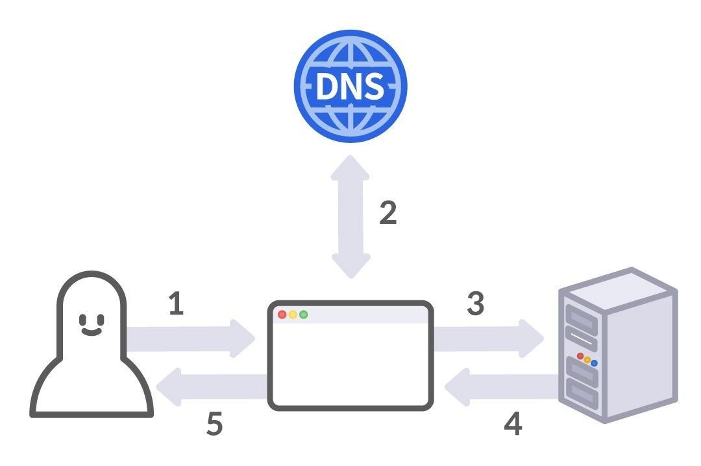
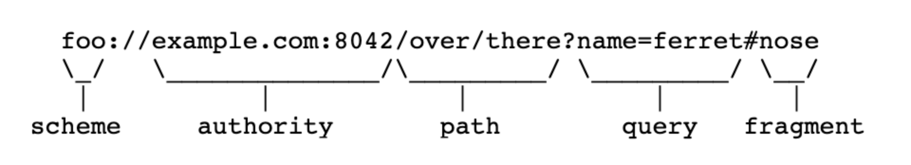
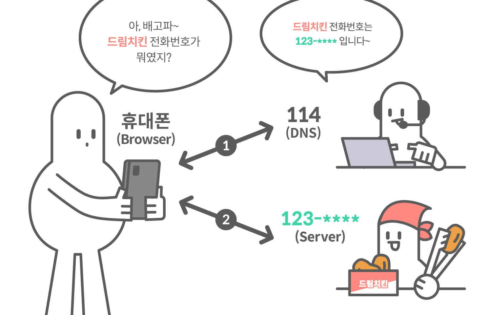

# 웹 브라우저  
## 웹 브라우저  
웹 브라우저는 서버와 **HTTP 통신을 대신해주고**, **수신한 리소스를 시각화**하는 UX(User eXperience)를 제공하는 소프트웨어 중 하나다.  

다음은 dreamhack.io 에 접속할 때 브라우저가 하는 동작이다.  

1. 웹 브라우저의 주소창에 입력된 주소를 해석 **(URL 분석)**  
2. dreamhack.io에 해당하는 주소 탐색 **(DNS 요청)**  
3. HTTP를 통해 dreamhack.io에 **요청**  
4. dreamhack.io의 HTTP **응답 수신**  
5. 리소스 다운로드 및 웹 렌더링 **(HTML, CSS, Javascript)**

  

## URL  
**URL(Uniform Resource Locator)** : 웹에 있는 **리소스의 위치를 표현**하는 문자열  
URL은 **Scheme, Authority (Userinfo, Host, Port), Path, Query, Fragment** 등으로 구성됨  

  

|요소|설명|
|---|---|
|**Scheme**|웹 서버와 **어떤 프로토콜로 통신할지** 나타낸다.| 
|**Host**|Authority의 일부로, 접속할 **웹 서버의 주소에 대한 정보**를 가지고 있다.|
|**Port**|Authority의 일부로, 접속할 **웹 서버의 포트에 대한 정보**를 가지고 있다.|
|**Path**|접근할 **웹 서버의 리소스 경로**로 '/'로 구분된다.|
|**Query**|웹 서버에 **전달하는 파라미터**이며 URL에서 '?' 뒤에 위치한다.|
|**Fragment**|메인 리소스에 존재하는 **서브 리소스를 접근**할 때 이를 식별하기 위한 정보를 담고 있다. '#' 문자 뒤에 위치한다.|

## Domain Name  
Host는 **Domain Name, IP Address**의 값을 가질 수 있다.  

**IP Address** : 네트워크상에서 통신이 이루어질 때 **장치를 식별하기 위해 사용되는 주소**  
**Domain Name** : 인터넷의 실제 IP 주소와 연결된 **기억하기 쉬운 이름** (IP주소는 외우기 힘들어서..)  

브라우저는 **Domain Name Server(DNS)** 에 **Domain Name**을 질의하고, DNS가 **응답한 IP Address를 사용**한다.  

  

## 웹 렌더링  
**웹 렌더링(Web Rendering)** : 서버로부터 받은 **리소스**를 이용자에게 **시각화하는 행위** (예 : **웹킷, 블링크, 개코**)  

  

# 마치며
## 마치며

- **웹 브라우저(Web browser)**: 웹 브라우저는 HTTP/S로 이용자와 웹 서버의 **통신을 중개**하며, 서버로부터 전달받은 다양한 **웹 리소스들을 가공해** 이용자에게 효과적으로 **전달**합니다. 이용자가 다양한 프로토콜들을 알지 못해도 **쉽게 웹을 사용할 수 있도록** 도와준다.

- **URL(Uniform Resource Locator)**: URL은 **리소스의 위치**를 나타내는 문자열로, 브라우저는 이를 사용하여 서버에 **특정 리소스를 요청**할 수 있다.

- **DNS(Domain Name Server)**: Host의 **도메인 이름을 IP로 변환**하거나 **IP를 도메인 이름으로 변환**한다.

- **웹 렌더링(Web rendering)**: 서버로부터 받은 **리소스**를 이용자에게 **시각화하는 것**.

# 퀴즈  
1. 다음 중 웹을 서핑하기 위해 사용하는 프로그램은?  
``답 : 웹 브라우저``
2. Host로는 Domain Name만 사용할 수 있다.  
``답 : X(ip 주소도 가능)``
