# 개발자 도구  
## 개발자 도구  

**개발자 도구(Devtools)** : 브라우저에게 **여러 기능을 제공**하는 도구  

1. HTML과 CSS **코드를** 브라우저에서 **수정**하고 **결과를 바로 확인**할 수 있음
2. 자바스크립트 코드를 대상으로 **디버거**도 제공
3. 서버와 오가는 HTTP **패킷도 상세히 보여줌**
4. 프로토콜 상에서 발생하는 **문제도 쉽게 발견**할 수 있음

보통 웹 브라우저에서 **f12**를 누르면 개발자 도구가 나온다.  

## 요소 검사  
요소 검사 : 특정 요소의 **개괄적인 정보**를 파악하고, 이와 관련된 **코드**를 쉽게 찾을 수 있다.  

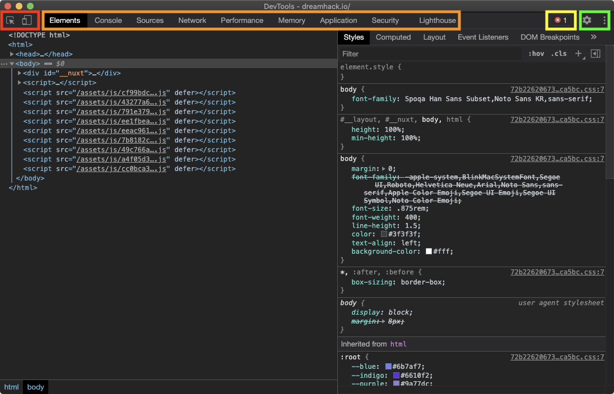  

|색깔|설명|
|---|---|
|🔴 빨간색|**요소 검사(Inspect)** 및 **디바이스 툴바(Device Toolbar)**|
|🟠 주황색|기능을 선택하는 패널. 코스에서는 굵게처리된 기능들만을 다룬다. <br> <ul> <li>**Elements**: 페이지를 구성하는 **HTML 검사**</li> <li>**Console**: **자바 스크립트를 실행**하고 결과를 확인할 수 있음</li> <li>**Sources**: HTML, CSS, JS 등 페이지를 구성하는 **리소스를 확인**하고 **디버깅**할 수 있음</li> <li>**Network**: 서버와 오가는 **데이터를 확인**할 수 있음</li> <li>Performance</li> <li>Memory</li> <li>**Application**: **쿠키를 포함**하여 웹 **어플리케이션**과 관련된 **데이터를 확인**할 수 있음</li> <li>Security</li> <li>Lighthouse</li> </ul>|
|🟡 노란색|현재 페이지에서 발생한 **에러 및 경고 메시지**|
|🟢 녹색|개발자 도구 **설정**|

## 요소 검사

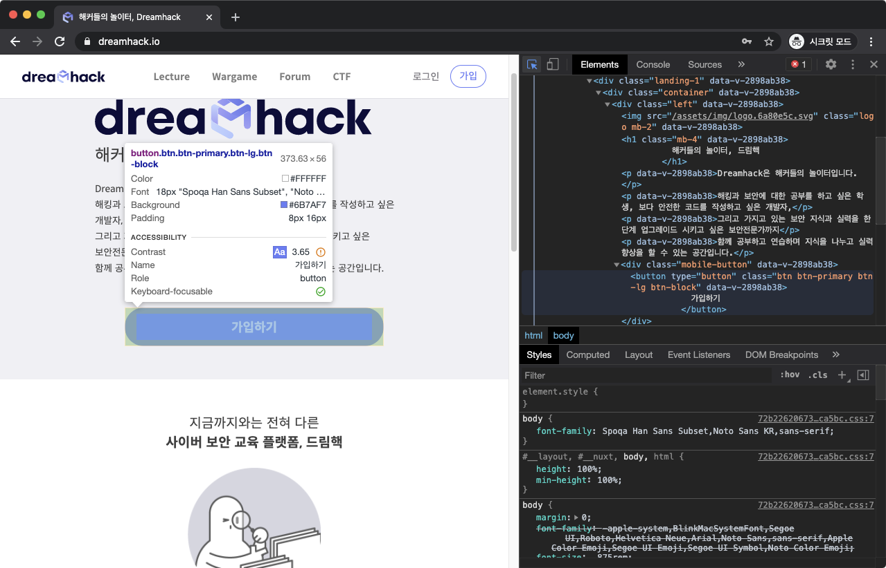  

다음과 같이 개발자 도구에서 가장 좌상단에 있는 **요소 검사** 버튼을 누르면, 커서를 원하는 요소에 가져가서 정보를 확인할 수 있다.  

## 디바이스 툴바  
**디바이스 툴바(Device Toolbar)** : 현재 브라우저의 **화면 비율** 및 **User-Agent**를 원하는 값으로 **변경함**(예 : 모바일 환경으로 화면 크기를 바꿀 수 있음)  

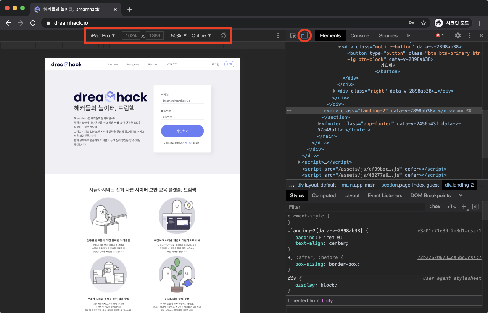  

## Elements  
### HTML 읽기  
현재 페이지를 구성하는 **HTML의 코드를 읽을 수 있음.**  

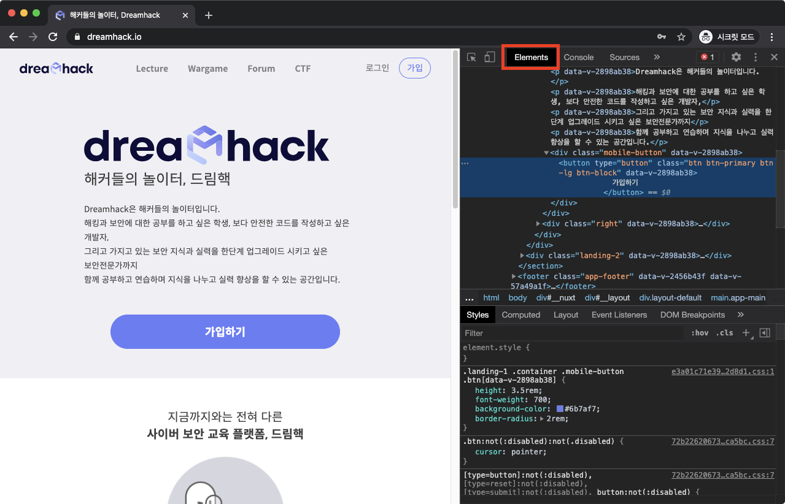  

### HTML 수정  
HTML **코드를 수정**할 수 있다.  

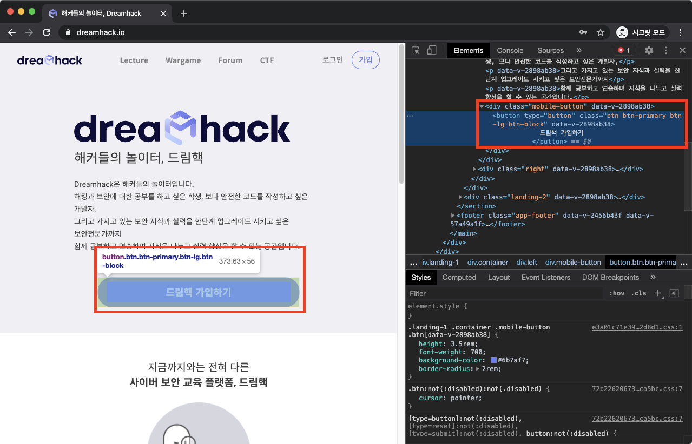  

### 콘솔(Console)
프론트엔드의 자바스크립트 **코드에서 발생한 각종 메세지를 출력**하고, 이용자가 **입력한 자바스크립트 코드를 실행**도 해주는 도구(예 : console.log(), 단축키 : Ctrl + Shift + J)  

## Sources  
현재 페이지를 구성하는 **웹 리소스들을 확인**  

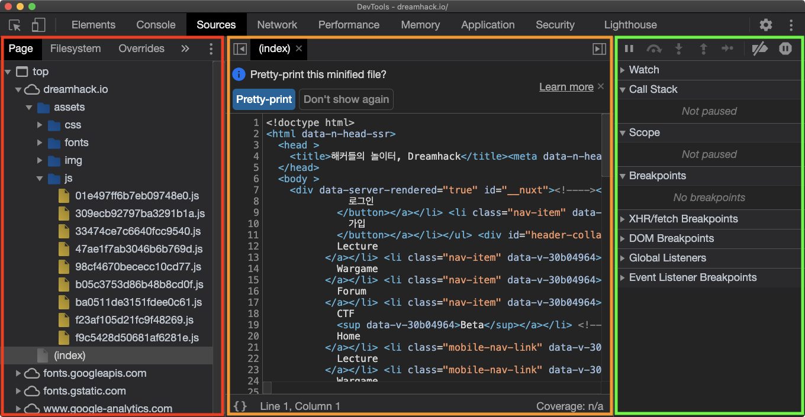  

|색깔|설명|
|---|---|
|🔴 빨간색|현재 페이지의 **리소스 파일 트리, 파일 시스템**|
|🟠 주황색|선택한 **리소스 상세 보기**|
|🟢 녹색|**디버깅** 정보 <br> <ul> <li>**Watch**: 원하는 **자바스크립트 식을 입력**하면, 코드 실행 과정에서 해당 식의 값 **변화를 확인**할 수 있다.</li> <li>**Call Stack**: **함수들의 호출 순서**를 스택 형태로 보여준다. 예를 들어, A → B → C 순서로 함수가 호출되어 현재 C 내부의 코드를 실행하고 있다면, Call Stack의 가장 위에는 C, 가장 아래에는 A가 위치한다.</li> <li>**Scope**: 정의된 **모든 변수들의 값을 확인**할 수 있다.</li> <li> **Breakpoints**: **브레이크포인트**들을 확인하고, 각각을 **활성화 또는 비활성화**할 수 있다. </li> </ul>|

## Sources - Debug  
Source에서 원하는 자바스크립트를 **디버깅**할 수도 있다.  

### 디버깅 실습  
[실습 페이지](https://dreamhack-lecture.s3.ap-northeast-2.amazonaws.com/uploads/web-devtools/debug.html)  

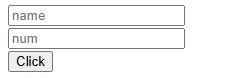  

실습 페이지에 들어가면, 위와 같이 name, num을 입력하는 공간이 나온다.  

```html
<!DOCTYPE html>
<html>

<head>
    <title>JS Debug</title>
    <meta charset="UTF-8">
</head>

<body>
    <input type='text' id='input-name' placeholder='name'><br />
    <input type='text' id='input-num' placeholder='num'><br />
    <!-- 버튼 클릭 시 button_click함수가 실행됩니다. -->
    <input type='button' onclick='button_click()' value="Click">
    <script>
        /*
         name과 num에 대한 변수를 검증하는 함수입니다.
         name이 'dreamhack', num이 31337인 경우 "congratulations !" 문자열을 출력합니다.
        */
        function compare(name, num) {
            if (name == 'dreamhack') {
                if (num == 31337) {
                    console.log("congratulations !");
                    return;
                }
            }
            console.log("No !");
        }
        /*
         버튼 클릭 시 실행되는 함수입니다.
         'input-name', 'input-num'의 값을 가져와 compare함수를 실행합니다.
        */
        function button_click() {
            var name = document.getElementById('input-name').value;
            var num = parseInt(document.getElementById('input-num').value);
            compare(name, num);
        }
    </script>
</body>

</html>
```

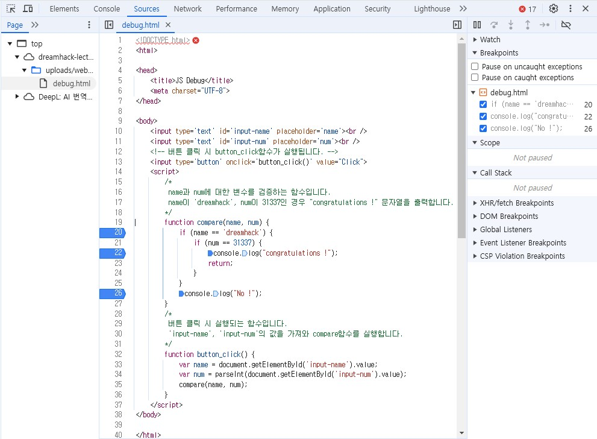  

위와 같이 20, 22, 26에 중단점이 있는 것을 확인할 수 있다.  

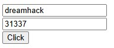 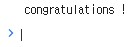  

위와 같이 각각 **dreamhack**, **31337** 을 입력하면 중단점을 거쳐서 console.log에 의해 **congratulations !** 가 나오는 것을 볼 수 있다.  

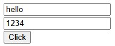 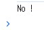  

그러나 다음과 같이 다른 값을 넣으면, **No !** 가 나오는 것을 볼 수 있다.  

## Network  
**서버와 오가는 데이터를 확인**할 수 있다.  

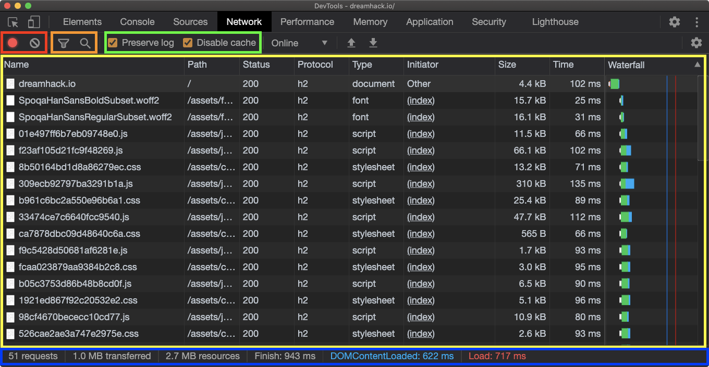  

|색깔|설명|
|---|---|
|🔴 빨간색|**로깅 중지** 및 로그 **전체 삭제**|
|🟠 주황색|로그 **필터링 및 검색**|
|🟢 녹색|옵션 <br> <ul> <li>**Preserve log**: 새로운 페이지로 이동해도 **로그를 삭제하지 않습니다.**</li> <li>**Disable cache**: 이미 **캐시된 리소스**도 서버에 **요청**합니다.</li> </ul>|
|🟡 노란색|**네트워크 로그**|
|🔵 파란색|네트워크 로그 **요약 정보**|

또한 그 데이터에 대한 **상세 설명**도 볼 수 있다.  

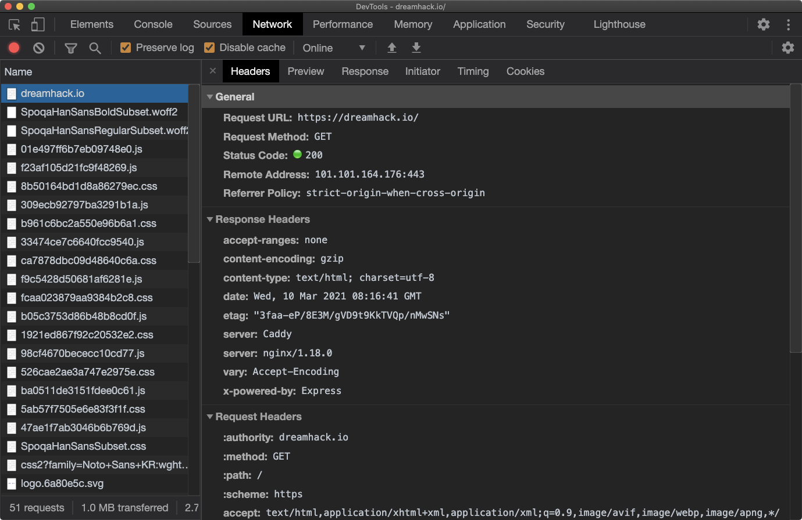  

## Network - Copy  
Network에서 **로그**를 우클릭하고, Copy에서 **원하는 형태로 복사**할 수 있음  

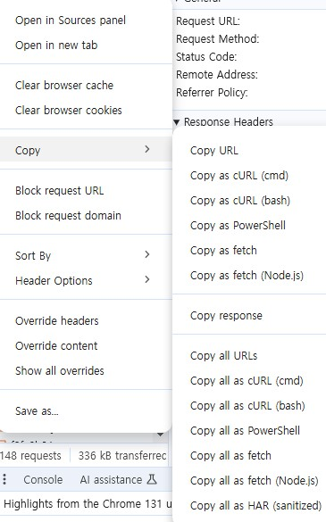  

## Application  
**쿠키, 캐시, 이미지, 폰트, 스타일시트** 등 웹 애플리케이션과 관련된 **리소스를 조회**  

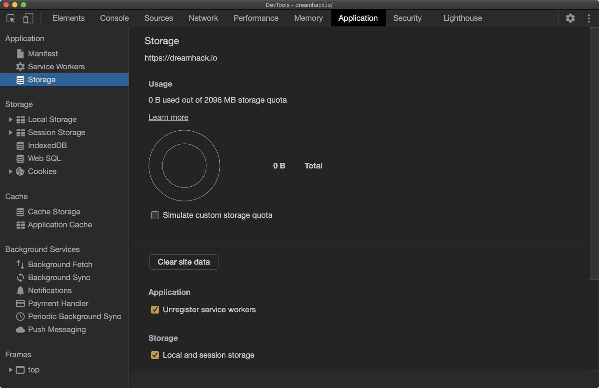  

그리고 뒤에서 배울 **쿠키**도 **확인하고 수정**할 수 있다.  

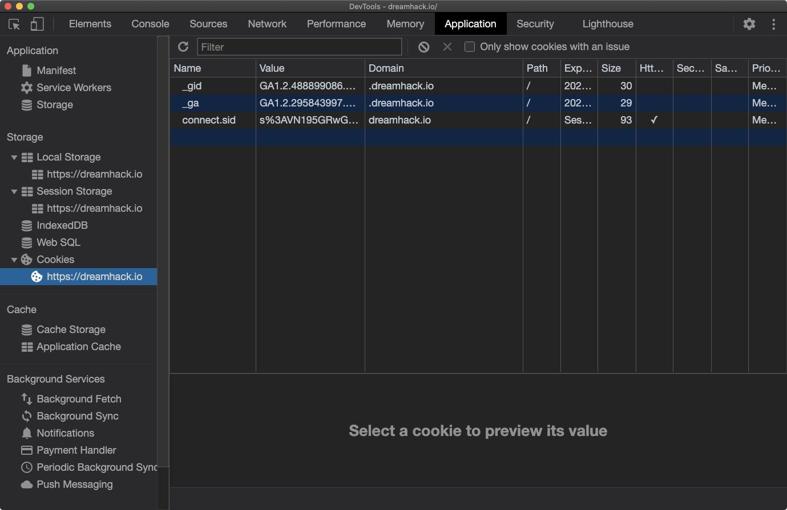  

## Console Drawer  
개발자 도구에 **새로운 콘솔창을 열어** 가시성과 효율성을 높일 수 있다.(단축키 : ESC)  

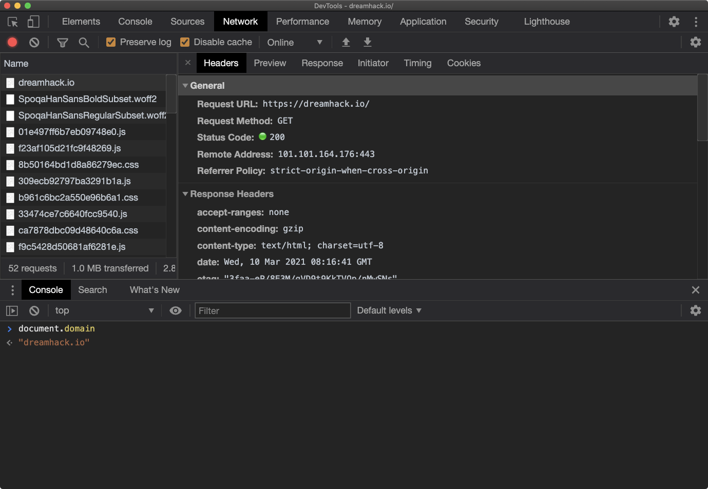  

# 기타 브라우저 기능  
## 페이지 소스 보기  
페이지 소스 보기 : 페이지와 관련된 **소스 코드들을 모두 확인**(단축키 : Ctrl + u)  

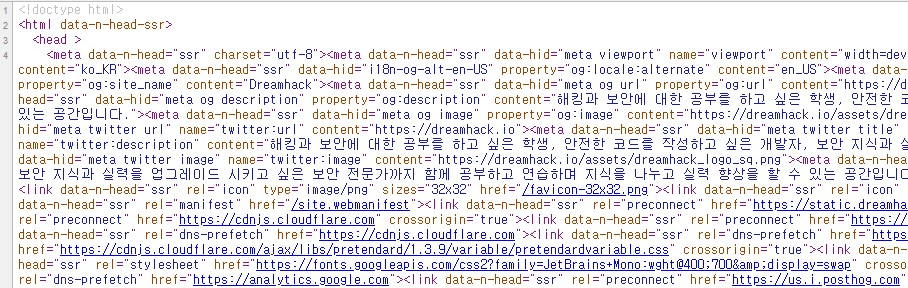  

## Secret browsing mode  
시크릿 모드로서 **방문 기록, 쿠키, 입력한 정보** 등을 저장하지 않는 브라우저 창이다.(단축키 : Ctrl + Shift + n)  

# 마치며  
## 마치며  

- **개발자 도구 (DevTools)**: 웹 페이지를 진단할 때 사용하는 브라우저 도구  

# 퀴즈  
1. 개발자 도구의 Console 탭에서 특정 변수의 값을 콘솔 화면에 출력할 때 사용하는 함수는?  
``답 : console.log``
2. 개발자 도구의 Sources 탭에서 원하는 자바스크립트를 디버깅할 수 있다.  
``답 : O``
3. 브라우저의 특정 모드로써 브라우저를 종료할 때 방문 기록, 쿠키 및 사이트 데이터, 양식 입력 값 등의 정보가 저장되지 않는 모드는?  
``답 : 시크릿 모드``
4. 개발자 도구에서는 HTML이나 JavaScript는 수정할 수 있지만 CSS는 수정할 수 없다.  
``답 : X(CSS도 수정 가능)``
