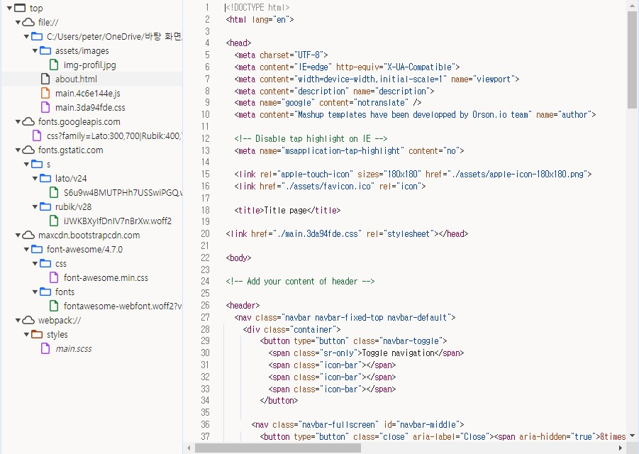
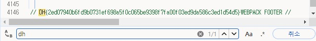

문제는 **"개발자 도구의 Sources 탭 기능을 활용해 플래그를 찾아보세요."** 입니다.  
먼저 문제 파일에서 제공한 html파일을 열었습니다.  
  
다음과 같이 사이트가 나왔습니다.  
  
그리고 개발자 도구를 열어서 Sources로 갔습니다.  
여기서 플래그를 찾으라고 해서, 코드에 플래그가 있는 것 같았습니다.  
그래서 이미지에 있는 모든 파일에서 플래그를 검색했습니다.  
  
결국 다음과 같이 코드에 flag가 숨겨져 있었습니다.  
따라서 정답은 **DH{2ed07940b6fd9b0731ef698a5f0c065be9398f7fa00f03ed9da586c3ed1d54d5}** 입니다.
