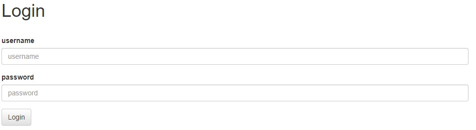
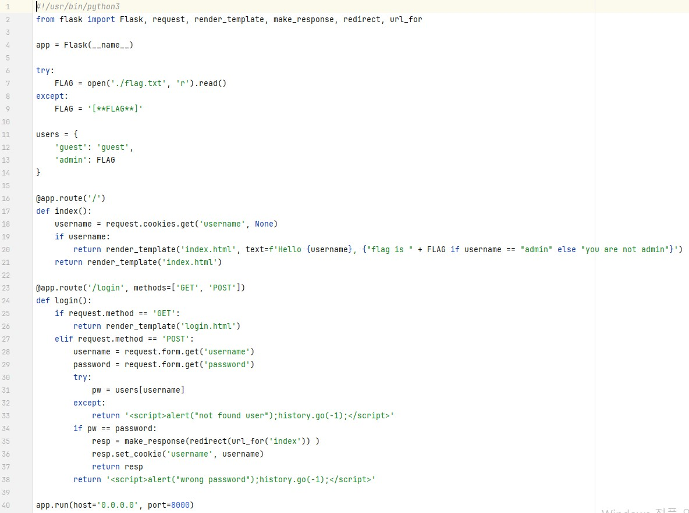
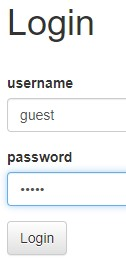

문제는 **"쿠키로 인증 상태를 관리하는 간단한 로그인 서비스입니다. admin 계정으로 로그인에 성공하면 플래그를 획득할 수 있습니다."** 입니다.  
우선 사이트로 들어갔습니다.  
   
다음과 같이 메인화면과 login화면이 나왔습니다.  

문제 파일을 풀어서 나온 app.py를 보면 다음과 같습니다.  
  
23 ~ 38번째 줄이 로그인 화면에 대한 코드입니다.  
여기서 27번째 줄부터 보면, **username과 password에 각각 입력한 username과 password**가 들어갑니다.  
즉, 31번째 줄을 보면 users에서 username에 해당하는 값(11번째 줄에 있는 딕셔너리 -> 즉, **비밀번호**)을 **pw에 넣고** 비교합니다.  
즉, username에 guest, password에 guest를 넣으면 로그인이 됩니다.  
   
이렇게 로그인이 됩니다.  
그러나 **admin이 아니기 때문에** 문제를 해결한 것은 아닙니다.  
여기서 문제를 보면, **쿠키를 이용하는 문제**인 것 같아서 쿠키를 확인했습니다.  
  
이렇게 **guest에 대한 쿠키**가 만들어졌습니다.  
**쿠키는 정보를 변조할 수 있기** 때문에 다음과 같이 **value에 admin**을 넣었습니다.  
   
쿠키를 이렇게 변조하면 flag가 나옵니다.  
따라서 정답은 **DH{7952074b69ee388ab45432737f9b0c56}** 입니다.  
