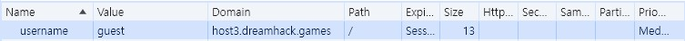
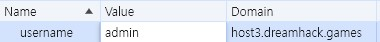

문제는 **"쿠키로 인증 상태를 관리하는 간단한 로그인 서비스입니다. admin 계정으로 로그인에 성공하면 플래그를 획득할 수 있습니다."** 이다.  

우선 사이트로 들어갔다.  

   

다음과 같이 메인화면과 login화면이 나왔다.  

문제 파일을 풀어서 나온 app.py를 보면 다음과 같다.  

```python
#!/usr/bin/python3
from flask import Flask, request, render_template, make_response, redirect, url_for

app = Flask(__name__)

try:
    FLAG = open('./flag.txt', 'r').read() # flag.txt 파일로부터 FLAG 데이터를 가져옴
except: # 없다면
    FLAG = '[**FLAG**]' # FLAG를 다음과 같이 설정

users = {
    'guest': 'guest',
    'admin': FLAG # FLAG 데이터를 password로 설정
}

@app.route('/') # / 페이지 라우팅
def index():
    username = request.cookies.get('username', None) # 이용자가 전송한 쿠키의 username 입력값을 가져옴
    if username: # username 입력값이 존재하는 경우
        # "admin"인 경우 FLAG 출력, 아닌 경우 "you are not admin" 출력
        return render_template('index.html', text=f'Hello {username}, {"flag is " + FLAG if username == "admin" else "you are not admin"}')
    return render_template('index.html')

@app.route('/login', methods=['GET', 'POST']) # login 페이지 라우팅, GET/POST 메소드로 접근
def login():
    if request.method == 'GET': # 만약 GET으로 요청 시
        return render_template('login.html') # login.html 페이지 출력
    elif request.method == 'POST': # 만약 POST로 요청 시
        username = request.form.get('username') # 이용자가 전송한 username 입력값을 가져옴
        password = request.form.get('password') # 이용자가 전송한 password 입력값을 가져옴
        try:
            pw = users[username] # users 변수(위에 있는 블럭)에 이용자가 전송한 username이 존재하는 지 확인
        except: # 없다면
            return '<script>alert("not found user");history.go(-1);</script>' # 존재하지 않는 다고 출력함
        if pw == password: # password가 같다면(username이 존재하고)
            resp = make_response(redirect(url_for('index')) ) # index 페이지로 이동하는 응답 생성
            resp.set_cookie('username', username) # username 쿠키 설정
            return resp
        return '<script>alert("wrong password");history.go(-1);</script>' # password가 틀렸다면, 틀렸다고 경고를 보냄

app.run(host='0.0.0.0', port=8000)
```

``login`` 에서 **elif** 부분을 보면, **username과 password에 각각 입력한 username과 password**가 들어간다.  

즉, **try** 부분을 보면 users에서 username에 해당하는 값(users 딕셔너리 -> 즉, **비밀번호**)을 **pw에 넣고** 비교한다.  

즉, username에 guest, password에 guest를 넣으면 로그인이 된다.  

   

이렇게 로그인이 된다.  

그러나 **admin이 아니기 때문에** 문제를 해결한 것은 아니다.  
여기서 문제를 보면, **쿠키를 이용하는 문제**인 것 같아서 쿠키를 확인했다.  

  

이렇게 **guest에 대한 쿠키**가 만들어졌다.  
**쿠키는 정보를 변조할 수 있기** 때문에 다음과 같이 **value에 admin**을 넣었다.  

   

쿠키를 이렇게 변조하면 flag가 나온다.  

따라서 정답은 **DH{7952074b69ee388ab45432737f9b0c56}** 이다.  
