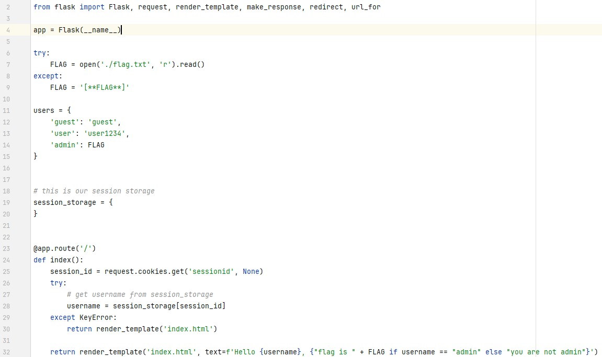

문제는 **'쿠키와 세션으로 인증 상태를 관리하는 간단한 로그인 서비스입니다. admin 계정으로 로그인에 성공하면 플래그를 획득할 수 있습니다."** 입니다.  
이전의 cookie 문제와 동일합니다.  
실제로 cookie 문제의 사이트와 거의 동일합니다.  
   
app.py도 거의 비슷합니다.  
   
cookie 문제와의 차이점은 먼저 **session**을 사용합니다. 그리고 users에 **user가 추가**되었습니다.  
실제로 아까와 같이 guest, user로 로그인을 하면 다음과 같이 나왔습니다.  
   
admin이 아니라고 합니다.  
  
개발자 도구에 들어가면 다음과 같이 session을 볼 수 있습니다.  
코드를 보면, session은 랜덤으로 생성되기 때문에 **변조를 하는 것은 사실상 불가능**입니다.  
그러나 56 ~ 65번째 줄을 보면, **@app.route('/admin')** 을 통해 다른 path가 있는 것을 볼 수 있습니다.  
코드를 보면, session이 들어있는 **session_storage를 return 하는 것**을 볼 수 있습니다.  
그래서 바로 그 경로로 들어갔습니다.  
  
이렇게 user에 따른 session을 볼 수 있었고, 개발자 도구에서 **1d2725be13fa981799aeb526a844a08906de54217856fcac62325c15baa15164** 로 session을 바꾸면 admin으로 로그인할 수 있습니다.  
  
session을 바꾸면 이렇게 flag를 얻을 수 있습니다.  

따라서 정답은 **DH{8f3d86d1134c26fedf7c4c3ecd563aae3da98d5c}** 입니다.  
