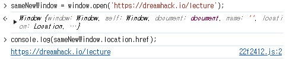
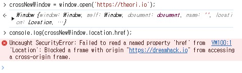
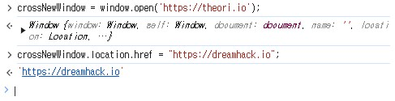

# Same Origin Policy(SOP)  
## SOP  
**동일 출처 정책 (Same Origin Policy, SOP)** : 클라이언트 입장에서 **가져온 데이터를 악의적인 페이지에서 읽을 수 없도록**하는 브라우저의 보안 메커니즘  

## Origin 구분 방법  
**오리진 (Origin)** : 브라우저가 가져온 **정보의 출처**  
오리진은 **프로토콜 (Protocol, Scheme), 포트 (Port), 호스트 (Host)** 로 구성  
-> 구성 요소가 **모두 일치**해야 같은 오리진  

https://same-origin.com/ 로 예시

|URL|결과|이유|
|-----|---|---|
|https://same-origin.com/frame.html|Same Origin|Path만 다름|
|http://same-origin.com/frame.html|Cross Origin|Scheme이 다름|
|https://cross.same-origin.com/frame.html|Cross Origin|Host가 다름|
|https://same-origin.com:1234/|Cross Origin|Port가 다름|

## SOP 실습 - 브라우저 
SOP는 Cross Origin이 아닌 **Same Origin일 때만 정보를 읽을 수 있도록** 해줍니다.  

예 : https://dreamhack.io 에서 console 창에서 실습  

### Same Origin  
```javascript
sameNewWindow = window.open('https://dreamhack.io/lecture');
console.log(sameNewWindow.location.href);
```
결과 : https://dreamhack.io/lecture (같은 오리진이므로 결과가 잘 나옴)  

  

### Cross Origin  

```javascript
crossNewWindow = window.open('https://theori.io');
console.log(crossNewWindow.location.href);
```

결과 : Origin 오류 (다른 오리진 이므로, 데이터를 읽을 수 없다)  

  

### Cross Origin 데이터 읽기/쓰기  
```javascript
crossNewWindow = window.open('https://theori.io');
crossNewWindow.location.href = "https://dreamhack.io";
```
다른 오리진의 데이터를 **읽는 것을 불가능** 하지만, **쓰는 것은 가능**하다.  

  

## SOP 실습 - Lab
**추후에 추가**

# Cross Origin Resource Sharing(CORS)  
## SOP 제한 완화  

**이미지나 자바스크립트, CSS** 등의 리소스를 불러오는 **, <style>, <script> 등의 태그** 는 SOP의 **영향을 받지 않습니다.**  

웹 서비스에서 동일 출처 정책인 **SOP를 완화**하여 **다른 출처의 데이터를 처리** 해야 하는 경우도 있다.  
-> 즉, 이런 경우에는 SOP를 완화할 수 있다.  

- 카페: https://cafe.dreamhack.io
- 블로그: https://blog.dreamhack.io
- 메일: https://mail.dreamhack.io
- 메인: https://dreamhack.io

위와 같은 경우에는 호스트가 다르므로 Cross Origin이다.  
그래서 데이터를 SOP를 피해서 공유해야 한다.(예 : 네이버 서비스)  

이 때, **CORS** 를 사용한다.

## CORS  
**교차 출처 리소스 공유 (Cross Origin Resource Sharing, CORS)** : HTTP 헤더에 기반하여 **Cross Origin 간에 리소스를 공유**하는 방법  

아래는 **웹 리소스를 요청**하는 코드이다.  
```javascript
/*
    XMLHttpRequest 객체를 생성합니다. 
    XMLHttpRequest는 웹 브라우저와 웹 서버 간에 데이터 전송을
    도와주는 객체 입니다. 이를 통해 HTTP 요청을 보낼 수 있습니다.
*/
xhr = new XMLHttpRequest();
/* https://theori.io/whoami 페이지에 POST 요청을 보내도록 합니다. */
xhr.open('POST', 'https://theori.io/whoami');
/* HTTP 요청을 보낼 때, 쿠키 정보도 함께 사용하도록 해줍니다. */
xhr.withCredentials = true;
/* HTTP Body를 JSON 형태로 보낼 것이라고 수신측에 알려줍니다. */
xhr.setRequestHeader('Content-Type', 'application/json');
/* xhr 객체를 통해 HTTP 요청을 실행합니다. */
xhr.send("{'data':'WhoAmI'}");
```

위의 코드에 의한 HTTP 요청 헤더이다.  
```http
OPTIONS /whoami HTTP/1.1
Host: theori.io
Connection: keep-alive
Access-Control-Request-Method: POST
Access-Control-Request-Headers: content-type
Origin: https://dreamhack.io
Accept: */*
Referer: https://dreamhack.io/
```

맨 위의 코드에서 **POST** 방식으로 요청을 보내려고 했으나, 실제로 HTTP 요청에는 **OPTIONS** 가 들어갔다.  

**CORS preflight** : 웹 리소스를 **요청해도 되는지 질의**하는 과정  

위의 HTTP 요청에 의한 응답이다.  
```http
HTTP/1.1 200 OK
Access-Control-Allow-Origin: https://dreamhack.io
Access-Control-Allow-Methods: POST, GET, OPTIONS
Access-Control-Allow-Credentials: true
Access-Control-Allow-Headers: Content-Type
```

다음은 위의 응답에 대한 설명이다.

|Header|설명|
|---|---|
|Access-Control-Allow-Origin|헤더 값에 해당하는 Origin에서 들어오는 요청만 처리합니다.|
|Access-Control-Allow-Methods|헤더 값에 해당하는 메소드의 요청만 처리합니다.|
|Access-Control-Allow-Credentials|쿠키 사용 여부를 판단합니다. 예시의 경우 쿠키의 사용을 허용합니다.|
|Access-Control-Allow-Headers|헤더 값에 해당하는 헤더의 사용 가능 여부를 나타냅니다.|

## JSONP  
**JSONP**(JSON with Padding) 방식은 **SOP에 영향을 받지 않는 특징**을 이용해 **<script> 태그로 Cross Origin의 데이터를 불러옵니다.**  

아래의 코드는 **웹 리소스를 요청**하는 코드이다.  

```javascript
<script>
/* myCallback이라는 콜백 함수를 지정합니다. */
function myCallback(data){
    /* 전달받은 인자에서 id를 콘솔에 출력합니다.*/
	console.log(data.id)
}
</script>
<!--
https://theori.io의 스크립트를 로드하는 HTML 코드입니다.
단, callback이라는 이름의 파라미터를 myCallback으로 지정함으로써
수신측에게 myCallback 함수를 사용해 수신받겠다고 알립니다.
-->
<script src='http://theori.io/whoami?callback=myCallback'></script>
```

다음 코드는 위의 요청에 대한 응답이다.
```javascript
/*
수신측은 myCallback 이라는 함수를 통해 요청측에 데이터를 전달합니다.
전달할 데이터는 현재 theori.io에서 클라이언트가 사용 중인 계정 정보인
{'id': 'dreamhack'} 입니다. 
*/
myCallback({'id':'dreamhack'});
```

참고로 JSONP는 거의 사용하지 않는다.  

# 마치며
## 마치며

- **Same Origin Policy (SOP)**: 동일 출처 정책, 현재 페이지의 출처가 아닌 **다른 출처로부터 온 데이터를 읽지 못하게** 하는 브라우저의 보안 메커니즘
- **Same Origin**: 현재 페이지와 **동일한 출처**
- **Cross Origin**: 현재 페이지와 **다른 출처**
- **Cross Origin Resource Sharing (CORS)**: **교차 출처 리소스 공유**, SOP의 제한을 받지 않고 Cross Origin의 데이터를 처리할 수 있도록 해주는 메커니즘

# 퀴즈  
1. 다음 중 CORS 헤더 방식에서 HTTP 메소드 중 OPTIONS를 통해 수신측 웹 리소스의 접근 관련 질의를 하는 과정은?
**답 : CORS preflight**
2. 다음 중 SOP의 동일 출처 기준을 판단하는 URI의 요소는? (모두 선택)
**답 : Port, Host, Schema**
3. 다음 중 SOP는 어디로부터 온 데이터를 브라우저가 읽지 못하게 하는 정책인가?
**답 : Cross Origin**
4. 다음 중 SOP의 제한을 완화하여 다른 Origin의 웹 리소스를 가져오는 방식은?
**답 : CORS**
