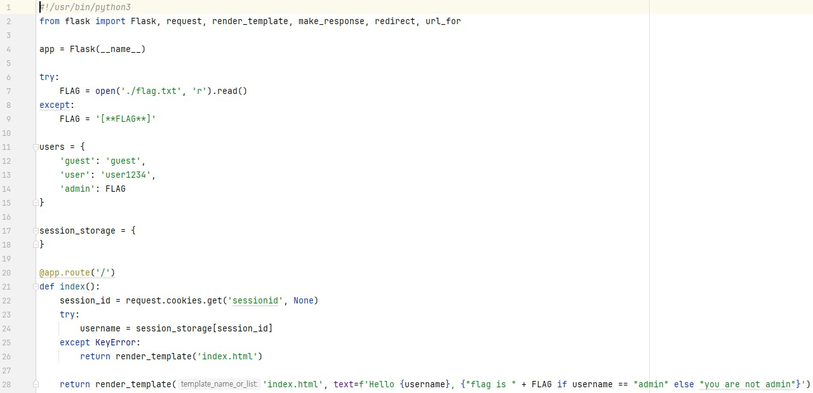
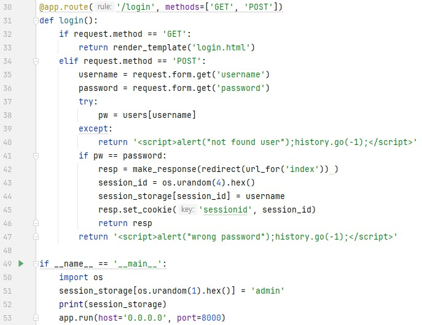
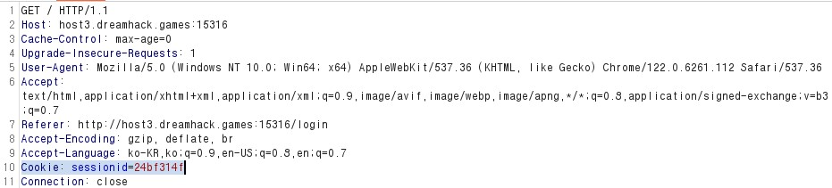
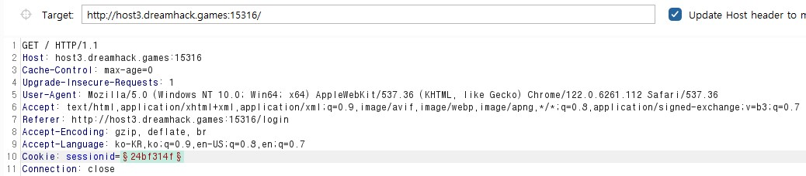
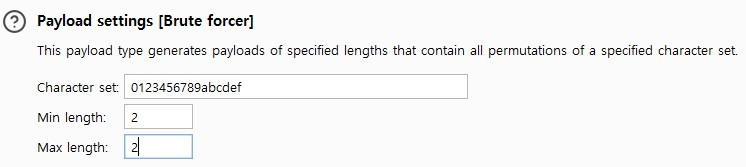
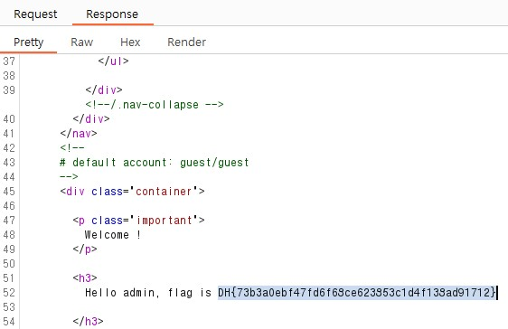

문제는 **쿠키와 세션으로 인증 상태를 관리하는 간단한 로그인 서비스입니다. admin 계정으로 로그인에 성공하면 플래그를 획득할 수 있습니다.** 입니다.  
사실 스터디에서 쉬운 이 문제를 풀지 못해서 아쉬웠습니다.  
이번에 이 문제를 풀면서 웹 해킹에서 자주 사용하는 **Burp Suite**를 사용해보기로 했습니다.  
   
코드는 이전에 cookie, session-basic 문제와 비슷합니다.  
코드에서 한 가지 집중적으로 봐야할 곳은 51번째 줄입니다.  
**session_storage[os.urandom(1).hex()] = 'admin'** 는 **admin에 대한 session에 대한 키** 값이 **랜덤으로 1바이트 값의 16진수(00 ~ FF)인 것**을 알 수 있다.  
그렇다면 이 문제를 풀기 위해 그 **키 값을 이용해 session을 알아내면** admin으로 로그인할 수 있고, 문제를 해결한다.  
이 때 **Burp Suite**를 이용했습니다.  
  
이는 Burp Suite를 이용해 guest로 로그인했을 때의 request 메시지입니다.  
여기서 **로그인한 사람의 session이 나온다**는 것을 알 수 있습니다.  
그래서 Burp Suite 에서 **brute force**를 통해 올바른 session을 구하기로 했습니다.  
   
먼저 Intruder-Positions 에서 공격할 Target과 보낼 request 메시지를 적습니다.  
여기서 중요한 점은 10번째 줄에 있는 session 에 대한 brute force를 할 것이므로, 특수기호로 감쌌습니다.  
그리고 Intruder-Payloads에서 **0 ~ f까지 2자리를 조합해서 공격**할 것이라고 설정하고 공격을 하면 다음과 같은 결과가 나옵니다.  
  
여기서 **response message의 길이가 혼자 다른** 경우가 있어서 response message를 봤습니다.  
그리고, **admin으로 로그인을 성공**했고, flag를 얻었습니다.  

답은 **DH{73b3a0ebf47fd6f68ce623853c1d4f138ad91712}** 입니다.
