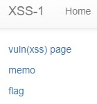
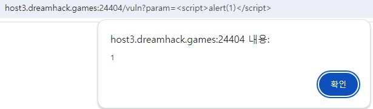
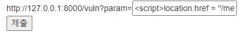
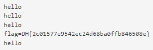

코드의 자세한 설명은 다음 사이트에서 참고했다. **https://velog.io/@mm0ck3r/Dreamhack-xss-1**  
문제는 **여러 기능과 입력받은 URL을 확인하는 봇이 구현된 서비스입니다. XSS 취약점을 이용해 플래그를 획득하세요. 플래그는 flag.txt, FLAG 변수에 있습니다.** 이다.  

우선 코드를 봤다.  

```python
#!/usr/bin/python3
from flask import Flask, request, render_template
from selenium import webdriver
from selenium.webdriver.chrome.service import Service
import urllib
import os

app = Flask(__name__)
app.secret_key = os.urandom(32)

try:
    FLAG = open("./flag.txt", "r").read()
except:
    FLAG = "[**FLAG**]"


def read_url(url, cookie={"name": "name", "value": "value"}):
    cookie.update({"domain": "127.0.0.1"})
    try:
        service = Service(executable_path="/chromedriver")
        options = webdriver.ChromeOptions()
        for _ in [
            "headless",
            "window-size=1920x1080",
            "disable-gpu",
            "no-sandbox",
            "disable-dev-shm-usage",
        ]:
            options.add_argument(_)
        driver = webdriver.Chrome(service=service, options=options)
        driver.implicitly_wait(3)
        driver.set_page_load_timeout(3)
        driver.get("http://127.0.0.1:8000/")
        driver.add_cookie(cookie)
        driver.get(url)
    except Exception as e:
        driver.quit()
        # return str(e)
        return False
    driver.quit()
    return True


def check_xss(param, cookie={"name": "name", "value": "value"}):
    url = f"http://127.0.0.1:8000/vuln?param={urllib.parse.quote(param)}"
    return read_url(url, cookie)


@app.route("/")
def index():
    return render_template("index.html")


@app.route("/vuln")
def vuln():
    param = request.args.get("param", "")
    return param


@app.route("/flag", methods=["GET", "POST"])
def flag():
    if request.method == "GET":
        return render_template("flag.html")
    elif request.method == "POST":
        param = request.form.get("param")
        if not check_xss(param, {"name": "flag", "value": FLAG.strip()}):
            return '<script>alert("wrong??");history.go(-1);</script>'

        return '<script>alert("good");history.go(-1);</script>'


memo_text = ""


@app.route("/memo")
def memo():
    global memo_text
    text = request.args.get("memo", "")
    memo_text += text + "\n"
    return render_template("memo.html", memo=memo_text)


app.run(host="0.0.0.0", port=8000)
```
코드를 보면, path가 여러가지 있다.  

1. / : index.html을 return 함  

  

2. /vuln : ``http://host3.dreamhack.games:24404/vuln?param=%3Cscript%3Ealert(1)%3C/script%3E`` 로 들어간다.  
-> 이 때, ``<script>``가 먹히는 것을 보고 XSS를 사용할 수 있다는 것을 알 수 있다.  

  

3. /memo : 다음과 같이 path를 지정하면(``/memo?memo=메모할 문자열``), 메모할 문자열이 memo 창에 가면 메모된다.  
-> 우리는 여기에 flag를 출력하게 할 것이다.  

  

4. /flag : 답을 입력하는 곳  

  

여기까지 웹 사이트를 다 살펴보았고, 본격적으로 코드를 살펴본다.  

간단하게 설명하면, **/flag** 에서 param에 들어가는 값을 입력하면, 그 값과 cookie에 flag를 넣어서 ``http://127.0.0.1:8000/vuln?param=`` 뒤에 param(우리가 입력한 답, 정확히는 또 인코딩해서..) 을 붙여서 flag와 함께 url을 연다.  

즉, 그 사이트의 **cookie를 메모**하면 flag를 알 수 있다!!  

  

따라서 다음과 같이 ``<script>location.href = "/memo?memo=" + document.cookie;</script>`` 를 통해 cookie(즉, flag) 를 memo 한다.  

  

이렇게 flag가 memo 된 것을 알 수 있다.  

답은 **DH{2c01577e9542ec24d68ba0ffb846508e}** 이다.  
