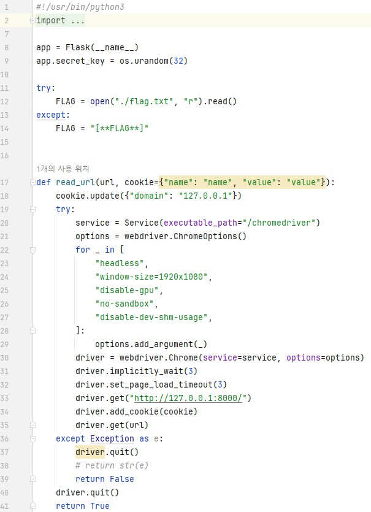
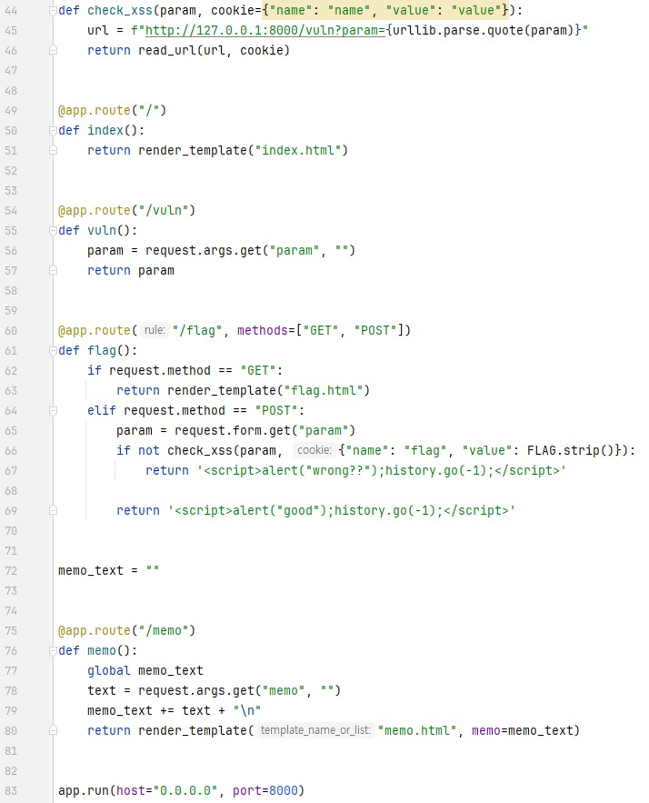
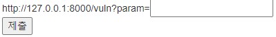

코드의 자세한 설명은 다음 사이트에서 참고했습니다. **https://velog.io/@mm0ck3r/Dreamhack-xss-1**  
문제는 **여러 기능과 입력받은 URL을 확인하는 봇이 구현된 서비스입니다. XSS 취약점을 이용해 플래그를 획득하세요. 플래그는 flag.txt, FLAG 변수에 있습니다.** 입니다.  
우선 코드를 봤습니다.  
   
코드를 보면, path가 여러가지 있다.  
  
1. / : index.html을 return 함
  
2. /vuln : <strong>http://host3.dreamhack.games:24404/vuln?param=%3Cscript%3Ealert(1)%3C/script%3E</strong> 로 들어간다. 
-> 이 때, <strong></strong> 를 통해 cookie(즉, flag) 를 memo 한다. 
  
이렇게 flag가 memo 된 것을 알 수 있다. 

답은 **DH{2c01577e9542ec24d68ba0ffb846508e}** 이다.  
