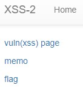
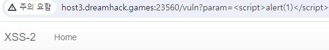
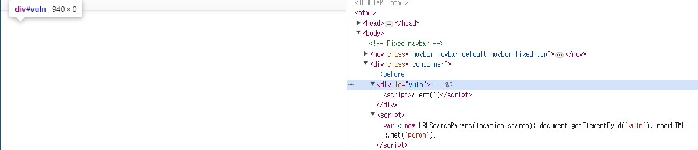
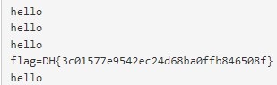

이전 문제인 xss-1 과 똑같다.  

```python
#!/usr/bin/python3
from flask import Flask, request, render_template
from selenium import webdriver
from selenium.webdriver.chrome.service import Service
import urllib
import os

app = Flask(__name__)
app.secret_key = os.urandom(32)

try:
    FLAG = open("./flag.txt", "r").read()
except:
    FLAG = "[**FLAG**]"


def read_url(url, cookie={"name": "name", "value": "value"}):
    cookie.update({"domain": "127.0.0.1"})
    try:
        service = Service(executable_path="/chromedriver")
        options = webdriver.ChromeOptions()
        for _ in [
            "headless",
            "window-size=1920x1080",
            "disable-gpu",
            "no-sandbox",
            "disable-dev-shm-usage",
        ]:
            options.add_argument(_)
        driver = webdriver.Chrome(service=service, options=options)
        driver.implicitly_wait(3)
        driver.set_page_load_timeout(3)
        driver.get("http://127.0.0.1:8000/")
        driver.add_cookie(cookie)
        driver.get(url)
    except Exception as e:
        driver.quit()
        # return str(e)
        return False
    driver.quit()
    return True


def check_xss(param, cookie={"name": "name", "value": "value"}):
    url = f"http://127.0.0.1:8000/vuln?param={urllib.parse.quote(param)}"
    return read_url(url, cookie)


@app.route("/")
def index():
    return render_template("index.html")


@app.route("/vuln")
def vuln():
    return render_template("vuln.html")


@app.route("/flag", methods=["GET", "POST"])
def flag():
    if request.method == "GET":
        return render_template("flag.html")
    elif request.method == "POST":
        param = request.form.get("param")
        if not check_xss(param, {"name": "flag", "value": FLAG.strip()}):
            return '<script>alert("wrong??");history.go(-1);</script>'

        return '<script>alert("good");history.go(-1);</script>'


memo_text = ""


@app.route("/memo")
def memo():
    global memo_text
    text = request.args.get("memo", "")
    memo_text += text + "\n"
    return render_template("memo.html", memo=memo_text)


app.run(host="0.0.0.0", port=8000)
```

실제로 코드도 거의 똑같다.  

  

사이트도 거의 유사하다.  

  

그런데 하나 다른 점이 있다.  

바로, **이전 문제에서 vuln 페이지에 가면 다음과 같이 url이 입력되고, ``<script>`` 안에 있는 alert(1)이 실행된** 모습을 볼 수 있다.(``http://host3.dreamhack.games:23560/vuln?param=<script>alert(1)</script>``)  

그런데 이번 문제는 ``<script> 가 적용이 되지 않습니다.``  
여기서 코드를 자세히 보면, 56번째 줄을 보면 다음과 같이 적혀있다.  

```python
return render_template("vuln.html")
```

그런데 이전 문제에서는 다음과 같이 코드가 적혀있었다.  

```python
    param = request.args.get("param", "")
    return param
```

즉, 이전 문제는 param 에 있는 값을 가져와서 return 했기 때문에 ``<script>`` 가 바로 실행이 됬지만, 이번 문제는 **vuln.html** 이라는 파일을 보여주기 때문에 이전 문제와 같이 공격하는 게 불가능하다.  

그래서 vuln.html 파일을 살펴봤다.  

  

다음과 같이 **특이한 ``<script>`` 명령**이 있는 것을 볼 수 있다.  

또한 위에 **id가 vuln인 div 태그 내부**를 보면 현재 url의 **param 값인 ``<script>alert(1)</script>``** 가 있는 것을 볼 수 있다.  

우선 ``<script>`` 명령을 보면 다음과 같다.  

```javascript
var x=new URLSearchParams(location.search);
document.getElementById('vuln').innerHTML = x.get('param');
```

위의 코드를 정리해보자면, x에 **URL의 쿼리 문자열을 사용하는 객체**를 만듭다.  

그리고 이 객체는 웹 브라우저의 **현재 URL에서 쿼리 문자열(? 뒤에 나오는 것들)** 을 나타내는 객체다.  

다음으로 x에서 param 의 값을 가져와서 id가 vuln인 태그에 HTML 코드를 넣는다.  

즉, ``<script>`` 는 html 태그로 인식되었기 때문에 아무것도 나오지 않은 것이다.(좀 더 정확히 말하자면, **innerHTML에는 ``<script>``를 넣을 수 없다.** -> 보안 이슈)  

그래서 다음과 같이 공격 코드를 짤 수 있다.  

```html

```

이는 xss-2 라는 경로에 있는 이미지를 삽입하는 태그다.  

그런데 오류가 발생하면, onerror 에 적은 이벤트를 적용한다.  

따라서, 우리는 xss-2 라는 곳에 이미지가 없으므로, onerror 에 있는 이벤트를 실행한다.  

즉, 이전 문제의 공격 코드와 같기 때문에 flag가 memo 되었을 것이다.  

   

공격 코드를 적고나서, 다음과 같이 flag가 memo 된 것을 볼 수 있다.  

따라서 답은 **DH{3c01577e9542ec24d68ba0ffb846508f}** 이다.  
