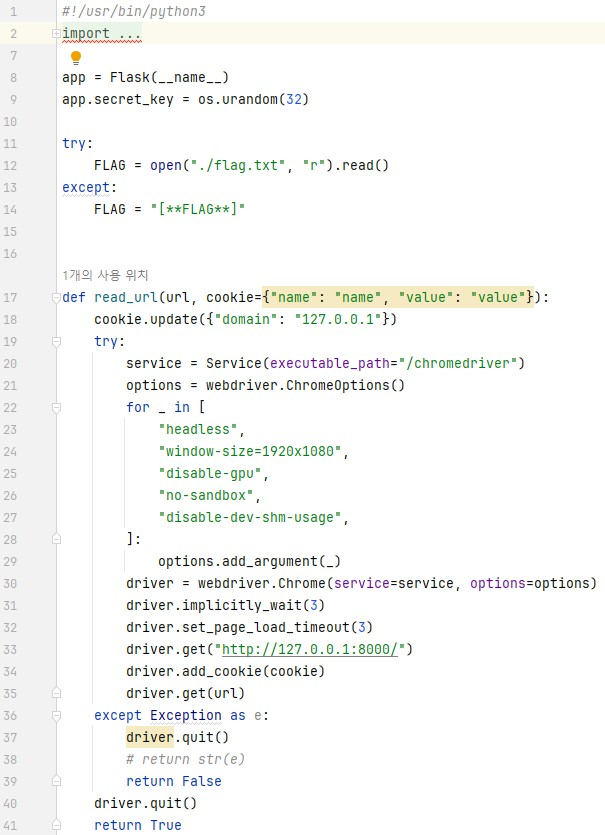
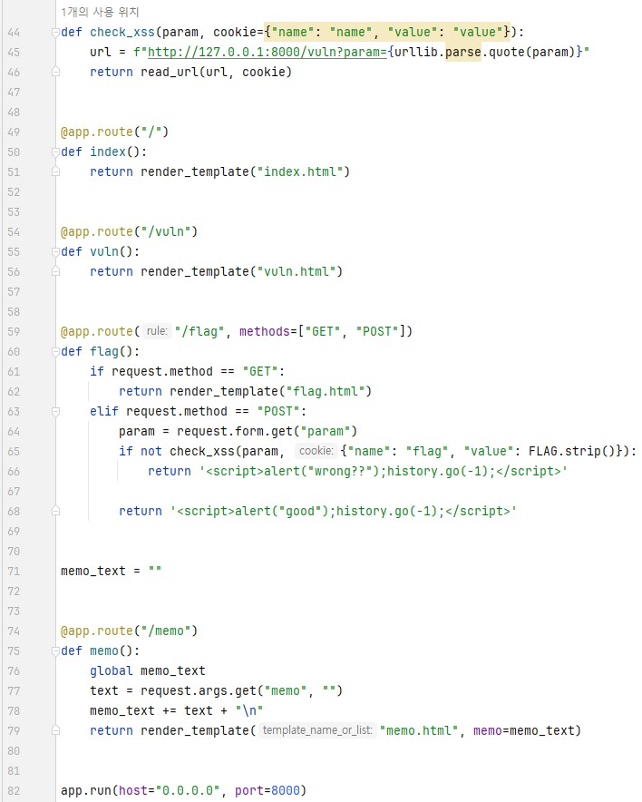
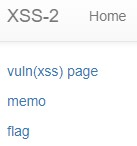
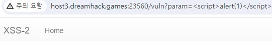
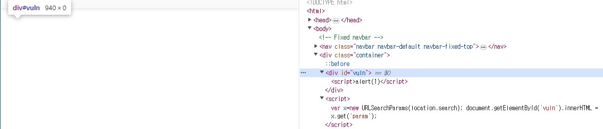
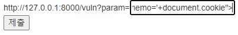
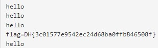

이전 문제인 xss-1 과 똑같습니다.  
   
실제로 코드도 거의 똑같습니다.  
  
사이트도 거의 유사합니다.  
  
그런데 하나 다른 점이 있습니다.  
바로, **이전 문제에서** vuln 페이지에 가면 다음과 같이 url이 입력되고, **<script> 안에 있는 alert(1)이 실행된** 모습을 볼 수 있었습니다.(**http://host3.dreamhack.games:23560/vuln?param=<script>alert(1)</script>**)  
그런데 이번 문제는 **<script> 가 적용이 되지 않습니다.**  
여기서 코드를 자세히 보면, 56번째 줄을 보면 다음과 같이 적혀있습니다.  
```python
return render_template("vuln.html")
```
그런데 이전 문제에서는 다음과 같이 코드가 적혀있었습니다.  
```python
    param = request.args.get("param", "")
    return param
```
즉, 이전 문제는 param 에 있는 값을 가져와서 return 했기 때문에 <script> 가 바로 실행이 됬지만, 이번 문제는 **vuln.html** 이라는 파일을 보여주기 때문에 이전 문제와 같이 공격하는 게 불가능합니다.  
그래서 vuln.html 파일을 살펴봤습니다.  
  
다음과 같이 **특이한 <script> 명령**이 있는 것을 볼 수 있습니다.  
또한 위에 **id가 vuln인 div 태그 내부**를 보면 현재 url의 **param 값인 <script>alert(1)</script>** 가 있는 것을 볼 수 있습니다.  
우선 <script> 명령을 보면 다음과 같습니다.  
```javascript
var x=new URLSearchParams(location.search);
document.getElementById('vuln').innerHTML = x.get('param');
```
위의 코드를 정리해보자면, x에 **URL의 쿼리 문자열을 사용하는 객체**를 만듭니다.  
그리고 이 객체는 웹 브라우저의 **현재 URL에서 쿼리 문자열(? 뒤에 나오는 것들)** 을 나타내는 객체입니다.  
다음으로 x에서 param 의 값을 가져와서 id가 vuln인 태그에 HTML 코드를 넣습니다.  
즉, <script> 는 html 태그로 인식되었기 때문에 아무것도 나오지 않은 것입니다.  

그래서 다음과 같이 공격 코드를 짤 수 있습니다.  
```html

```
이는 xss-2 라는 경로에 있는 이미지를 삽입하는 태그입니다.  
그런데, 오류가 발생하면, onerror 에 적은 이벤트를 적용합니다.  
따라서, 저희는 xss-2 라는 곳에 이미지가 없으므로, onerror 에 있는 이벤트를 실행합니다.  
즉, 이전 문제의 공격 코드와 같기 때문에 flag가 memo 되었을 것입니다.  
   
공격 코드를 적고나서, 다음과 같이 flag가 memo 된 것을 볼 수 있습니다.  

따라서 답은 **DH{3c01577e9542ec24d68ba0ffb846508f}** 입니다.  

