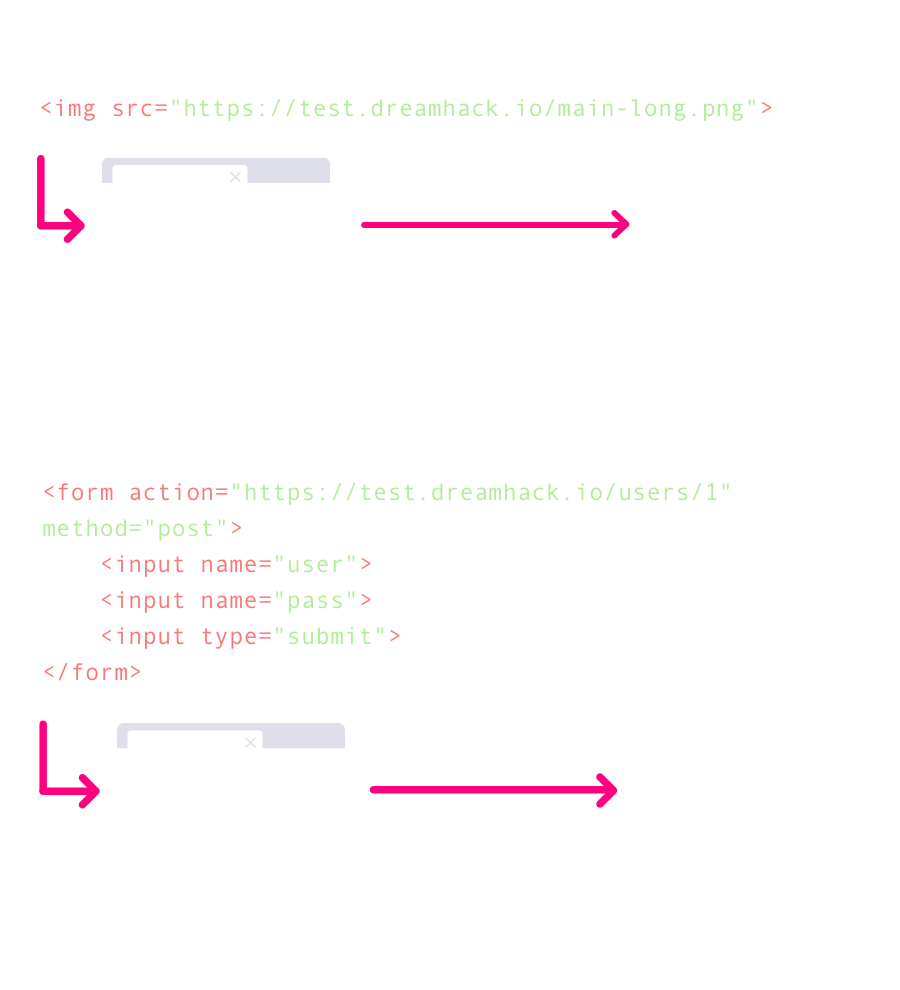

# Cross Site Request Forgery (CSRF)  
## CSRF  
CSRF : 임의 이용자의 권한으로 임의 주소에 **HTTP 요청**을 보낼 수 있는 취약점 -> 이용자를 속여서, 의도치 않은 요청에 동의하게 하는 공격  
## CSRF 동작  
공격자가 악성 스크립트(HTML, Javascript 등)을 넣어서 이용자에게 **메일**을 보내거나 게시판에 **글을 작성**해 이용자가 이를 조회하도록 하는 방식입니다.  
**img 태그**를 사용하거나 웹 페이지에 입력된 양식을 전송하는 **form 태그**를 사용하는 방법이 있습니다.  
```
GET /sendmoney?to=dreamhack&amount=1337 HTTP/1.1
Host: bank.dreamhack.io
Cookie: session=IeheighaiToo4eenahw3
```
위의 메시지는 송금 요청하는 예시 request message 입니다.  
```python# 이용자가 /sendmoney에 접속했을때 아래와 같은 송금 기능을 웹 서비스가 실행함.
@app.route('/sendmoney')
def sendmoney(name):
  # 송금을 받는 사람과 금액을 입력받음.
  to_user = request.args.get('to')
  amount = int(request.args.get('amount'))
	
	# 송금 기능 실행 후, 결과 반환	
	success_status = send_money(to_user, amount)
	
	# 송금이 성공했을 때,
	if success_status:
    # 성공 메시지 출력
		return "Send success."
	# 송금이 실패했을 때,
	else:
    # 실패 메시지 출력
		return "Send fail."
```
위의 파이썬 코드는 이전에 적었던 request message를 보내는 코드입니다.  
```html

```
```Javascript
/* 새 창 띄우기 */
window.open('http://bank.dreamhack.io/sendmoney?to=dreamhack&amount=1337');
/* 현재 창 주소 옮기기 */
location.href = 'http://bank.dreamhack.io/sendmoney?to=dreamhack&amount=1337';
location.replace('http://bank.dreamhack.io/sendmoney?to=dreamhack&amount=1337');
```
위에 있는 코드들처럼 img 태그나 location.href 등을 사용해서 csrf 공격을 합니다.  
  

## CSRF 실습  
  
위에 있던 송금을 하게끔 csrf 공격을 합니다.  
  
다음과 같이 적으면, 한 번 요청되면 1000000원이 송금됩니다.  
  

```html


<link rel="stylesheet" href="/sendmoney?to=dreamhack&amount=1337">
```
위에 있는 코드처럼 여러 방식으로 csrf 공격을 할 수 있습니다.  
## XSS와 CSRF 차이  
### 공통점  
클라이언트를 대상으로 하는 공격, 악성 스크립트를 사용한다.  
### 차이점  
목적이 다르다.  
1. xss : 세션 및 쿠키 탈취를 목적  
2. csrf : HTTP 요청을 보내는 것을 목적  
# 퀴즈  
1. 서버에서 이용자를 식별하기 위해 쿠키를 사용하고 있어야 CSRF 취약점으로 공격할 수 있다.  
답 : O  
2. 브라우저는 CSRF 취약점을 방지하기 위한 보안 메커니즘을 제공한다.  
답 : O  
3. 서버에서 HTTP의 GET 메소드가 아닌 POST 메소드로 데이터를 받으면 CSRF에 안전하다.  
답 : X  
4. CSRF 공격이 불가능할 때 XSS 공격도 불가능하다.  
답 : X  
