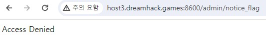
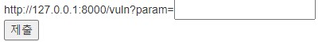
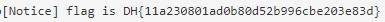

문제는 **여러 기능과 입력받은 URL을 확인하는 봇이 구현된 서비스입니다. CSRF 취약점을 이용해 플래그를 획득하세요.** 이다.(https://jwcs.tistory.com/13)  

우선 코드를 보면 다음과 같다.  

```python
#!/usr/bin/python3
from flask import Flask, request, render_template
from selenium import webdriver
from selenium.webdriver.chrome.service import Service
import urllib
import os

app = Flask(__name__)
app.secret_key = os.urandom(32)

try:
    FLAG = open("./flag.txt", "r").read()
except:
    FLAG = "[**FLAG**]"


def read_url(url, cookie={"name": "name", "value": "value"}):
    cookie.update({"domain": "127.0.0.1"})
    try:
        service = Service(executable_path="/chromedriver")
        options = webdriver.ChromeOptions()
        for _ in [
            "headless",
            "window-size=1920x1080",
            "disable-gpu",
            "no-sandbox",
            "disable-dev-shm-usage",
        ]:
            options.add_argument(_)
        driver = webdriver.Chrome(service=service, options=options)
        driver.implicitly_wait(3)
        driver.set_page_load_timeout(3)
        driver.get("http://127.0.0.1:8000/")
        driver.add_cookie(cookie)
        driver.get(url)
    except Exception as e:
        driver.quit()
        print(str(e))
        # return str(e)
        return False
    driver.quit()
    return True


def check_csrf(param, cookie={"name": "name", "value": "value"}):
    url = f"http://127.0.0.1:8000/vuln?param={urllib.parse.quote(param)}"
    return read_url(url, cookie)


@app.route("/")
def index():
    return render_template("index.html")


@app.route("/vuln")
def vuln():
    param = request.args.get("param", "").lower()
    xss_filter = ["frame", "script", "on"]
    for _ in xss_filter:
        param = param.replace(_, "*")
    return param


@app.route("/flag", methods=["GET", "POST"])
def flag():
    if request.method == "GET":
        return render_template("flag.html")
    elif request.method == "POST":
        param = request.form.get("param", "")
        if not check_csrf(param):
            return '<script>alert("wrong??");history.go(-1);</script>'

        return '<script>alert("good");history.go(-1);</script>'


memo_text = ""


@app.route("/memo")
def memo():
    global memo_text
    text = request.args.get("memo", None)
    if text:
        memo_text += text
    return render_template("memo.html", memo=memo_text)


@app.route("/admin/notice_flag")
def admin_notice_flag():
    global memo_text
    if request.remote_addr != "127.0.0.1":
        return "Access Denied"
    if request.args.get("userid", "") != "admin":
        return "Access Denied 2"
    memo_text += f"[Notice] flag is {FLAG}\n"
    return "Ok"


app.run(host="0.0.0.0", port=8000)
```

xss 문제와 비슷하지만 약간의 차이점이 있다.  

  

웹 사이트도 거의 xss 문제와 비슷하다.  

(1)   
(2)   
(3)   
(4)     

1. /vuln 페이지  
화면으로 봤을 때, param에 있는 ``<script>alert(1)</script>`` 가 실행되지 않고, ``<*>alert(1)`` 가 표시되어 있다.
코드에서 **/vuln**에서 ``xss_filter``을 통해, **frame, script, on** 을 '*' 로 치환해서, xss 가 통하지 않게 막았다.
2. /memo 페이지   
이전 xss 문제와 똑같다.
3. /notice_flag 페이지  
xss 문제와 큰 차이점이자 가장 중요한 페이지이다.
코드를 보면 ip주소가 **127.0.0.1** 이고, **userid** 의 값이 **admin** 이면, flag를 memo 하는 곳이다.
4. /flag 페이지  
이전 xss 문제와 똑같다.

우선 문제를 보면, ``<script>`` 등을 통한 **xss를 할 수 없다**는 것을 알 수 있다.  
여기서 사용할 수 있는 태그가 **** 태그이다.  

비록 이전 xss-2 에서는 

```html

```

를 이용해 **onerror를 사용**했지만, 이번에는 on 을 필터링하기 때문에 **그냥 src에 공격코드**를 바로 넣을 수 있다.  

그런데, 여기서 중요한 점은 이 문제에서 가장 중요한 페이지인 **/notice_flag** 페이지에서 **flag를 memo** 할 수 있다.  

따라서 저희는 **/notice_flag** 를 이용해 문제를 풀 것이다.  

먼저, ```` 에서 src에 넣을 주소를 만들면 된다.  

**ip주소는 127.0.0.1** 이면 되고, **경로는 코드를 보면 /admin/notice_flag** 이고, **userid의 value가 admin** 이면 되므로 다음과 같이 코드를 작성할 수 있다.  

```html

```

  

따라서 다음과 같이 공격코드를 넣으면 성공이다.  

  

따라서 정답은 **DH{11a230801ad0b80d52b996cbe203e83d}** 이다.  
