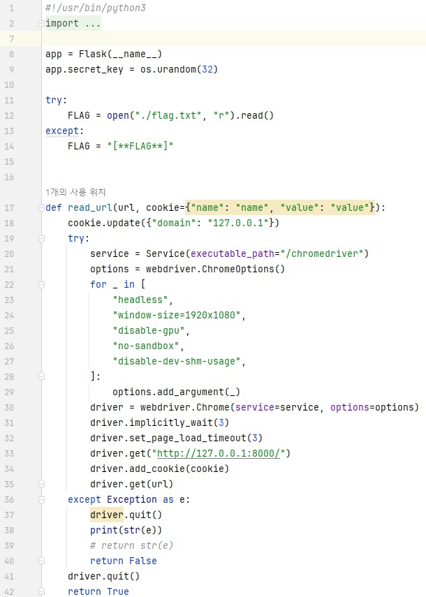
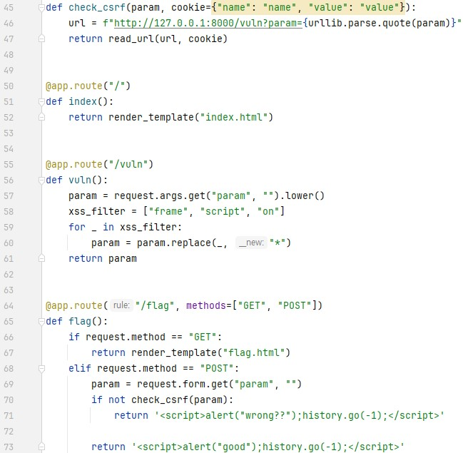
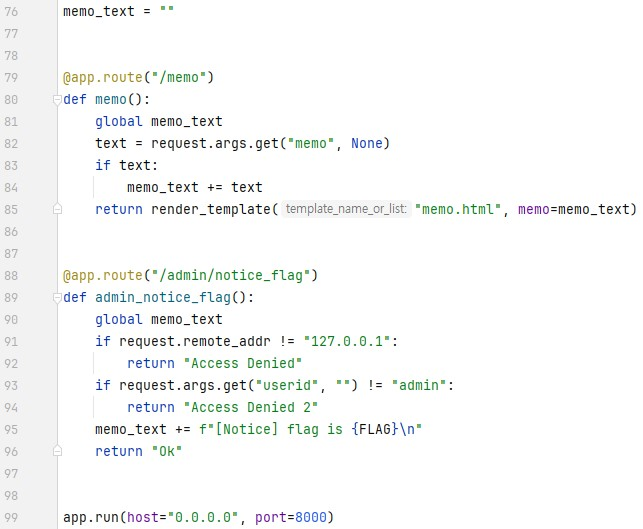
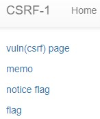
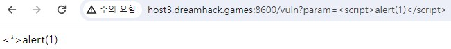
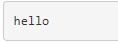
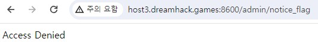
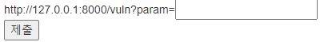
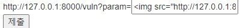
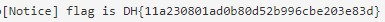

문제는 **여러 기능과 입력받은 URL을 확인하는 봇이 구현된 서비스입니다. CSRF 취약점을 이용해 플래그를 획득하세요.** 입니다.  
우선 코드를 보겠습니다.  
    
xss 문제와 비슷하지만 약간의 차이점이 있습니다.  
  
웹 사이트도 거의 xss 문제와 비슷합니다.  
(1)   
(2)   
(3)   
(4)     
1. /vuln 페이지  
화면으로 봤을 때, param에 있는 **<script>alert(1)</script>** 가 실행되지 않고, **<*>alert(1)** 가 표시되어 있습니다.
코드에서 58 ~ 60번째 줄을 통해, **frame, script, on** 을 '*' 로 치환해서, xss 가 통하지 않게 막았습니다.
2. /memo 페이지   
이전 xss 문제와 똑같습니다.
3. /notice_flag 페이지  
xss 문제와 큰 차이점이자 가장 중요한 페이지입니다.
코드를 보면 ip주소가 **127.0.0.1** 이고, **userid** 의 값이 **admin** 이면, flag를 memo 하는 곳입니다.
4. /flag 페이지  
이전 xss 문제와 똑같습니다.

우선 문제를 보면, **<script>** 등을 통한 xss를 할 수 없다는 것을 알 수 있습니다.  
여기서 사용할 수 있는 태그가 **** 태그입니다.  
비록 이전 xss-2 에서는 
```html

```
를 이용해 **onerror를 사용**했지만, 이번에는 on 을 필터링하기 때문에 **그냥 src에 공격코드**를 바로 넣을 수 있습니다.  
그런데, 여기서 중요한 점은 이 문제에서 가장 중요한 페이지인 **/notice_flag** 페이지에서 **flag를 memo** 할 수 있습니다.  
따라서 저희는 **/notice_flag** 를 이용해 문제를 풀 것입니다.  
먼저, **** 에서 src에 넣을 주소를 만들면 됩니다.  
**ip주소는 127.0.0.1** 이면 되고, **경로는 코드를 보면 /admin/notice_flag** 이고, **userid의 value가 admin** 이면 되므로 다음과 같이 코드를 작성할 수 있습니다.  
```html

```
  
따라서 다음과 같이 공격코드를 넣으면 성공입니다.  
  

따라서 정답은 **DH{11a230801ad0b80d52b996cbe203e83d}** 입니다.  
