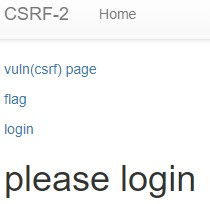
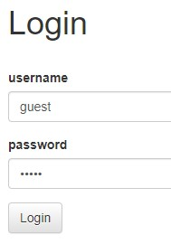
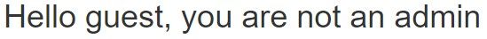
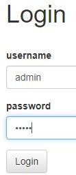

문제는 **여러 기능과 입력받은 URL을 확인하는 봇이 구현된 서비스입니다. CSRF 취약점을 이용해 플래그를 획득하세요.** 이다.(https://velog.io/@helenason/dreamhack-wargame-csrf-2)  

먼저 코드를 봤다.  

```python
#!/usr/bin/python3
from flask import Flask, request, render_template, make_response, redirect, url_for
from selenium import webdriver
from selenium.webdriver.chrome.service import Service
import urllib
import os

app = Flask(__name__)
app.secret_key = os.urandom(32)

try:
    FLAG = open("./flag.txt", "r").read()
except:
    FLAG = "[**FLAG**]"

users = {
    'guest': 'guest',
    'admin': FLAG
}

session_storage = {}

def read_url(url, cookie={"name": "name", "value": "value"}):
    cookie.update({"domain": "127.0.0.1"})
    try:
        service = Service(executable_path="/chromedriver")
        options = webdriver.ChromeOptions()
        for _ in [
            "headless",
            "window-size=1920x1080",
            "disable-gpu",
            "no-sandbox",
            "disable-dev-shm-usage",
        ]:
            options.add_argument(_)
        driver = webdriver.Chrome(service=service, options=options)
        driver.implicitly_wait(3)
        driver.set_page_load_timeout(3)
        driver.get("http://127.0.0.1:8000/")
        driver.add_cookie(cookie)
        driver.get(url)
    except Exception as e:
        driver.quit()
        print(str(e))
        # return str(e)
        return False
    driver.quit()
    return True


def check_csrf(param, cookie={"name": "name", "value": "value"}):
    url = f"http://127.0.0.1:8000/vuln?param={urllib.parse.quote(param)}"
    return read_url(url, cookie)


@app.route("/")
def index():
    session_id = request.cookies.get('sessionid', None)
    try:
        username = session_storage[session_id]
    except KeyError:
        return render_template('index.html', text='please login')

    return render_template('index.html', text=f'Hello {username}, {"flag is " + FLAG if username == "admin" else "you are not an admin"}')


@app.route("/vuln")
def vuln():
    param = request.args.get("param", "").lower()
    xss_filter = ["frame", "script", "on"]
    for _ in xss_filter:
        param = param.replace(_, "*")
    return param


@app.route("/flag", methods=["GET", "POST"])
def flag():
    if request.method == "GET":
        return render_template("flag.html")
    elif request.method == "POST":
        param = request.form.get("param", "")
        session_id = os.urandom(16).hex()
        session_storage[session_id] = 'admin'
        if not check_csrf(param, {"name":"sessionid", "value": session_id}):
            return '<script>alert("wrong??");history.go(-1);</script>'

        return '<script>alert("good");history.go(-1);</script>'


@app.route('/login', methods=['GET', 'POST'])
def login():
    if request.method == 'GET':
        return render_template('login.html')
    elif request.method == 'POST':
        username = request.form.get('username')
        password = request.form.get('password')
        try:
            pw = users[username]
        except:
            return '<script>alert("not found user");history.go(-1);</script>'
        if pw == password:
            resp = make_response(redirect(url_for('index')) )
            session_id = os.urandom(8).hex()
            session_storage[session_id] = username
            resp.set_cookie('sessionid', session_id)
            return resp 
        return '<script>alert("wrong password");history.go(-1);</script>'


@app.route("/change_password")
def change_password():
    pw = request.args.get("pw", "")
    session_id = request.cookies.get('sessionid', None)
    try:
        username = session_storage[session_id]
    except KeyError:
        return render_template('index.html', text='please login')

    users[username] = pw
    return 'Done'

app.run(host="0.0.0.0", port=8000)
```

이번 문제는 이전 문제와 많은 차이점이 있다.  

  

웹 사이트도 약간의 차이점이 있다.  

(1)   
(2)   
(3)    
1. /vuln 페이지  
이전 문제인 csrf-1 과 똑같이 **xss를 필터링 한다는 것**을 알려주는 페이지다.  
2. /flag 페이지  
이전 문제처럼 **정답을 입력**하는 곳이다.   
3. /login 페이지  
user를 **로그인** 하는 곳이다.  
위의 이미지에서는 guest로 로그인해서 flag가 나오지 않는 모습이다.  
4. /change_password 페이지  
user의 **password를 바꾸는 곳**이다.(사이트에는 나타나지 않았지만, 코드에 나와있다.)

여기서 이전 문제와의 차이점을 설명하자면, 다음과 같다.  

1. 페이지의 차이  
예를 들면, 이전 문제에 없었던 **login**, **change_password** 가 생겼다.
2. session 추가  
xss, csrf-1 에 없었던 **session 이 추가**됐다. 이로써 로그인한 대상을 식별할 수 있다.

``/`` 를 보면, 마지막 return문에 의해 **현재 로그인된 user 가 admin** 이면 **flag를 출력**한다.  
즉, 이 문제를 풀기 위해 **admin으로 로그인**해야한다.  

그런데 우리는 일반적으로 admin의 **session 값**이나 **비밀번호**를 **알 수 없다.**  
그래서 이 문제에서 admin으로 로그인 하는 방법은 이 문제와 지난 문제의 큰 차이점 중 하나인, **/change_password** 를 이용해 **admin의 비밀번호를 바꿔서 로그인**을 하는 것이다.  
  
여기서 /change_password 를 보면, **pw에 새로운 비밀번호**와 **sessionid에 비밀번호를 바꿀 user의 session** 이 있어야 바꿀 수 있다.  

그런데 위에 있는 것처럼 일반적으로 **admin의 session을 얻을 수 없다.**  

이 때, 코드를 보면 **/flag 에서 무작위로 얻는 session** 이 **admin에 대한 session** 이라는 것을 알 수 있다.  

따라서 /flag에서 우회할 수 있는 ```` 태그를 통해 **/change_password** 에서 **admin 의 비밀번호를 바꾸는** 공격코드를 만들 수 있다.  

바로 다음과 같이 만들 수 있다.  

```html

```

  

이렇게 위의 코드를 적어서 admin 의 비밀번호를 바꾼다.  
참고로 나는 비밀번호를 admin 으로 바꿨다.  

  

이렇게 로그인을 하면 다음과 같이 나온다.  

  
  
따라서 정답은 **DH{c57d0dc12bb9ff023faf9a0e2b49e470a77271ef}** 이다.  
