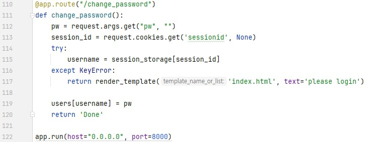

문제는 **여러 기능과 입력받은 URL을 확인하는 봇이 구현된 서비스입니다. CSRF 취약점을 이용해 플래그를 획득하세요.** 입니다.  
먼저 코드를 봤습니다.  
     
이번 문제는 이전 문제와 많은 차이점이 있습니다.  
  
웹 사이트도 약간의 차이점이 있습니다.  
(1)   
(2)   
(3)    
1. /vuln 페이지  
이전 문제인 csrf-1 과 똑같이 **xss를 필터링 한다는 것**을 알려주는 페이지입니다.  
2. /flag 페이지  
이전 문제처럼 **정답을 입력**하는 곳입니다.   
3. /login 페이지  
user를 **로그인** 하는 곳입니다.  
위의 이미지에서는 guest로 로그인해서 flag가 나오지 않는 모습입니다.  
4. /change_password 페이지  
user의 **password를 바꾸는 곳**입니다.(사이트에는 나타나지 않았지만, 코드에 나와있습니다.)

여기서 이전 문제와의 차이점을 설명하겠습니다.  
1. 페이지의 차이  
예를 들면, 이전 문제에 없었던 **login**, **change_password** 가 생겼습니다.
2. session 추가  
xss, csrf-1 에 없었던 **session 이 추가**됬습니다. 이로써 로그인한 대상을 식별할 수 있습니다.

64번째 코드를 보면, **현재 로그인된 user 가 admin** 이면 **flag를 출력**합니다.  
즉, 이 문제를 풀기 위해 **admin으로 로그인**해야 합니다.  
그런데 저희는 일반적으로 admin의 **session 값**이나 **비밀번호**를 **알 수 없습니다.**  
그래서 이 문제에서 admin으로 로그인 하는 방법은 이 문제와 지난 문제의 큰 차이점 중 하나인, **/change_password** 를 이용해 **admin의 비밀번호를 바꿔서 로그인**을 하는 것입니다.  
  
여기서 /change_password 를 보면, **pw에 새로운 비밀번호**와 **sessionid에 비밀번호를 바꿀 user의 session** 이 있어야 바꿀 수 있습니다.  
그런데 위에 있는 것처럼 일반적으로 **admin의 session을 얻을 수 없습니다.**  
이 때, 코드를 보면 83번째 줄에 **/flag 에서 무작위로 얻는 session** 이 **admin에 대한 session** 이라는 것을 알 수 있습니다.  
따라서 /flag에서 우회할 수 있는 **** 태그를 통해 **/change_password** 에서 **admin 의 비밀번호를 바꾸는** 공격코드를 만들 수 있습니다.  
바로 다음과 같이 만들 수 있습니다.  
```html

```
  
이렇게 위의 코드를 적어서 admin 의 비밀번호를 바꿉니다.   
저는 참고로 비밀번호를 admin 으로 바꿨습니다.  
  
이렇게 로그인을 하면 다음과 같이 나옵니다.  
  
  
따라서 정답은 **DH{c57d0dc12bb9ff023faf9a0e2b49e470a77271ef}** 입니다.  
