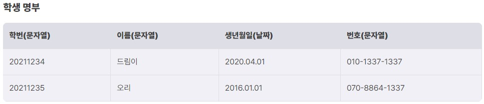
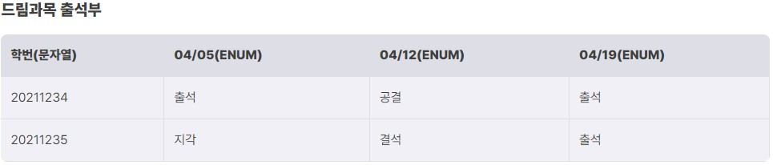
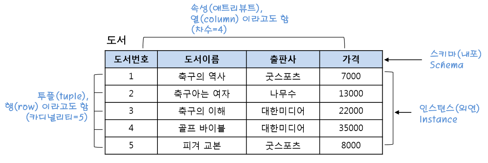

# Database Management System(DBMS)  
**데이터베이스(Database)** : 컴퓨터가 정보를 기록하기 위해 사용하는 것(사람들이 필요로 하는 데이터들의 집합)  
**DBMS(DataBase Management System)** : 데이터베이스를 관리하는 애플리케이션  
예시 : 웹 서버는 데이터베이스를 사용하여 **회원 정보, 글** 을 **저장, 조회, 수정** 한다.  
## DBMS  
위의 예시처럼 웹 서버는 **데이터베이스를 관리**하기 위해 **DBMS** 를 사용  
DBMS 는 데이터베이스에 정보를 **삽입, 수정, 삭제**를 한다.  
### DBMS 종류  
1. **관계형(Relational)** : 행과 열의 집합인 **테이블 형식**으로 데이터를 저장함  
예시 : MySQL, MariaDB, PostgreSQL, SQLite  
2. **비관계형(Non-Relational)** : **키-값** 형태로 값을 저장함  
예시 : MongoDB, CouchDB, Redis  
# Relational DBMS  
## RDBMS  
RDBMS(Relational DataBase Management System) 은 1970년에 Codds가 12가지 규칙을 정의하여 생성한 데이터베이스 모델  
행과 열의 집합으로 구성된 **테이블** 형식으로 데이터를 **관리**하고, 데이터를 **조작**할 수 있는 관계 연산자를 제공  
   
위의 두 테이블이 RDBMS의 예시입니다.  
여기서 각 학생들의 정보를 확인하기 위해 **학번(고유 키 : 특정 학생을 식별할 수 있는 속성)** 를 이용한다.  
  
이 테이블도 RDBMS의 예시이다.  
## SQL  
**SQL(Structured Query Language)** : RDBMS의 데이터를 **정의**하고 **질의, 수정** 등을 하기 위해 고안된 언어
-> 웹 어플리케이션이 **DBMS 와 상호작용**할 때 사용함  
### SQL의 다양한 구조  
1. **DDL(Data Definition Language)** : 데이터를 **정의**하기 위한 언어. **스키마, 데이터베이스**의 **생성/수정/삭제** 등의 행위를 수행합니다.    
2. **DML(Data Manipulation Language)** : 데이터를 **조작**하기 위한 언어. 실제 데이터베이스 내에 **존재하는 데이터**에 대해 **조회/저장/수정/삭제** 등의 행위를 수행합니다.   
3. **DCL(Data Control Language)** : 데이터베이스의 **접근 권한 등의 설정**을 하는 언어. 데이터베이스 내에 이용자의 **권한을 부여**하기 위한 **GRANT**와 **권한을 박탈**하는 **REVOKE**가 대표적입니다.  
## SQL 예시   
#### DDL  
우리가 데이터를 다루디 위해 데이터베이스, 테이블을 만들어야 한다.  
이 때, DDL 을 사용한다.  
```SQL
CREATE DATABASE Dreamhack;
```
위는 데이터베이스를 생성하는 쿼리문  
```SQL
USE Dreamhack;
# Board 이름의 테이블 생성
CREATE TABLE Board(
	idx INT AUTO_INCREMENT,
	boardTitle VARCHAR(100) NOT NULL,
	boardContent VARCHAR(2000) NOT NULL,
	PRIMARY KEY(idx)
);
```
위는 앞서 생성한 데이터베이스에 Board 테이블을 생성하는 쿼리문  
#### DML  
DDL 에서 생성한 테이블에 데이터를 추가, 조회, 수정할 때 사용한다.  
```SQL
INSERT INTO 
  Board(boardTitle, boardContent, createdDate) 
Values(
  'Hello', 
  'World !',
  Now()
);
```
위는 Board 테이블에 데이터를 삽입하는 쿼리문  
```SQL
SELECT boardTitle, boardContent
FROM Board
Where idx=1;
```
위는 Board 테이블의 데이터를 조회하는 쿼리문  
```SQL
UPDATE Board SET boardContent='DreamHack!' 
  Where idx=1;
```
위는 Board 테이블의 컬럼(속성) 값을 변경하는 쿼리문  
