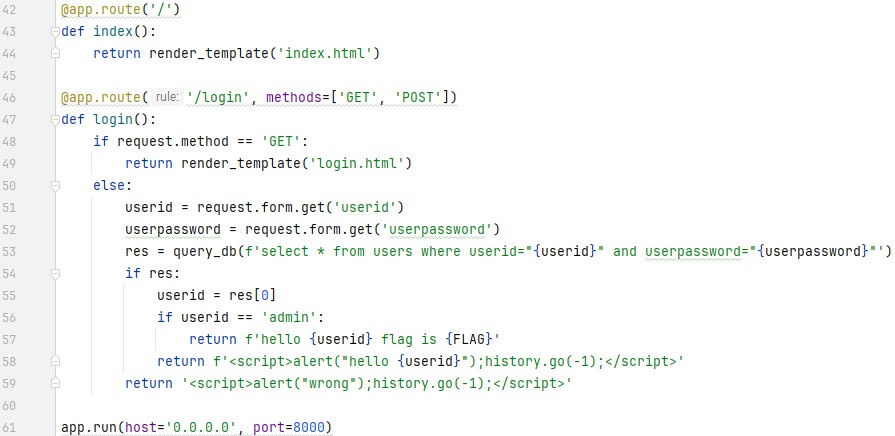

문제는 **로그인 서비스입니다. SQL INJECTION 취약점을 통해 플래그를 획득하세요. 플래그는 flag.txt, FLAG 변수에 있습니다.** 입니다.  
   
코드를 보면 다음과 같습니다.  
  
다음은 웹 사이트 입니다.  
  
1. /login  
로그인을 하는 화면입니다.
먼저 GET(로그인 화면으로 들어갈 때) 을 하면 **login.html** 을 render 합니다.
그리고 POST(로그인 버튼을 누를 때) 를 하면 **userid, userpassword** 를 가져와서
```SQL
select * from users where userid="{userid}" and userpassword="{userpassword}"
```
에 넣어서 이 쿼리문에 대한 결과를 반환합니다.  
그렇다면, SQL Injection 의 실습에서 했던 것처럼 **userpasword** 를 검사하지 못하게, 주석처리를 하면 됩니다.  
따라서 이렇게 공격문을 적을 수 있습니다.  
  
이렇게 적으면, 
```SQL
select * from users where userid="admin"--" and userpassword="{userpassword}"
```
이렇게 인식이 되서
```SQL
select * from users where userid="admin"
```
이러한 쿼리가 완성됩니다.  
따라서 **users 테이블에서 userid 가 admin인 속성(userid, userpassword) 를 보여주는 쿼리**입니다.  
즉, 53번째 줄에서 **질의 결과가 res** 에 들어가고, **res의 0번 인덱스를 userid** 에 넣습니다.  
그리고 userid 가 **admin** 이면, **FLAG**를 보여주는 방식입니다.  
  
따라서 정답은 **DH{c1126c8d35d8deaa39c5dd6fc8855ed0}** 입니다.
