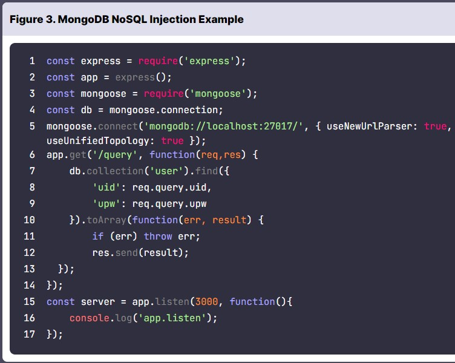

# NoSQL Injection  
## NoSQL Injection  
NoSQL Injection 은 이용자의 입력값이 쿼리에 포함되면서 발생하는 문제점이다.  
여기에서는 MongoDB를 사용하는데, MongoDB의 NoSQL Injection 취약점은 이용자의 **입력값에 대한 타입 검증이 불충분**할 때 발생한다.  
MongoDB는 자료형으로 **문자열, 정수, 날짜, 실수, 오브젝트, 배열** 등을 사용할 수 있다.  
  
위의 코드는 **입력값과 타입을 출력**하는데 req.query의 타입이 **문자열로 지정되어 있지 않기** 때문에 **문자열 외의 타입이 입력될 수** 있습니다.  
  
위의 코드는 각 **데이터의 type 을 출력**하는 코드이다.  
## NoSQL Injection 예시  
  위의 코드는 user 컬렉션에서 이용자가 입력한 **uid, upw** 에 해당하는 **데이터를 찾고 출력** 하는 예제 코드입니다.  
입력값에 대해 **타입을 검증하지 않기** 때문에 오브젝트 타입의 값을 입력할 수 있습니다.  
  
**$ne 연산자** 를 사용해 uid와 upw가 **"a"가 아닌 데이터를 조회** 하는 공격 쿼리와 실행 결과이다.  

## NoSQL Injection 실습  
  다음이 모듈을 구성하는 코드입니다. 코드를 보면 위에서 봤던 Figure 3 과 비슷합니다.  
  
이렇게 uid에 admin을 적고, **$ne** 를 통해 **upw 에 상관없이 uid가 admin 인 데이터를 조회**한다.  
# Blind NoSQL Injection  
## Blind NoSQL Injection  
Blind NoSQL Injection 는 **참/거짓 결과**를 통해 **데이터베이스 정보**를 알아낼 수 있습니다.  
  
다음은 **MongoDB의 연산자**입니다.  
## NoSQL 연산자와 표현식  
$regex : 정규식을 사용해 식과 일치하는 데이터를 조회  
  
$where : 인자로 전달한 Javascript 표현식을 만족하는 데이터를 조회  
  
(1) substring : Blind SQL Injection에서 **한 글자씩 비교했던 것**과 같이 데이터를 알아냄  
  
(2) Sleep : **지연 시간**을 통해 참/거짓 결과를 확인  
  
(3) Error based Injection : 올바르지 않은 문법을 입력해 **고의로 에러**를 발생  
  
# Blind NoSQL Injection 실습  
## Blind NoSQLi 실습  
다음은 Blind NOSQLi 실습입니다.  
  
저는 여기에서는 **$regex** 를 사용했습니다.  
   
위의 그림을 보면 **{"$regex":"^a"}** 를 해서 result가 **uid**가 나온 것을 보고, **첫 번재 글자는 a** 라는 것을 알 수 있습니다.  
이와 다르게 **{"$regex":"^b"}** 를 적으면 result 에서 **undefined** 를 출력하는 것을 볼 수 있습니다.  
이렇게 하나씩 넣어서 알 수 있습니다.  
  
결국 비밀번호가 **apple** 인 것을 알 수 있습니다.  
## Blind NoSQLi 실습 풀이  
  풀이를 보던 중 **{"$regex":".{5}"}** 등을 통해 길이를 알 수 있다는 것을 알았습니다.  
# 퀴즈  
1. Blind NoSQL Injection 실습 모듈에서 획득한 admin의 비밀번호는 (A) 이다.  
답 : apple  
2. MongoDB는 데이터의 자료형으로 오브젝트와 배열을 사용할 수 있다.  
답 : O  
