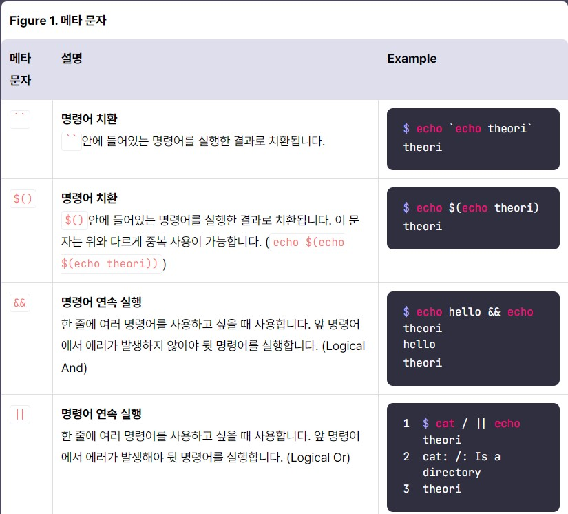
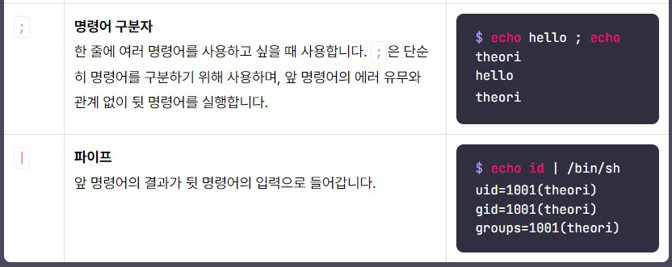
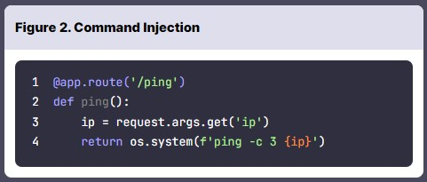
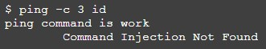
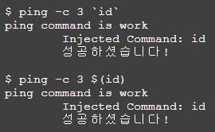
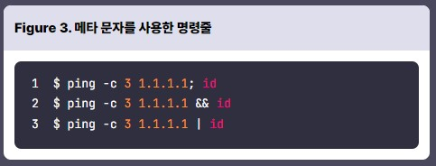

# Command Injection  

## Command Injection  
Command Injection : **이용자의 입력을 시스템 명령어로 실행**하게 하는 취약점  
**파이썬으로 개발된 웹 애플리케이션**에서 입력한 임의 IP에 ping을 전송하고 싶다면 
```python
os.system("ping [user-input]")
```
임의 파일을 읽고 싶다면 
```python
os.system(“cat [user-input]”)
```
등의 형태로 **시스템 함수를 사용**할 수 있습니다.  
시스템 함수는 **리눅스의 셸 프로그램에 명령어를 전달**하여 실행하는데, 셸 프로그램은 **다양한 메타 문자**를 지원함  
   
다음과 같이 명령어를 치환하거나, 연속해서 실행하거나, 파이프라인 등을 사용할 수 있습니다.  
## Command Injection 실습  
  

이 코드는 URL 쿼리를 통해 전달되는 **ip 값을 ping 명령어의 인자로 전달** 하는 코드입니다.  
여기서는 **id 명령어**를 실행해야 합니다.  
  
이렇게 그냥 id 를 입력하면, id를 명령어로 인지하지 못합니다.  
즉, 다른 방식으로 id를 진짜 명령어로 해석하게 해야합니다.  
  
이런식으로 id 를 명령어로 해석하게 할 수 있습니다.  
  
위와 다르게 아까 배웠던 다른 메타문자를 이용해서 실습할 수 있습니다.  

# 퀴즈  
1. 다음은 Command Injeciton이 발생하는 코드이다. 어떠한 입력값을 넣어야 "/flag" 파일을 읽을 수 있을까?
```python
@app.route('/ping')
def ping():
  ip = request.args.get('ip')
	return os.system(f'ping -c 3 "{ip}"')
```
답 : "; cat /fl*;"  
2. 커맨드 인젝션(Command Injection)의 설명으로 올바른 것은?  
답 : 인젝션의 종류 중 하나. 시스템 명령어에 대한 인젝션을 의미함. 취약점이 발생하는 원인은 단순하지만, 매우 치명적인 공격으로 이어질 수 있음. 개발자는 이용자의 입력을 반드시 검사해야 하며, 되도록 system 함수의 사용을 자제해야 함.  
3. 메타 문자와 그에 대한 설명이 올바르게 짝지어진 것을 모두 고르세요.  
답 : ``: 명령어 치환, ;: 명령어 구분자
