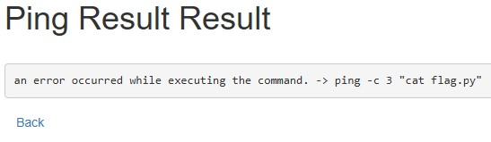
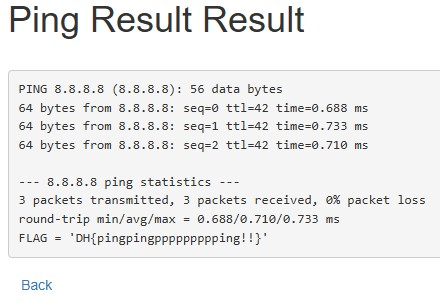

문제는 **특정 Host에 ping 패킷을 보내는 서비스입니다. Command Injection을 통해 플래그를 획득하세요. 플래그는 flag.py에 있습니다.** 이다.

우선 코드를 보면 다음과 같다.

```python
#!/usr/bin/env python3
import subprocess

from flask import Flask, request, render_template, redirect

from flag import FLAG

APP = Flask(__name__)


@APP.route('/')
def index():
    return render_template('index.html')


@APP.route('/ping', methods=['GET', 'POST'])
def ping():
    if request.method == 'POST':
        host = request.form.get('host')
        cmd = f'ping -c 3 "{host}"'
        try:
            output = subprocess.check_output(['/bin/sh', '-c', cmd], timeout=5)
            return render_template('ping_result.html', data=output.decode('utf-8'))
        except subprocess.TimeoutExpired:
            return render_template('ping_result.html', data='Timeout !')
        except subprocess.CalledProcessError:
            return render_template('ping_result.html', data=f'an error occurred while executing the command. -> {cmd}')

    return render_template('ping.html')


if __name__ == '__main__':
    APP.run(host='0.0.0.0', port=8000)
```

**/ping** 에서 3가지 기능을 한다.  
먼저 host 라는 폼에서 값을 받고, **ping -c 3 "host"** 를 실행한다.

1. 정상적으로 실행이 되면, 결과를 보여줌.
2. 만약 시간초과라면, Timeout ! 을 보여줌.
3. 만약 외부 프로세스가 비정상적인 종료 코드를 반환했을 때(쉽게 말하면, 잘못됬을 때) 에러발생했다고 알려줌

즉, 여기서 **host에 값**을 줘서 flag를 찾아야 한다.  
여기서 flag는 app.py와 같은 디렉토리에 있으므로 `cat flag.py` 와 같은 명령어를 사용할 수 있다.  


ping 으로 들어가면 다음과 같이 값을 입력하는 폼이 있다.  
그런데 테스트 삼아 `cat flag.py`를 적어봤는데, 다음과 같은 메시지가 나왔다.  

  

**요청한 형식과 일치시키세요.** 라는 html에서 발생할 법한 오류가 나왔다.  
그래서 코드에서 이 form에 대해 제한을 걸었는지 살펴봤지만, 찾을 수 없었다.  

이 부분 때문에 시간을 많이 썼는데, 답은 생각보다 가까이 있었다.  
그냥 그 form을 우클릭한 후 검사를 눌러보니 다음과 같은 코드로 이루어져 있었다.


위의 정규식을 해석하면, 이 폼에는 **5 ~ 20글자의 영문자와 숫자**가 들어갈 수 있다.


즉, 이렇게 pattern 을 제거하면 아까 테스트할 때 넣어봤던 cat flag.py 처럼 아무 문자열을 form에 넣을 수 있다.

여기서 우회할 때 중요한 점은, 메타문자를 이용해서 두 명령어를 사용할 수 있다는 것이다.  
하나는 앞에 있는 `ping 명령어`, 두 번째는 flag.py를 출력할 `cat flag.py` 를 메타문자를 이용해서 **묶을 수 있다.**

예를 들면, 나는 `;` 를 이용해서 풀었다.(좀 더 성공할 확률이 높아서? -> **앞의 명령(ping)의 에러 유무와 관계없이** 뒤에 적을 **cat flag.py를 실행**할 것이기 때문이다.)

그리고 하나 더 중요한 점은 **쌍따옴표**이다.

파이썬 코드를 보면 `ping -c 3 "host"` 에 값을 넣는 것을 알 수 있다.  
이 때, 그냥 명령어를 적으면, ping 명령에 해당하는 **따옴표 안에** 들어가기 때문에, 오류가 발생한다.  

  

위는 `cat flag.py` 를 입력한 결과로, 입력한 명령 자체가 **쌍따옴표**에 들어가서 오류가 발생한 것을 알 수 있다.  
따라서 `8.8.8.8";` 를 통해 ping에 대한 **따옴표를 닫고**, `;` 를 통해 **뒤에 들어올 명령어도 실행**할 수 있게 한다.  

여기까지 하면 명령어가 `ping -c 3 "8.8.8.8";"` 가 된다. **콜론 뒤에도 따옴표**가 있어서 이를 처리해야 하는데, 이 때, **꼭 따옴표 안에 인자값**을 넣어야한다.

따라서 `8.8.8.8"; cat "flag.py` 과 같이 적으면, 전체 명령어는 `ping -c 3 "8.8.8.8"; cat "flag.py"` 가 된다.

  

  

따라서 정답은 **DH{pingpingppppppppping!!}** 이다.