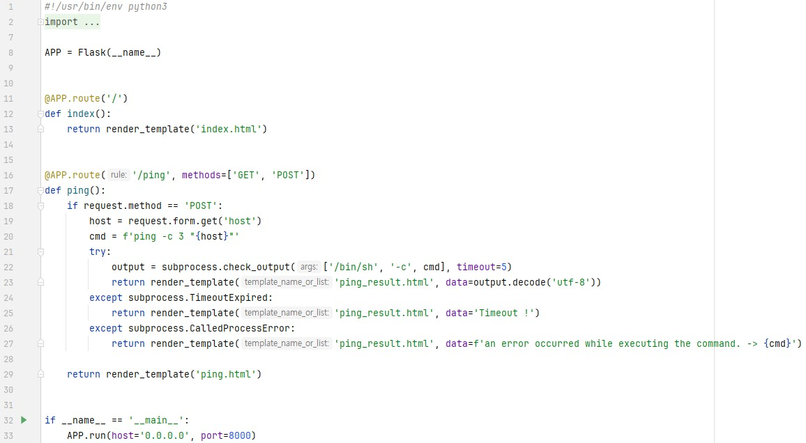

문제는 **특정 Host에 ping 패킷을 보내는 서비스입니다. Command Injection을 통해 플래그를 획득하세요. 플래그는 flag.py에 있습니다.** 입니다.  
우선 코드를 보겠습니다.  
  
**/ping** 에서 3가지 기능을 합니다.  
먼저 host 라는 폼에서 값을 받고, **ping -c 3 "host"** 를 실행합니다.  
1. 정상적으로 실행이 되면, 결과를 보여줍니다.
2. 만약 시간초과라면, Timeout ! 을 보여줌.
3. 만약 외부 프로세스가 비정상적인 종료 코드를 반환했을 때(쉽게 말하면, 잘못됬을 때) 에러발생했다고 알려줌

즉, 여기서 host에 값을 줘서 flag를 찾아야 합니다.  
여기서 flag는 app.py와 같은 디렉토리에 있으므로 **cat flag.py** 와 같은 명령어를 사용할 수 있습니다.  
  
ping 으로 들어가면 다음과 같이 값을 입력하는 폼이 있습니다.  
  
참고로, 이 폼에는 **5 ~ 20글자의 영문자와 숫자**가 들어갈 수 있습니다.  
  
즉, 이렇게 pattern 을 제거하면 마음껏 폼에 값을 넣을 수 있습니다.  
여기서 우회할 때 중요한 점은, 메타문자를 이용해서 두 명령어를 사용할 수 있다는 것 입니다.  
하나는 앞에 있는 ping 명령어, 두 번째는 flag.py를 출력할 cat flag.py 를 메타문자를 이용해서 묶을 수 있습니다.  
예를 들면, 저는 **;** 를 이용해서 풀었습니다.  
그리고 하나 더 중요한 점은 **쌍따옴표**입니다.  
파이썬 코드를 보면 **ping -c 3 "host"** 에 값을 넣는 것을 알 수 있습니다.  
이 때, 그냥 명령어를 적으면, ping 명령에 해당하는 따옴표 안에 들어가기 때문에, 오류가 발생합니다.  
따라서 **8.8.8.8";** 를 통해 ping에 대한 따옴표를 닫고, **;** 를 통해 뒤에 들어올 명령어도 실행할 수 있게 합니다.  
여기까지 하면 명령어가 **ping -c 3 "8.8.8.8";"** 가 됩니다. 콜론 뒤에도 따옴표가 있어서 이를 처리해야 하는데, 이 때, **꼭 따옴표 안에 인자값**을 넣어야 합니다.  
따라서 **8.8.8.8"; cat "flag.py** 과 같이 적으면, 전체 명령어는 **ping -c 3 "8.8.8.8"; cat "flag.py"** 가 됩니다.  
  
따라서 정답은 **DH{pingpingppppppppping!!}** 입니다.
