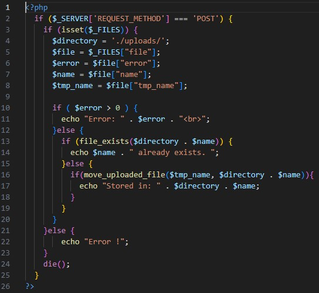
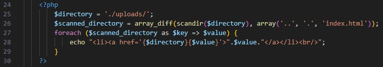
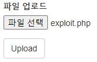

문제는 **php로 작성된 파일 저장 서비스입니다. 파일 업로드 취약점을 이용해 플래그를 획득하세요. 플래그는 /flag.txt에 있습니다.** 입니다.  
이번 문제 코드는 php 입니다.  
일단 여기서 중요한 부분인 php 부분만 보겠습니다.(나머지는 html 처럼 사이트 구성입니다)  
   
처음은 upload.php 에 있는 일부분입니다.  
이 코드는, 만약 **POST 방식이면(파일을 업로드 할 때)**, **./uploads** 에 업로드한 파일을 **저장**하고, **오류 여부**와 파일 저장을 성공했다면, **어디에 저장했는지** 알려줍니다.  
아래는 list.php 에 있는 코드입니다.  
./uploads 에 있는 파일들을 찾는데, 제목에 **'..', '.', 'index.html'** 가 있다면, 제외하고, 나머지 파일은 list에 파일 이름을 출력하고, 그 이름에 파일이 있는 곳으로 하이퍼링크를 설정합니다.  

여기서 저희는 /flag.txt 를 찾는 것이기 때문에, 그냥 **cat /flag.txt** 를 하면 됩니다.  
  
다음과 같이 코드를 작성하고,
  
파일을 업로드하고, list에서 그 파일에 들어가면
  
다음과 같이 flag 가 나옵니다.  
따라서 답은 **DH{c29f44ea17b29d8b76001f32e8997bab}** 입니다.
