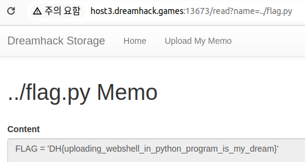

문제는 **File Download 취약점이 존재하는 웹 서비스입니다. flag.py를 다운로드 받으면 플래그를 획득할 수 있습니다.** 입니다.

```python
#!/usr/bin/env python3
import os
import shutil

from flask import Flask, request, render_template, redirect

from flag import FLAG

APP = Flask(__name__)

UPLOAD_DIR = 'uploads'


@APP.route('/')
def index():
    files = os.listdir(UPLOAD_DIR)
    return render_template('index.html', files=files)


@APP.route('/upload', methods=['GET', 'POST'])
def upload_memo():
    if request.method == 'POST':
        filename = request.form.get('filename')
        content = request.form.get('content').encode('utf-8')

        if filename.find('..') != -1:
            return render_template('upload_result.html', data='bad characters,,')

        with open(f'{UPLOAD_DIR}/{filename}', 'wb') as f:
            f.write(content)

        return redirect('/')

    return render_template('upload.html')


@APP.route('/read')
def read_memo():
    error = False
    data = b''

    filename = request.args.get('name', '')

    try:
        with open(f'{UPLOAD_DIR}/{filename}', 'rb') as f:
            data = f.read()
    except (IsADirectoryError, FileNotFoundError):
        error = True


    return render_template('read.html',
                           filename=filename,
                           content=data.decode('utf-8'),
                           error=error)


if __name__ == '__main__':
    if os.path.exists(UPLOAD_DIR):
        shutil.rmtree(UPLOAD_DIR)

    os.mkdir(UPLOAD_DIR)

    APP.run(host='0.0.0.0', port=8000)
```

1. /
기본 화면에서는 uploads 디렉터리에 있는 파일들을 보여준다.
2. /upload
만약 파일을 업로드할 때, 파일 이름에 '..' 이 있는 경우에 필터링을 하고, /uploads 에 저장한다.
3. /read
name 이라는 쿼리에서 값을 가져와서 파일을 연다.(`uploads/{name}`)

  

예를 들어서 다음과 같이 test1 파일을 적으면, `uploads/test1` 이 업로드 되고, 그 파일의 내용이 나온다.  


그리고 다음과 같이 `http://host1.dreamhack.games:14124/read?name=test1` 에서 **read?name=test1** 로 test1 파일을 읽는다.

즉, 저러한 방식으로 URL 을 적으면, flag.py를 알아낼 수 있다.

그렇다면, flag.py가 어느 디렉터리에 있는지 알아야 하는데, 위에서 **uploads** 에서 파일 이름에 `..` 를 넣지 못한다는 것을 보고, **`flag.py` 가 상위 디렉터리에 있다**고 추측했다.  
또한 **content**에 쓴 것은 명령어로 쓰는 것이 아니라, 실제로 그냥 **용도가 없는 텍스트**이므로, /read 에서 **name** 에 상위 디렉토리에 flag.py가 있는지 확인하는 방법 밖에 없다고 생각했다.  

그래서 다음과 같이 `http://host1.dreamhack.games:14124/read?name=../flag.py` 를 적었다.



따라서 정답은 **DH{uploading_webshell_in_python_program_is_my_dream}** 입니다.