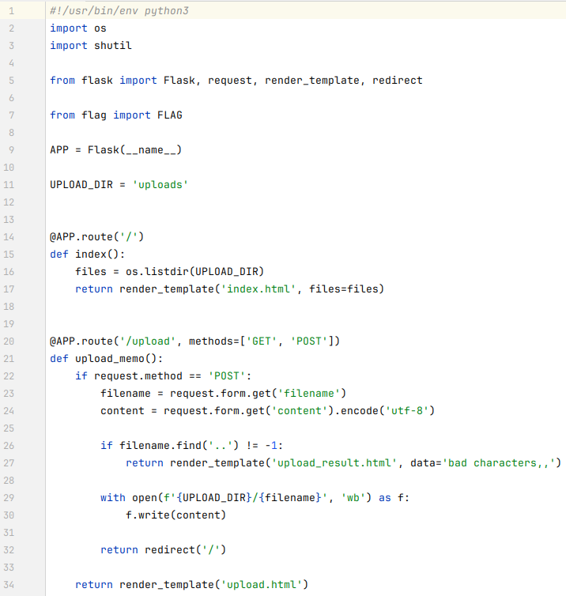
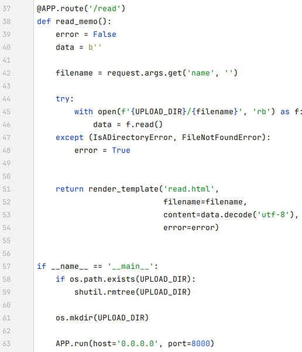
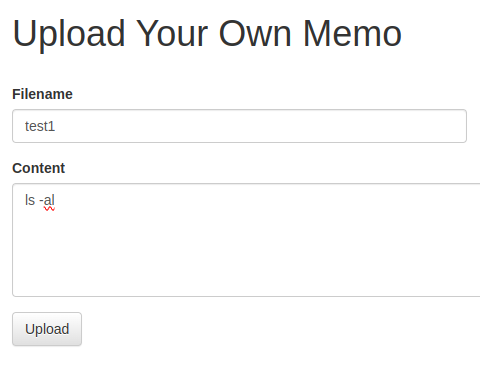
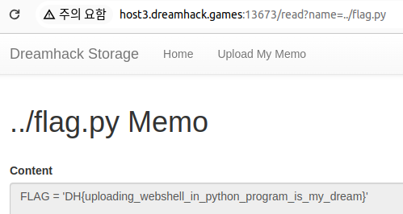

문제는 **File Download 취약점이 존재하는 웹 서비스입니다. flag.py를 다운로드 받으면 플래그를 획득할 수 있습니다.** 입니다.  
   
1. /  
기본 화면에서는 uploads 디렉터리에 있는 파일들을 보여준다.  
2. /upload  
만약 파일을 업로드할 때, 파일 이름에 '..' 이 있는 경우에 필터링을 하고, /uploads 에 저장한다.
3. /read  
name 이라는 쿼리에서 값을 가져와서 파일을 연다.
  
예를 들어서 다음과 같이 test1 파일을 적으면, '/' 에서 파일 리스트에 나옵니다.
  

그리고 다음과 같이 **http://host3.dreamhack.games:13673/read?name=test1** 에서 **read?name=test1** 로 test1 파일을 읽습니다.

즉, 저러한 방식으로 URL 을 적으면, flag.py를 알아낼 수 있습니다.  
그렇다면, flag.py가 어느 디렉터리에 있는지 알아야 하는데, 위에서 /upload 에서 파일 이름에 '..' 를 넣지 못한다는 것을 보고, **flag.py 가 상위 디렉터리에 있다**고 추측했습니다.  
그래서 다음과 같이 **http://host3.dreamhack.games:13673/read?name=../flag.py** 를 적었습니다.  
   
이렇게 정답이 나오는 것을 알 수 있습니다.  

따라서 정답은 **DH{uploading_webshell_in_python_program_is_my_dream}** 입니다.  
