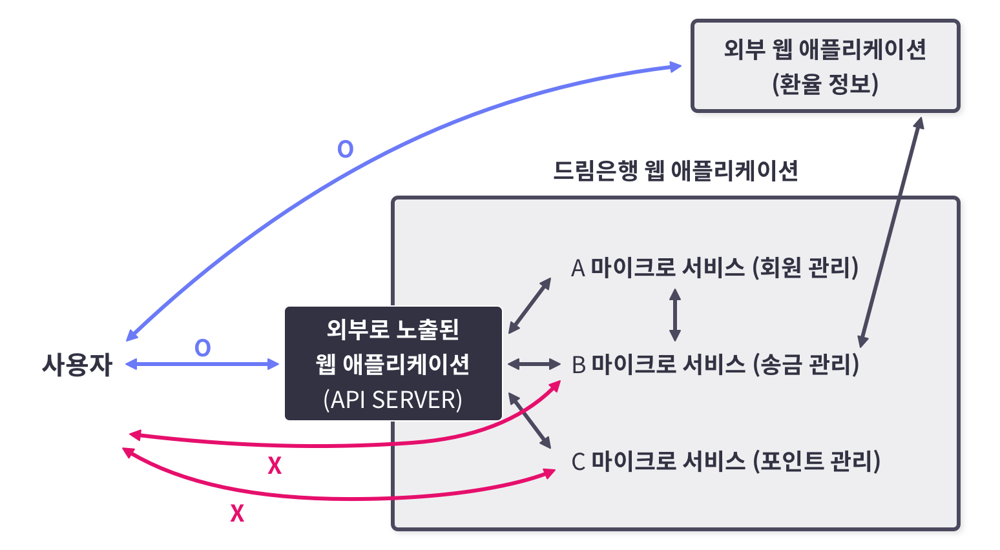

# Server-side Request Forgery (SSRF)  
## SSRF  
Server-side Request Forgery(SSRF) : 웹 서비스의 **요청을 변조**하는 취약점으로, 브라우저가 변조된 요청을 보내는 CSRF와는 다르게 **웹 서비스의 권한으로 변조된 요청**을 보낼 수 있습니다.  
최근의 웹 서비스는 지원하는 기능이 증가해서, 코드의 복잡도를 낮추기 위해 **마이크로서비스**들로 웹 서비스를 구현하는 추세이다.  
  
위의 이미지는 **마이크로서비스들로 통신**하는 예시이다.  
최근의 대다수 서비스들은 마이크로서비스로 구조를 많이 바꾸고, 새롭게 개발하는 추세이기 때문에 **SSRF 취약점의 파급력이 더욱 높아**지고 있습니다.  
웹 서비스는 외부에서 접근할 수 없는 내부망의 기능 중 하나인 **백오피스 서비스**를 사용합니다.  
**백오피스 서비스** : 관리자 페이지, 이용자의 행위가 의심스러울 때 해당 계정을 정지시키거나 삭제하는 등 **관리자만이 수행할 수 있는 모든 기능을 구현**한 서비스   
만약 공격자가 SSRF 취약점을 통해 **웹 서비스의 권한으로 요청을 보낼 수 있다**면 공격자는 **외부에서 내부망 서비스를 이용**할 수 있다.  

# 이용자가 입력한 URL에 요청을 보내는 경우  
## 분석  
```python
# pip3 install flask requests # 파이썬 flask, requests 라이브러리를 설치하는 명령입니다.
# python3 main.py # 파이썬 코드를 실행하는 명령입니다.

from flask import Flask, request
import requests

app = Flask(__name__)


@app.route("/image_downloader")
def image_downloader():
    # 이용자가 입력한 URL에 HTTP 요청을 보내고 응답을 반환하는 페이지 입니다.
    image_url = request.args.get("image_url", "") # URL 파라미터에서 image_url 값을 가져옵니다.
    response = requests.get(image_url) # requests 라이브러리를 사용해서 image_url URL에 HTTP GET 메소드 요청을 보내고 결과를 response에 저장합니다.
    return ( # 아래의 3가지 정보를 반환합니다.
        response.content, # HTTP 응답으로 온 데이터
        200, # HTTP 응답 코드
        {"Content-Type": response.headers.get("Content-Type", "")}, # HTTP 응답으로 온 헤더 중 Content-Type(응답 내용의 타입)
    )


@app.route("/request_info")
def request_info():
    # 접속한 브라우저(User-Agent)의 정보를 출력하는 페이지 입니다.
    return request.user_agent.string
    
    
app.run(host="127.0.0.1", port=8000)
```
위 코드는 이용자가 전달한 URL에 요청을 보내는 예제 코드이다.  
### image_downloader  
```
http://127.0.0.1:8000/image_downloader?image_url=https://dreamhack.io/assets/dreamhack_logo.png
```
이용자가 입력한 **image_url**을 requests.get 함수를 사용해 **GET 메소드로 HTTP 요청을 보내고 응답을 반환**한다.  
위의 URL 은 예시입니다.  
### request_info  
```
Mozilla/5.0 (Macintosh; Intel Mac OS X 10_15_6) AppleWebKit/537.36 (KHTML, like Gecko) Chrome/93.0.4558.0 Safari/537.36
```
웹 페이지에 접속한 **브라우저의 정보(User-Agent)를 반환**한다.  
위는 request_info 에 접속했을 때, 나오는 예시입니다.  
## 예시 문제점 확인  
### 문제점 확인  
```
http://127.0.0.1:8000/image_downloader?image_url=http://127.0.0.1:8000/request_info
```
위 경로에 접속하면, 브라우저 정보가 **python-requests/<LIBRARY_VERSION>** 인 것을 확인할 수 있다.  
이전에 적은 것처럼, request_info 에 접속하면, User-agent 가 반환된다.  
그래서 image_downloader 에서 request_info 의 반환값을 출력하길 바랬지만, 실제로는 **python-requests 가 출력**됐다.  
이유는 **웹 서비스에서 HTTP 요청을 보냈기 때문**이다.  
이처럼 이용자가 **웹 서비스에서 사용하는 마이크로서비스의 API 주소**를 알아내고, **image_url에 주소를 전달**하면 외부에서 접근할 수 없는 **마이크로서비스의 기능을 임의로 사용**할 수 있다.  

# 웹 서비스의 요청 URL에 이용자의 입력값이 포함되는 경우  
## 예시 분석  
```python
INTERNAL_API = "http://api.internal/"
# INTERNAL_API = "http://172.17.0.3/"


@app.route("/v1/api/user/information")
def user_info():
	user_idx = request.args.get("user_idx", "")
	response = requests.get(f"{INTERNAL_API}/user/{user_idx}")
	

@app.route("/v1/api/user/search")
def user_search():
	user_name = request.args.get("user_name", "")
	user_type = "public"
	response = requests.get(f"{INTERNAL_API}/user/search?user_name={user_name}&user_type={user_type}")
```
위의 코드는 **이용자의 입력값이 포함된 URL에 요청을 보내는** 예제 코드입니다.  
### user_info  
이용자가 전달한 **user_idx 값**을 **내부 API의 URL 경로로 사용**합니다.  
```
http://x.x.x.x/v1/api/user/information?user_idx=1
```
위와 같이 **user_idx를 1로 설정**하고 **요청을 보내면** 웹 서비스는 8번째 줄 코드에 의해 아래에 있는 주소로 요청을 보낸다.  
```
http://api.internal/user/1

```
### user_search  
이용자가 전달한 **user_name 값**을 **내부 API의 쿼리로 사용**합니다.  
```
http://x.x.x.x/v1/api/user/search?user_name=hello
```
위와 같이 **user_name을 “hello”로 설정**하고 요청을 보내면 웹 서비스는 15번째 줄 코드에 의해 아래에 있는 주소로 요청을 보낸다.  
```
http://api.internal/user/search?user_name=hello&user_type=public
```
### 문제점 확인  
이용자의 입력값 중 **URL의 구성 요소 문자를 삽입**하면 **API 경로를 조작**할 수 있다.  
예를 들어, user_info 함수에서 **user_idx에 ../search**를 입력할 경우 웹 서비스는 다음과 같은 URL에 요청을 보낸다.  
```
http://api.internal/search
```
**..** 는 **상위 경로로 이동**하기 위한 구분자이고, 이러한 취약점은 **Path Traversal** 이라고 한다.  
**#** 문자를 입력해 **경로를 조작**할 수 있다.  
예를 들어, user_search 함수에서 **user_name에 secret&user_type=private#** 를 입력할 경우 웹 서비스는 다음과 같은 URL에 요청을 보낸다.  
```
http://api.internal/search?user_name=secret&user_type=private#&user_type=public
```
**#** 문자는 뒤에 붙는 문자열은 API 경로에서 생략됩니다. 따라서 해당 URL은 실제로 아래와 같은 URL을 나타낸다.
```
http://api.internal/search?user_name=secret&user_type=private
```

# 웹 서비스의 요청 Body에 이용자의 입력값이 포함되는 경우  
## 예시 분석  
```python
# pip3 install flask
# python main.py

from flask import Flask, request, session
import requests
from os import urandom


app = Flask(__name__)
app.secret_key = urandom(32)
INTERNAL_API = "http://127.0.0.1:8000/"
header = {"Content-Type": "application/x-www-form-urlencoded"}


@app.route("/v1/api/board/write", methods=["POST"])
def board_write():
    session["idx"] = "guest" # session idx를 guest로 설정합니다.
    title = request.form.get("title", "") # title 값을 form 데이터에서 가져옵니다.
    body = request.form.get("body", "") # body 값을 form 데이터에서 가져옵니다.
    data = f"title={title}&body={body}&user={session['idx']}" # 전송할 데이터를 구성합니다.
    response = requests.post(f"{INTERNAL_API}/board/write", headers=header, data=data) # INTERNAL API 에 이용자가 입력한 값을 HTTP BODY 데이터로 사용해서 요청합니다.
    return response.content # INTERNAL API 의 응답 결과를 반환합니다.
    
    
@app.route("/board/write", methods=["POST"])
def internal_board_write():
    # form 데이터로 입력받은 값을 JSON 형식으로 반환합니다.
    title = request.form.get("title", "")
    body = request.form.get("body", "")
    user = request.form.get("user", "")
    info = {
        "title": title,
        "body": body,
        "user": user,
    }
    return info
    
    
@app.route("/")
def index():
    # board_write 기능을 호출하기 위한 페이지입니다.
    return """
        <form action="/v1/api/board/write" method="POST">
            <input type="text" placeholder="title" name="title"/><br/>
            <input type="text" placeholder="body" name="body"/><br/>
            <input type="submit"/>
        </form>
    """
    
    
app.run(host="127.0.0.1", port=8000, debug=True)
```
위의 코드는 이용자의 **입력값이 요청의 Body에 포함**되는 예제 코드이다.  
## board_write  
이용자의 **입력값을 HTTP Body에 포함**하고 내부 API로 요청을 보낸다. 그리고 **세션 정보를 "guest" 계정**으로 설정합니다.  
## internal_board_write  
**board_write** 함수에서 요청하는 **내부 API를 구현**한 기능이다. **title, body 그리고 계정 이름**을 **JSON 형식으로 변환하고 반환**한다.  
## index  
**기본 인덱스 페이지** 이다.  
### 문제점 확인  
다음 URL에 접속하면 **title과 body를 입력**하는 페이지가 표시된다.  
```
http://127.0.0.1:8000
```
입력하고 제출 버튼을 누르면 다음과 같은 응답을 확인할 수 있다.  
```
{ "body": "body", "title": "title", "user": "guest" }
```
**세션 정보를 "guest"로 설정**했기 때문에 user가 "guest"인 것을 확인할 수 있다.  
```
data = f"title={title}&body={body}&user={session['idx']}
```
위의 코드는 20번째 줄의 코드로, board_write 에서 POST 방식으로 데이터를 전송하는 format 이다.  
**입력값인 title, body 그리고 user의 값**을 파라미터 형식으로 설정한다.  
**파라미터를 구분하기 위해 사용**하는 구분 문자인 **&** 를 포함하면 설정되는 **data의 값을 변조**할 수 있다.  
```
title=title&user=admin&body=body&user=guest
```
title에서 **title&user=admin를 삽입**하면 위와 같이 data가 구성된다.  
```
{ "body": "body", "title": "title", "user": "admin" }
```
**&** 를 이용해서, **user를 admin으로 바꿨다.**  

# 퀴즈  
1. 구분 문자(Delimiter)에 대한 올바른 설명은?  
답 : 일반 텍스트 또는 데이터 스트림에서 별도의 독립적 영역 사이의 경계를 지정하는 데 사용하는 하나의 문자 혹은 문자들의 배열. URL 에서 구분 문자는 “/”(Path identifier), “?” (Query identifier) 등 이 있으며 구분 문자에 따라 URL의 해석이 다라질 수 있음.
2. Server Side Request Forgery는 무엇일까?  
답 : 웹 서비스의 요청을 변조하는 취약점으로, 브라우저가 변조된 요청을 보내는 CSRF와는 다르게 웹 서비스의 권한으로 변조된 요청을 보낼 수 있음
3. 다음이 설명하는 키워드는 무엇일까요?  
소프트웨어가 잘 정의된 API를 통해 통신하는 소규모의 독립적인 서비스로 구성되어 있는 경우의 소프트웨어 개발을 위한 아키텍처 및 조직적 접근 방식  
답 : 마이크로서비스  
