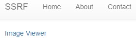
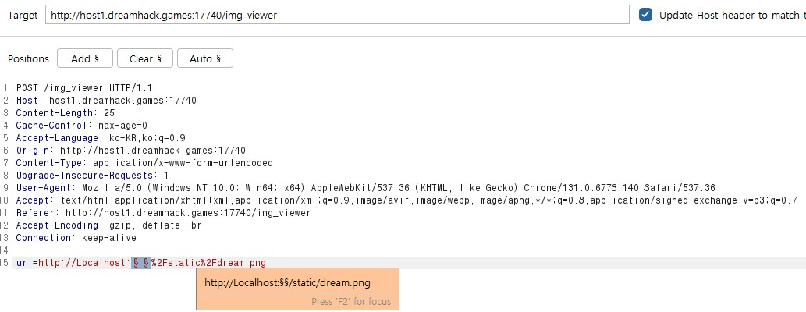
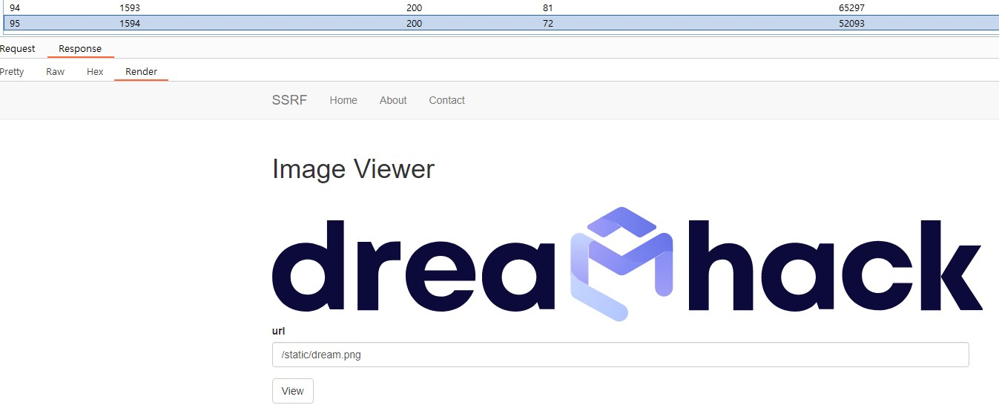
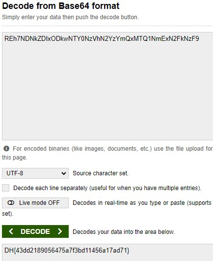

문제는 **flask로 작성된 image viewer 서비스 입니다. SSRF 취약점을 이용해 플래그를 획득하세요. 플래그는 /app/flag.txt에 있습니다.** 입니다.  
우선 코드를 보겠습니다.  
```python
#!/usr/bin/python3
from flask import (
    Flask,
    request,
    render_template
)
import http.server
import threading
import requests
import os, random, base64
from urllib.parse import urlparse

app = Flask(__name__)
app.secret_key = os.urandom(32)

try:
    FLAG = open("./flag.txt", "r").read()  # Flag is here!!
except:
    FLAG = "[**FLAG**]"


@app.route("/")
def index():
    return render_template("index.html")


@app.route("/img_viewer", methods=["GET", "POST"])
def img_viewer():
    if request.method == "GET":
        return render_template("img_viewer.html")
    elif request.method == "POST":
        url = request.form.get("url", "")
        urlp = urlparse(url)
        if url[0] == "/":
            url = "http://localhost:8000" + url
        elif ("localhost" in urlp.netloc) or ("127.0.0.1" in urlp.netloc):
            data = open("error.png", "rb").read()
            img = base64.b64encode(data).decode("utf8")
            return render_template("img_viewer.html", img=img)
        try:
            data = requests.get(url, timeout=3).content
            img = base64.b64encode(data).decode("utf8")
        except:
            data = open("error.png", "rb").read()
            img = base64.b64encode(data).decode("utf8")
        return render_template("img_viewer.html", img=img)


local_host = "127.0.0.1"
local_port = random.randint(1500, 1800)
local_server = http.server.HTTPServer(
    (local_host, local_port), http.server.SimpleHTTPRequestHandler
)
print(local_port)


def run_local_server():
    local_server.serve_forever()


threading._start_new_thread(run_local_server, ())

app.run(host="0.0.0.0", port=8000, threaded=True)
```
   
1. '/' : index.html 을 render 하는 엔드포인트
2. 'img_viewer' : 경로를 입력받아서 **파일이 있으면 보여주고**, **없거나 일정시간이 지났지만 응답이 없다**면 **error.png**를 띄운다.  

   
다음과 같이 파일이 있는 경우, 왼쪽처럼 보여주고, 없다면 error.png를 띄운다.  

처음에 문제를 풀다가 어려워서 막막했지만, 코드를 보면서 뜬금없는 코드를 봤다.  
```python
local_host = "127.0.0.1"
local_port = random.randint(1500, 1800)
local_server = http.server.HTTPServer(
    (local_host, local_port), http.server.SimpleHTTPRequestHandler
)
```
이 코드를 봤을 때, local_host와 port 를 지정하는 것을 봐서, 저 **url에 있는 flag.txt** 를 찾아야한다고 생각했다.  
```python
elif ("localhost" in urlp.netloc) or ("127.0.0.1" in urlp.netloc):
    data = open("error.png", "rb").read()
    img = base64.b64encode(data).decode("utf8")
    return render_template("img_viewer.html", img=img)
```
위의 코드를 보고, **localhost 나 127.0.0.1** 을 입력받은 경우, 그냥 **error.png를 띄우는 것**을 보고 확신했다.  
결론적으로 **port 번호를 brute force를 통해 알아내고**, **127.0.0.1 이나 localhost 를 우회**하면 된다고 생각했습니다.  
1. 127.0.0.1 이나 localhost 우회하는 방법(https://nameng.tistory.com/160 참고)  
이 문제를 풀때, 127.0.0.1 대신에 **Localhost** 를 이용해 우회했다.
2. port 번호 알기(1500 ~ 1800 brute force)  
burp suite를 사용해서 brute force 를 했습니다.

   
왼쪽처럼 request message 를 port 번호만 바꿔서 보냈고, 오른쪽 그림처럼 port 번호가 **1609** 일 때, 그림이 정상적으로 나왔습니다.  
따라서 **http://Localhost:1609/flag.txt** 를 적어서 flag 를 얻을 수 있습니다.  

  
그래서 다음과 같이 적어서 버튼을 눌렀습니다.  

  
그런데, 이미지가 깨졌습니다??  

```python
img = base64.b64encode(data).decode("utf8")
```

왜나하면, try 문에서 파일을 **base64로 encode 해서** 주기 때문에, 저희가 이 값을 개발자도구에서 찾고, **decode를 해야합니다.**   

  

다음과 같이 **REh7NDNkZDIxODkwNTY0NzVhN2YzYmQxMTQ1NmExN2FkNzF9** 를 찾을 수 있고, 이를 decode 하면 답이 나옵니다.  

  

답은 **DH{43dd2189056475a7f3bd11456a17ad71}** 입니다.  


