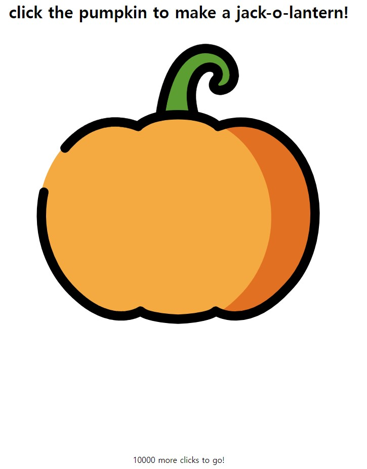
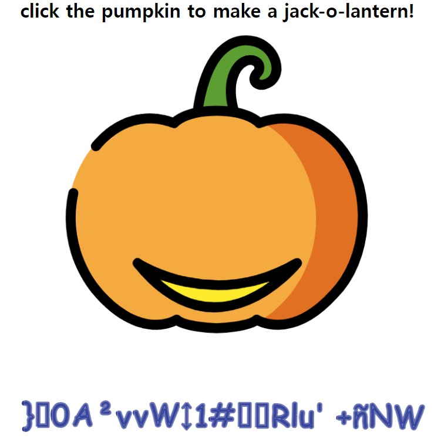
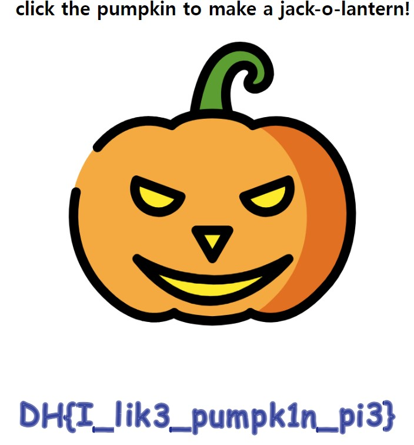
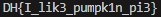

문제는 **할로윈 파티를 기념하기 위해 호박을 준비했습니다! 호박을 10000번 클릭하고 플래그를 획득하세요!** 입니다.  

일단 문제를 보자마자 10000번을 클릭해야하는 불안감이 있었는데, 그 예상은 빗나가지 않았고, 10000번을 클릭하면 플래그를 얻을 수 있는 문제이다.  

  

실제로 10000번 클릭해도 되지만, 기왕이면 다른 방식으로 접근하기로 했다.  

먼저 html 코드 중에 `<script>` 부분만 가져오면 다음과 같다.  

```javascript
var pumpkin = [ 124, 112, 59, 73, 167, 100, 105, 75, 59, 23, 16, 181, 165, 104, 43, 49, 118, 71, 112, 169, 43, 53 ];
var counter = 0;
var pie = 1;

function make() {
  if (0 < counter && counter <= 1000) {
    $('#jack-nose').css('opacity', (counter) + '%');
  }
  else if (1000 < counter && counter <= 3000) {
    $('#jack-left').css('opacity', (counter - 1000) / 2 + '%');
  }
  else if (3000 < counter && counter <= 5000) {
    $('#jack-right').css('opacity', (counter - 3000) / 2 + '%');
  }
  else if (5000 < counter && counter <= 10000) {
    $('#jack-mouth').css('opacity', (counter - 5000) / 5 + '%');
  }

  if (10000 < counter) {
    $('#jack-target').addClass('tada');
    var ctx = document.querySelector("canvas").getContext("2d"),
    dashLen = 220, dashOffset = dashLen, speed = 20,
    txt = pumpkin.map(x=>String.fromCharCode(x)).join(''), x = 30, i = 0;

    ctx.font = "50px Comic Sans MS, cursive, TSCu_Comic, sans-serif"; 
    ctx.lineWidth = 5; ctx.lineJoin = "round"; ctx.globalAlpha = 2/3;
    ctx.strokeStyle = ctx.fillStyle = "#1f2f90";

    (function loop() {
      ctx.clearRect(x, 0, 60, 150);
      ctx.setLineDash([dashLen - dashOffset, dashOffset - speed]); // create a long dash mask
      dashOffset -= speed;                                         // reduce dash length
      ctx.strokeText(txt[i], x, 90);                               // stroke letter

      if (dashOffset > 0) requestAnimationFrame(loop);             // animate
      else {
        ctx.fillText(txt[i], x, 90);                               // fill final letter
        dashOffset = dashLen;                                      // prep next char
        x += ctx.measureText(txt[i++]).width + ctx.lineWidth * Math.random();
        ctx.setTransform(1, 0, 0, 1, 0, 3 * Math.random());        // random y-delta
        ctx.rotate(Math.random() * 0.005);                         // random rotation
        if (i < txt.length) requestAnimationFrame(loop);
      }
    })();
  }
  else {
    $('#clicks').text(10000 - counter);
  }
}

$(function() {
  $('#jack-target').click(function () {
    counter += 1;
    if (counter <= 10000 && counter % 100 == 0) {
      for (var i = 0; i < pumpkin.length; i++) {
        pumpkin[i] ^= pie;
        pie = ((pie ^ 0xff) + (i * 10)) & 0xff;
      }
    }
    make();
  });
});
```

정말 긴데, 그나마 중요한 부분으로 추려보면 다음과 같다.    

```javascript
var pumpkin = [ 124, 112, 59, 73, 167, 100, 105, 75, 59, 23, 16, 181, 165, 104, 43, 49, 118, 71, 112, 169, 43, 53 ];
var counter = 0;
var pie = 1;
  $('#jack-target').click(function () {
    counter += 1;
    if (counter <= 10000 && counter % 100 == 0) {
      for (var i = 0; i < pumpkin.length; i++) {
        pumpkin[i] ^= pie;
        pie = ((pie ^ 0xff) + (i * 10)) & 0xff;
      }
    }
  }
```

결론적으로 for문에 있는 함수에 의미는 다음과 같다.  

1. 클릭을 할 때마다 **counter를 1씩 증가**
2. 만약 counter가 아직 10000에 도달하지 않았고, counter가 **100의 배수**이면
3. **pumpkin** 에 있는 값을 **pie와 xor 연산**
4. 그리고 **pie 값**도 특정 연산에 따라 값을 **바꿈**  
  
# 1. javascript 조작(클릭 당 100씩 증가하게끔)

처음에 이 문제를 풀려고 했을 때, '그냥 한 번 클릭했을 때, 10000이 증가하게 하면 되는거 아닌가?' 라는 생각을 해서 다음과 같이 코드를 바꿨다.  

```javascript
$(function() {
  $('#jack-target').click(function () {
    counter += 10000;
    if (counter <= 10000 && counter % 100 == 0) {
      for (var i = 0; i < pumpkin.length; i++) {
        pumpkin[i] ^= pie;
        pie = ((pie ^ 0xff) + (i * 10)) & 0xff;
      }
    }
    make();
  });
});
```
그런데 다음과 같은 결과가 나왔다.  

  

즉, 위에 적은 것처럼 **counter가 100의 배수일 때마다 특정한 연산**을 하기 때문에 **한 번에 10000을 증가시키면 그 연산을 1번**밖에 할 수 없어서 이러한 오류가 발생한다.  

따라서 저는 counter += 10000;을 **counter += 100;** 으로 바꿨다.  

```javascript
$(function() {
  $('#jack-target').click(function () {
    counter += 100;
    if (counter <= 10000 && counter % 100 == 0) {
      for (var i = 0; i < pumpkin.length; i++) {
        pumpkin[i] ^= pie;
        pie = ((pie ^ 0xff) + (i * 10)) & 0xff;
      }
    }
    make();
  });
});
```

  

위의 코드에서 counter가 10000이 될때까지 클릭하면 다음과 같은 flag가 나옵니다.  

# 2. 직접 계산하기(프로그래밍으로)

그냥 위의 코드를 프로그래밍하면 간편하게 구할 수 있다.  

```python
# javascript에 있던 변수
pumpkin = [124, 112, 59, 73, 167, 100, 105, 75, 59, 23, 16, 181, 165, 104, 43, 49, 118, 71, 112, 169, 43, 53]
counter = 0
pie = 1

# 10000번 반복(클릭을 대체함)
for i in range(10000):
    counter += 1

    if counter % 100 == 0:
      for i in range(len(pumpkin)):
        pumpkin[i] ^= pie
        pie = ((pie ^ 0xff) + (i * 10)) & 0xff

# char로 바꿔서 출력
for i in range(len(pumpkin)):
   print(chr(pumpkin[i]), end='')
```

위의 코드를 실행하면 다음과 같이 결과가 나온다.  

  

따라서 정답은 **DH{I_lik3_pumpk1n_pi3}** 이다.
