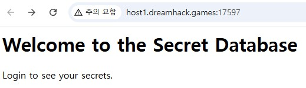
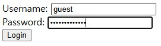
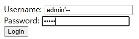

문제는 **저희 직원이 중요한 정보를 admin 계정에 저장해놨다고 했는데... 직원이 admin 계정을 잃어버렸어요... 여러분들이 대신 찾아줄 수 있어요?플래그 형식은 0xH0P3{...} 입니다.** 이다.  

주어진 코드는 다음과 같다.

```python
from flask import Flask, request, render_template_string
import sqlite3

app = Flask(__name__)

def init_db():
    conn = sqlite3.connect('challenge.db')
    c = conn.cursor()
    c.execute('''CREATE TABLE IF NOT EXISTS users (id INTEGER PRIMARY KEY, username TEXT, password TEXT, secret TEXT)''')
    c.execute("INSERT OR IGNORE INTO users (id, username, password, secret) VALUES (1, 'admin', '**[NO!]**', '**[HERE_IS_THE_FLAG]**')")
    c.execute("INSERT OR IGNORE INTO users (id, username, password, secret) VALUES (2, 'guest', 'guestpassword', 'Huh? Do you think the owner will give guests the flag? :)')")
    conn.commit()
    conn.close()

@app.route('/')
def index():
    return '<h1>Welcome to the Secret Database</h1><p>Login to see your secrets.</p>'

@app.route('/login', methods=['GET', 'POST'])
def login():
    if request.method == 'POST':
        username = request.form.get('username')
        password = request.form.get('password')

        conn = sqlite3.connect('challenge.db')
        c = conn.cursor()
        query = f"SELECT secret FROM users WHERE username = '{username}' AND password = '{password}'"
        print(f"Executing query: {query}")

        try:
            c.execute(query)
            result = c.fetchone()
            if result:
                return f"<h1>Welcome, {username}!</h1><p>Your secret: {result[0]}</p>"
            else:
                return "<h1>Login failed</h1><p>Invalid username or password.</p>"
        except Exception as e:
            return f"<h1>Error</h1><p>{e}</p>"
        finally:
            conn.close()

    return '''
        <form method="post">
            Username: <input type="text" name="username"><br>
            Password: <input type="password" name="password"><br>
            <input type="submit" value="Login">
        </form>
    '''

if __name__ == '__main__':
    init_db()
    app.run(debug=True)
```

# (1) /

  

위와 같이 메인 페이지 이다.  
간단하게 힌트로 숨겨진 **데이터베이스**를 찾는 것 같다.  
-> 위의 코드와 이를 통해 **SQL Injection**이라는 것을 짐작할 수 있다.  

# (2) /login

  

위와 같이 **Username, Password**를 적어서 로그인하는 페이지이다.  

실제로 로그인을 하면 **init_db** 에서 설정한 각 계정의 **Secert(admin에서는 flag)** 를 볼 수 있다.  

예시로 Username : guest, Password : guestpassword를 입력하면, guest로 로그인된다.  

  

그럼 다음과 같이 guest의 secret가 나온다.  

여기서 **admin**으로 로그인해야 한다.  

코드를 보고 바로 생각나는 풀이는 우선 로그인을 통해 데이터베이스에 질의하는 쿼리는 다음과 같다.  

```SQL
SELECT secret FROM users WHERE username = '{username}' AND password = '{password}'
```

여기서 **SQL Injection** 으로 password를 주석처리하면 성공할 것이라고 생각했다.  

그래서 다음과 같이 username에 `admin'--`를 넣었다.  

  

위에서 password에 12345를 넣었다고 가정하면, 질의되는 쿼리는 다음과 같다.

```SQL
SELECT secret FROM users WHERE username = 'admin'--' AND password = '12345'
```

이를 통해 password를 검사하지 않고, admin만을 이용해 로그인에 성공한다.  

  

따라서 정답은 **0xH0P3{688787d8ff144c502c7f5cffaafe2cc588d86079f9de88304c26b0cb99ce91c6}** 이다.